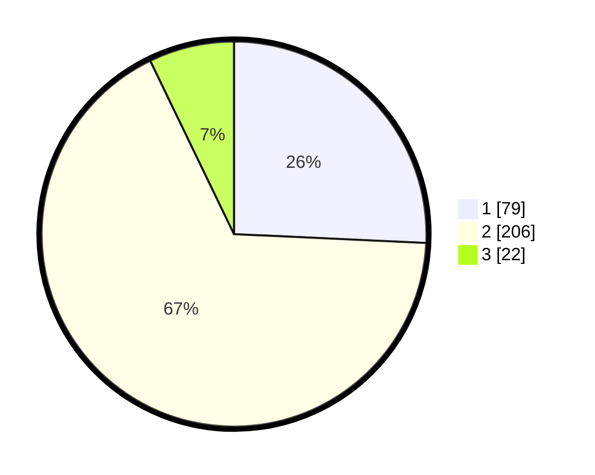

# Hasil

## Grafik

## Tabel

| No. | Nama Paslon    | Suara | Suara (raw) | Persentase |
|:--- |:-------------- | -----:| -----------:| ----------:|
| 1   | ANIES MUHAIMIN | 79    | [79][p-1]   | 25,73      |
| 2   | PRABOWO GIBRAN | 206   | [206][p-2]  | 67,10      |
| 3   | GANJAR MAHFUD  | 22    | [22][p-3]   | 7,17       |

[p-1]: https://github.com/gigit-pemilu/pemilu-2024-32-jawa-barat/blob/main/pilpres/hitung-suara/sub/32-jawa-barat/sub/01-bogor/sub/33-ciseeng/sub/2002-ciseeng/sub/003-tps/sub/paslon-1.txt
[p-2]: https://github.com/gigit-pemilu/pemilu-2024-32-jawa-barat/blob/main/pilpres/hitung-suara/sub/32-jawa-barat/sub/01-bogor/sub/33-ciseeng/sub/2002-ciseeng/sub/003-tps/sub/paslon-2.txt
[p-3]: https://github.com/gigit-pemilu/pemilu-2024-32-jawa-barat/blob/main/pilpres/hitung-suara/sub/32-jawa-barat/sub/01-bogor/sub/33-ciseeng/sub/2002-ciseeng/sub/003-tps/sub/paslon-3.txt

## Foto C Plano

https://sirekap-obj-formc.kpu.go.id/567c/pemilu/ppwp/32/01/33/20/02/3201332002003-20240214-191606--7b9477c9-966d-4b38-8b37-6d37d73b6ea4.jpg

https://sirekap-obj-formc.kpu.go.id/567c/pemilu/ppwp/32/01/33/20/02/3201332002003-20240214-195624--3d387e69-ded2-43ba-9378-fb927416697b.jpg

https://sirekap-obj-formc.kpu.go.id/567c/pemilu/ppwp/32/01/33/20/02/3201332002003-20240214-195759--74f86a31-9ee3-4753-8c6f-5ae7fb2916a1.jpg

## Metadata

| Key        | Value               |
| ---------- | ------------------- |
| Time Stamp | 2024-02-16 23:45:47 |

