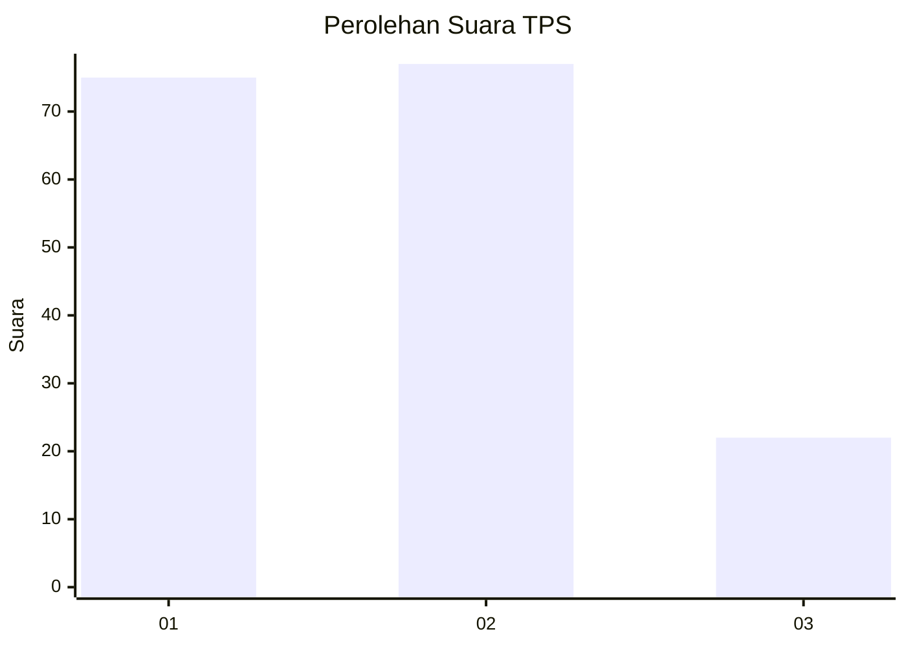
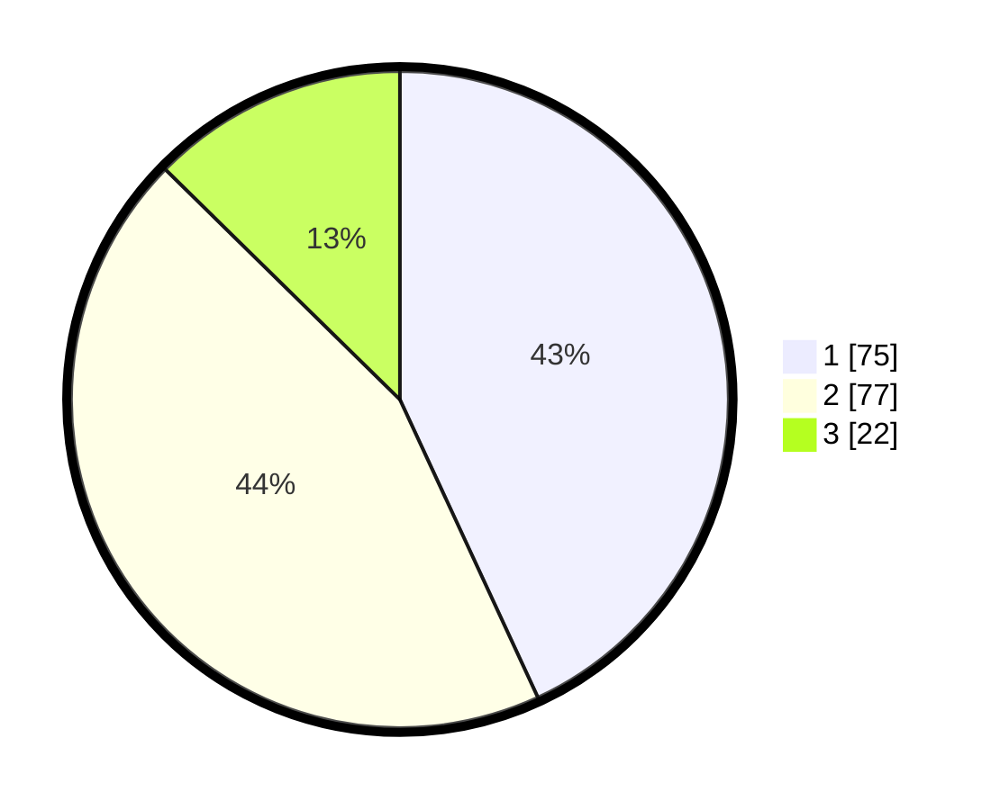

# Hasil

## Grafik

## Tabel

| No. | Nama Paslon    | Suara | Suara (raw) | Persentase |
|:--- |:-------------- | -----:| -----------:| ----------:|
| 1   | ANIES MUHAIMIN | 75    | [75][p-1]   | 43,10      |
| 2   | PRABOWO GIBRAN | 77    | [77][p-2]   | 44,25      |
| 3   | GANJAR MAHFUD  | 22    | [22][p-3]   | 12,64      |

[p-1]: https://github.com/gigit-pemilu/pemilu-2024/blob/main/pilpres/hitung-suara/sub/32-jawa-barat/sub/01-bogor/sub/33-ciseeng/sub/2002-ciseeng/sub/014-tps/sub/paslon-1.txt
[p-2]: https://github.com/gigit-pemilu/pemilu-2024/blob/main/pilpres/hitung-suara/sub/32-jawa-barat/sub/01-bogor/sub/33-ciseeng/sub/2002-ciseeng/sub/014-tps/sub/paslon-2.txt
[p-3]: https://github.com/gigit-pemilu/pemilu-2024/blob/main/pilpres/hitung-suara/sub/32-jawa-barat/sub/01-bogor/sub/33-ciseeng/sub/2002-ciseeng/sub/014-tps/sub/paslon-3.txt

## Foto C Plano

https://sirekap-obj-formc.kpu.go.id/a794/pemilu/ppwp/32/01/33/20/02/3201332002014-20240219-192746--1a97c1c0-7d8e-4162-8019-0c2c859753f4.jpg

https://sirekap-obj-formc.kpu.go.id/a794/pemilu/ppwp/32/01/33/20/02/3201332002014-20240219-192826--4c95f01e-83e1-4585-b537-354e019e71ec.jpg

https://sirekap-obj-formc.kpu.go.id/a794/pemilu/ppwp/32/01/33/20/02/3201332002014-20240219-192910--ed4b71d3-3e99-41cb-86c2-f38ac5ce4259.jpg

## Metadata

| Key        | Value               |
| ---------- | ------------------- |
| Time Stamp | 2024-02-19 20:00:00 |

## DATA PEMILIH TETAP

Jumlah pemilih dalam DPT: **44**.
 * L: **151**.
 * P: **140**.

## DATA PENGGUNA HAK PILIH

Jumlah pengguna hak pilih dalam DPT: **546**.
 * L: **167**.
 * P: **100**.

Jumlah pengguna hak pilih dalam DPTb: **545**.
 * L: **500**.
 * P: **505**.

Jumlah pengguna hak pilih dalam DPK: **555**.
 * L: **0**.
 * P: **5**.

Jumlah pengguna hak pilih: **772**.
 * L: **555**.
 * P: **577**.

## JUMLAH SUARA SAH DAN TIDAK SAH

JUMLAH SELURUH SUARA SAH: **275**.

JUMLAH SUARA TIDAK SAH: **11**.

JUMLAH SELURUH SUARA SAH DAN SUARA TIDAK SAH: **245**.

