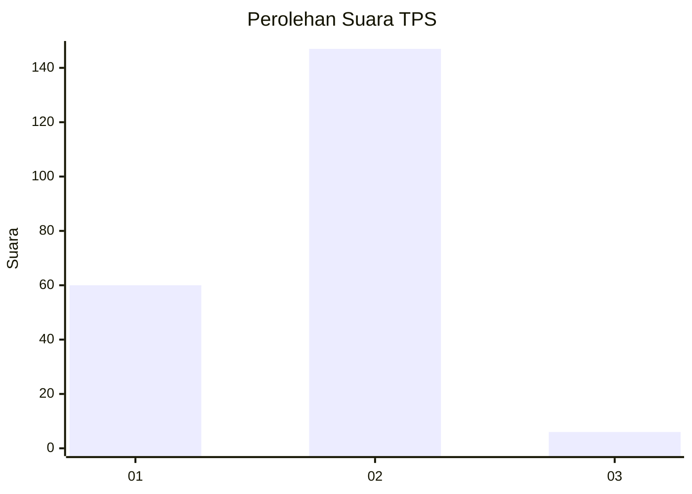
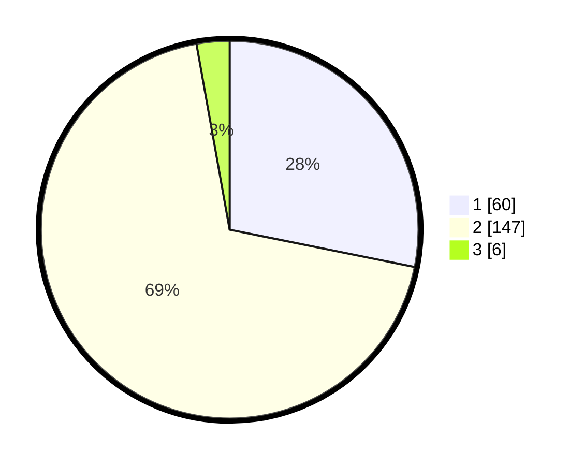

# Hasil

## Grafik

## Tabel

| No. | Nama Paslon    | Suara | Suara (raw) | Persentase |
|:--- |:-------------- | -----:| -----------:| ----------:|
| 1   | ANIES MUHAIMIN | 60    | [60][p-1]   | 28,17      |
| 2   | PRABOWO GIBRAN | 147   | [147][p-2]  | 69,01      |
| 3   | GANJAR MAHFUD  | 6     | [6][p-3]    | 2,82       |

[p-1]: https://github.com/gigit-pemilu/pemilu-2024/blob/main/pilpres/hitung-suara/sub/32-jawa-barat/sub/01-bogor/sub/33-ciseeng/sub/2005-cibeuteung-udik/sub/005-tps/sub/paslon-1.txt
[p-2]: https://github.com/gigit-pemilu/pemilu-2024/blob/main/pilpres/hitung-suara/sub/32-jawa-barat/sub/01-bogor/sub/33-ciseeng/sub/2005-cibeuteung-udik/sub/005-tps/sub/paslon-2.txt
[p-3]: https://github.com/gigit-pemilu/pemilu-2024/blob/main/pilpres/hitung-suara/sub/32-jawa-barat/sub/01-bogor/sub/33-ciseeng/sub/2005-cibeuteung-udik/sub/005-tps/sub/paslon-3.txt

## Foto C Plano

https://sirekap-obj-formc.kpu.go.id/708c/pemilu/ppwp/32/01/33/20/05/3201332005005-20240214-231031--ab3cc5e0-2bfc-4126-a202-636973d35d82.jpg

https://sirekap-obj-formc.kpu.go.id/708c/pemilu/ppwp/32/01/33/20/05/3201332005005-20240214-231138--a67308ff-567a-4c02-acbb-b047fdb5a610.jpg

https://sirekap-obj-formc.kpu.go.id/708c/pemilu/ppwp/32/01/33/20/05/3201332005005-20240214-233938--c649e256-c601-44a6-9e90-e8c0abf06fc9.jpg

## Metadata

| Key        | Value               |
| ---------- | ------------------- |
| Time Stamp | 2024-02-15 15:00:29 |

