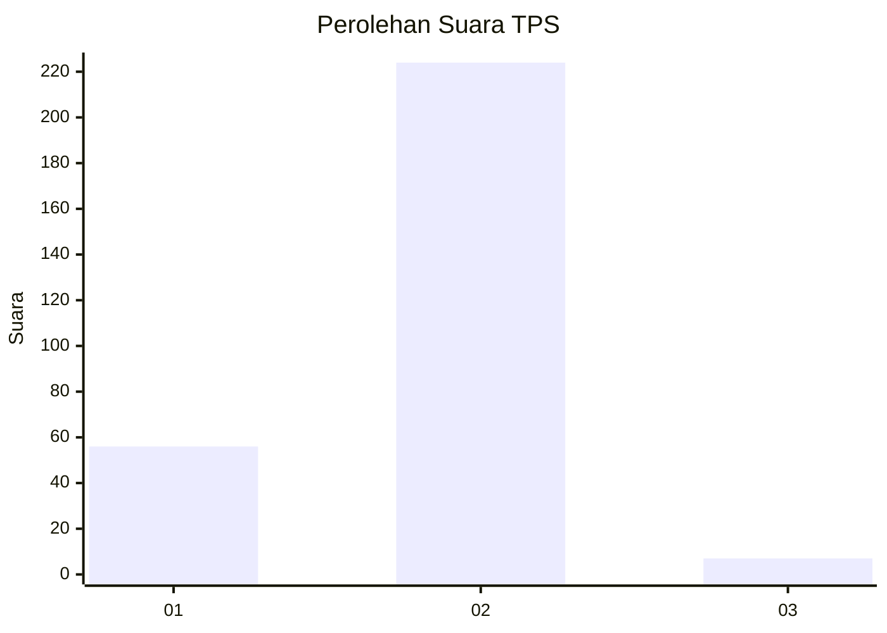
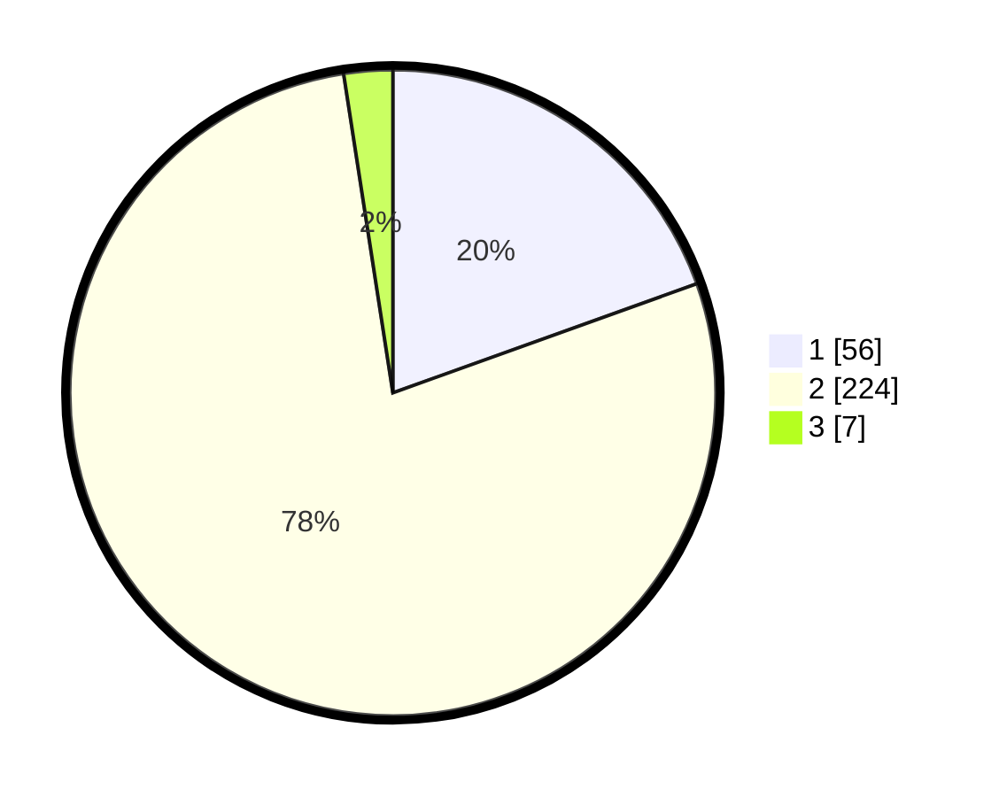

# Hasil

## Grafik

## Tabel

| No. | Nama Paslon    | Suara | Suara (raw) | Persentase |
|:--- |:-------------- | -----:| -----------:| ----------:|
| 1   | ANIES MUHAIMIN | 56    | [56][p-1]   | 19,51      |
| 2   | PRABOWO GIBRAN | 224   | [224][p-2]  | 78,05      |
| 3   | GANJAR MAHFUD  | 7     | [7][p-3]    | 2,44       |

[p-1]: https://github.com/gigit-pemilu/pemilu-2024-32-jawa-barat/blob/main/pilpres/hitung-suara/sub/32-jawa-barat/sub/01-bogor/sub/33-ciseeng/sub/2010-kuripan/sub/020-tps/sub/paslon-1.txt
[p-2]: https://github.com/gigit-pemilu/pemilu-2024-32-jawa-barat/blob/main/pilpres/hitung-suara/sub/32-jawa-barat/sub/01-bogor/sub/33-ciseeng/sub/2010-kuripan/sub/020-tps/sub/paslon-2.txt
[p-3]: https://github.com/gigit-pemilu/pemilu-2024-32-jawa-barat/blob/main/pilpres/hitung-suara/sub/32-jawa-barat/sub/01-bogor/sub/33-ciseeng/sub/2010-kuripan/sub/020-tps/sub/paslon-3.txt

## Foto C Plano

https://sirekap-obj-formc.kpu.go.id/9244/pemilu/ppwp/32/01/33/20/10/3201332010020-20240219-192106--ef395371-c8f9-44d4-afd2-7d321b90b9b2.jpg

https://sirekap-obj-formc.kpu.go.id/9244/pemilu/ppwp/32/01/33/20/10/3201332010020-20240219-192143--f5bbed2b-ab2b-4bfb-a594-4a6752223d2d.jpg

https://sirekap-obj-formc.kpu.go.id/9244/pemilu/ppwp/32/01/33/20/10/3201332010020-20240219-191930--8ce1d1d3-ffd6-4cc9-bf2c-1de32f004234.jpg

## Metadata

| Key        | Value               |
| ---------- | ------------------- |
| Time Stamp | 2024-02-19 20:00:00 |

## DATA PEMILIH TETAP

Jumlah pemilih dalam DPT: **252**.
 * L: **775**.
 * P: **725**.

## DATA PENGGUNA HAK PILIH

Jumlah pengguna hak pilih dalam DPT: **744**.
 * L: **207**.
 * P: **44**.

Jumlah pengguna hak pilih dalam DPTb: **8**.
 * L: **808**.
 * P: **0**.

Jumlah pengguna hak pilih dalam DPK: **0**.
 * L: **0**.
 * P: **0**.

Jumlah pengguna hak pilih: **244**.
 * L: **22**.
 * P: **42**.

## JUMLAH SUARA SAH DAN TIDAK SAH

JUMLAH SELURUH SUARA SAH: **277**.

JUMLAH SUARA TIDAK SAH: **22**.

JUMLAH SELURUH SUARA SAH DAN SUARA TIDAK SAH: **242**.

