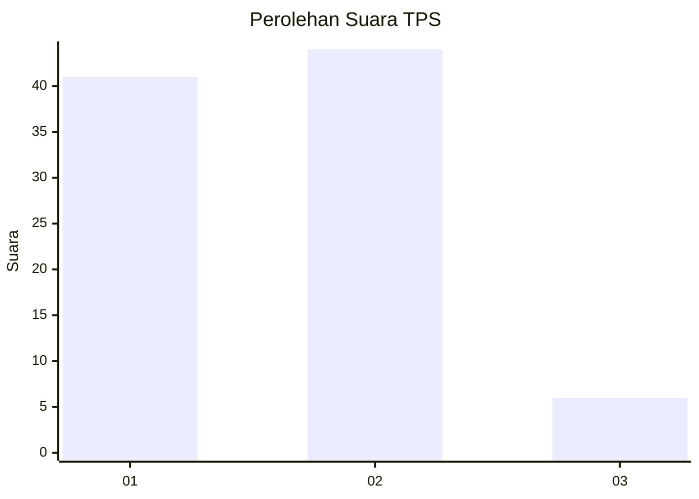
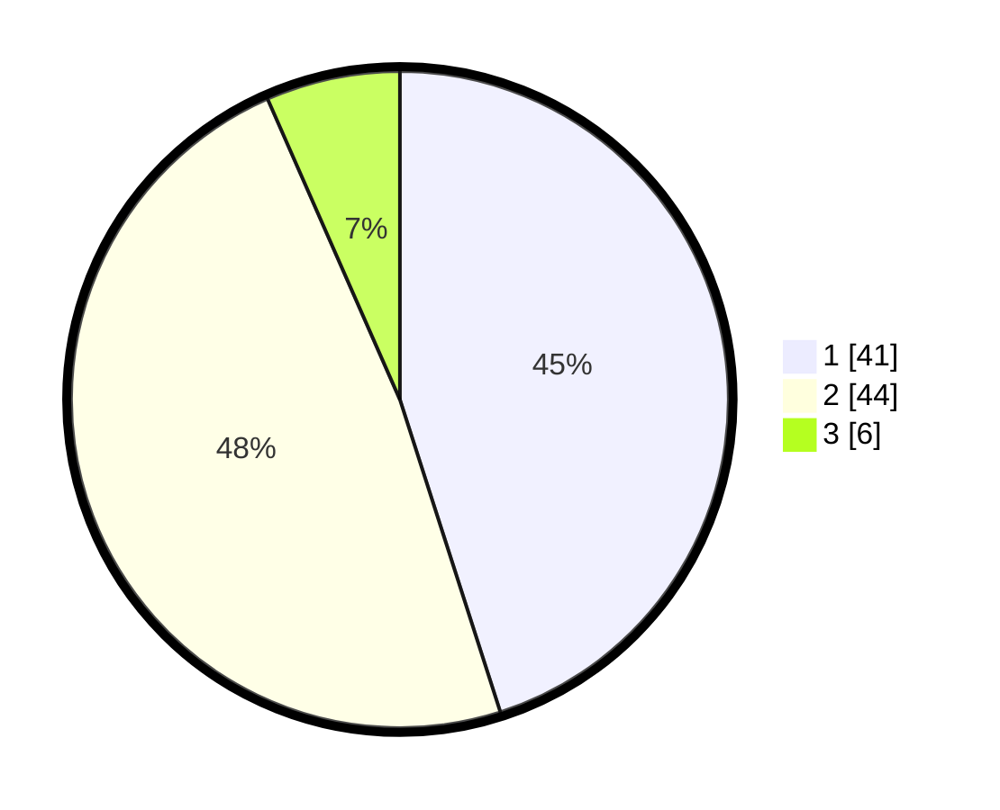

# Hasil

## Grafik

## Tabel

| No. | Nama Paslon    | Suara | Suara (raw) | Persentase |
|:--- |:-------------- | -----:| -----------:| ----------:|
| 1   | ANIES MUHAIMIN | 41    | [41][p-1]   | 45,05      |
| 2   | PRABOWO GIBRAN | 44    | [44][p-2]   | 48,35      |
| 3   | GANJAR MAHFUD  | 6     | [6][p-3]    | 6,59       |

[p-1]: https://github.com/gigit-pemilu/pemilu-2024/blob/main/pilpres/hitung-suara/sub/32-jawa-barat/sub/01-bogor/sub/33-ciseeng/sub/2010-kuripan/sub/023-tps/sub/paslon-1.txt
[p-2]: https://github.com/gigit-pemilu/pemilu-2024/blob/main/pilpres/hitung-suara/sub/32-jawa-barat/sub/01-bogor/sub/33-ciseeng/sub/2010-kuripan/sub/023-tps/sub/paslon-2.txt
[p-3]: https://github.com/gigit-pemilu/pemilu-2024/blob/main/pilpres/hitung-suara/sub/32-jawa-barat/sub/01-bogor/sub/33-ciseeng/sub/2010-kuripan/sub/023-tps/sub/paslon-3.txt

## Foto C Plano

https://sirekap-obj-formc.kpu.go.id/7651/pemilu/ppwp/32/01/33/20/10/3201332010023-20240214-141017--75509b37-cf88-420f-a1a9-0beb2f2948ba.jpg

https://sirekap-obj-formc.kpu.go.id/7651/pemilu/ppwp/32/01/33/20/10/3201332010023-20240214-141043--74e97283-10ce-4cd2-8e25-6743a6fe1430.jpg

https://sirekap-obj-formc.kpu.go.id/7651/pemilu/ppwp/32/01/33/20/10/3201332010023-20240214-141112--2116b5b4-2e4d-412f-a85a-c58416a8e776.jpg

## Metadata

| Key        | Value               |
| ---------- | ------------------- |
| Time Stamp | 2024-02-16 00:00:26 |

