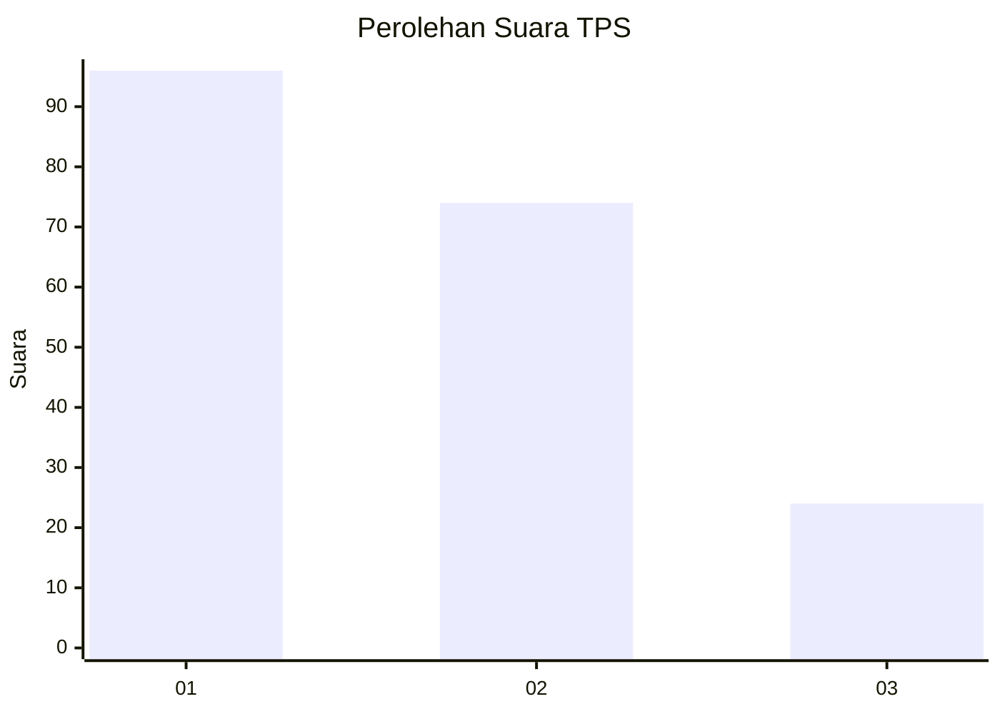
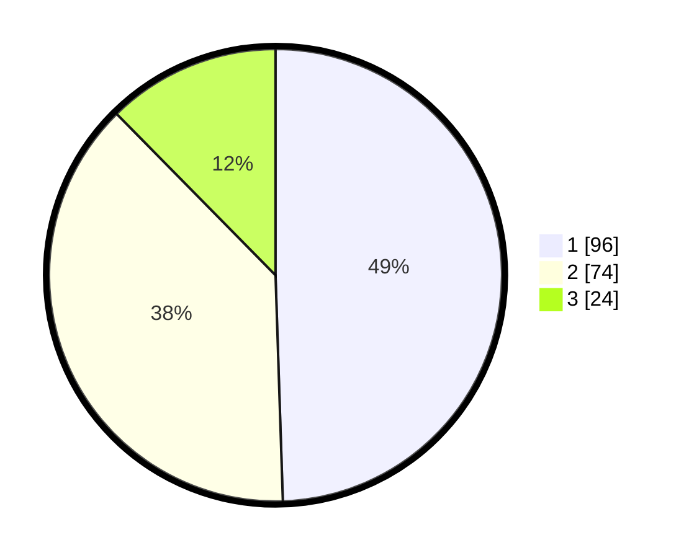

# Hasil

## Grafik

## Tabel

| No. | Nama Paslon    | Suara | Suara (raw) | Persentase |
|:--- |:-------------- | -----:| -----------:| ----------:|
| 1   | ANIES MUHAIMIN | 96    | [96][p-1]   | 49,48      |
| 2   | PRABOWO GIBRAN | 74    | [74][p-2]   | 38,14      |
| 3   | GANJAR MAHFUD  | 24    | [24][p-3]   | 12,37      |

[p-1]: https://github.com/gigit-pemilu/pemilu-2024/blob/main/pilpres/hitung-suara/sub/32-jawa-barat/sub/01-bogor/sub/34-ranca-bungur/sub/2001-bantarjaya/sub/002-tps/sub/paslon-1.txt
[p-2]: https://github.com/gigit-pemilu/pemilu-2024/blob/main/pilpres/hitung-suara/sub/32-jawa-barat/sub/01-bogor/sub/34-ranca-bungur/sub/2001-bantarjaya/sub/002-tps/sub/paslon-2.txt
[p-3]: https://github.com/gigit-pemilu/pemilu-2024/blob/main/pilpres/hitung-suara/sub/32-jawa-barat/sub/01-bogor/sub/34-ranca-bungur/sub/2001-bantarjaya/sub/002-tps/sub/paslon-3.txt

## Foto C Plano

https://sirekap-obj-formc.kpu.go.id/cfaf/pemilu/ppwp/32/01/34/20/01/3201342001002-20240215-184056--4add1fd3-58d7-4020-a1bb-75aefa52c75b.jpg

https://sirekap-obj-formc.kpu.go.id/cfaf/pemilu/ppwp/32/01/34/20/01/3201342001002-20240215-184110--83f84912-5042-401e-8b31-23db5403e9ca.jpg

https://sirekap-obj-formc.kpu.go.id/cfaf/pemilu/ppwp/32/01/34/20/01/3201342001002-20240215-184121--bfc2e8eb-c0c7-42db-b756-407940a2a31b.jpg

## Metadata

| Key        | Value               |
| ---------- | ------------------- |
| Time Stamp | 2024-02-15 22:40:13 |

