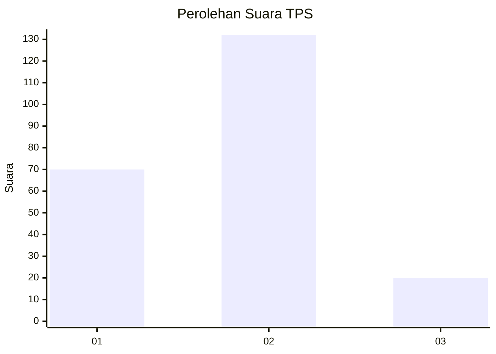
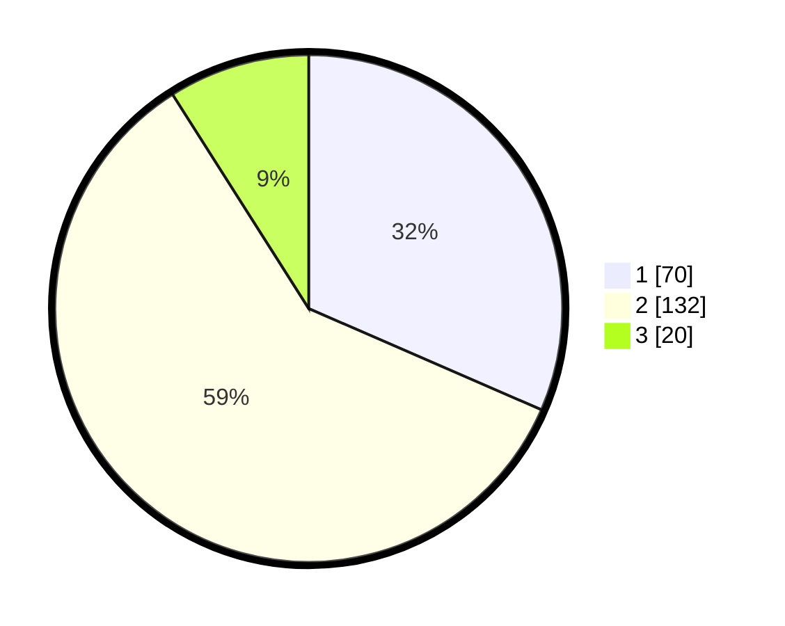

# Hasil

## Grafik

## Tabel

| No. | Nama Paslon    | Suara | Suara (raw) | Persentase |
|:--- |:-------------- | -----:| -----------:| ----------:|
| 1   | ANIES MUHAIMIN | 70    | [70][p-1]   | 31,53      |
| 2   | PRABOWO GIBRAN | 132   | [132][p-2]  | 59,46      |
| 3   | GANJAR MAHFUD  | 20    | [20][p-3]   | 9,01       |

[p-1]: https://github.com/gigit-pemilu/pemilu-2024/blob/main/pilpres/hitung-suara/sub/32-jawa-barat/sub/01-bogor/sub/34-ranca-bungur/sub/2001-bantarjaya/sub/004-tps/sub/paslon-1.txt
[p-2]: https://github.com/gigit-pemilu/pemilu-2024/blob/main/pilpres/hitung-suara/sub/32-jawa-barat/sub/01-bogor/sub/34-ranca-bungur/sub/2001-bantarjaya/sub/004-tps/sub/paslon-2.txt
[p-3]: https://github.com/gigit-pemilu/pemilu-2024/blob/main/pilpres/hitung-suara/sub/32-jawa-barat/sub/01-bogor/sub/34-ranca-bungur/sub/2001-bantarjaya/sub/004-tps/sub/paslon-3.txt

## Foto C Plano

https://sirekap-obj-formc.kpu.go.id/c1b7/pemilu/ppwp/32/01/34/20/01/3201342001004-20240214-234327--4f72d4da-9bc6-404c-a43d-b55fb8245f2d.jpg

https://sirekap-obj-formc.kpu.go.id/c1b7/pemilu/ppwp/32/01/34/20/01/3201342001004-20240214-234640--507f1c53-7f04-4592-8b3b-e4f45b614328.jpg

https://sirekap-obj-formc.kpu.go.id/c1b7/pemilu/ppwp/32/01/34/20/01/3201342001004-20240214-235001--b92df8e4-25dd-4eb6-8e58-3c574e229d21.jpg

## Metadata

| Key        | Value               |
| ---------- | ------------------- |
| Time Stamp | 2024-02-15 20:30:46 |

