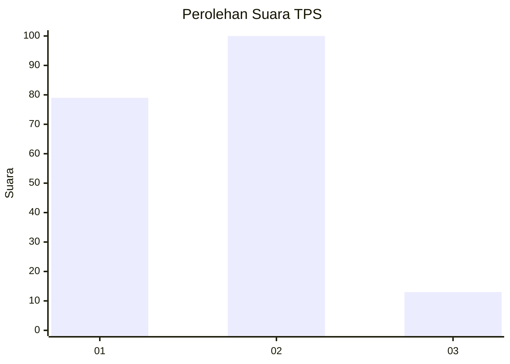

# Hasil

## Grafik

## Tabel

| No. | Nama Paslon    | Suara | Suara (raw) | Persentase |
|:--- |:-------------- | -----:| -----------:| ----------:|
| 1   | ANIES MUHAIMIN | 79    | [79][p-1]   | 41,15      |
| 2   | PRABOWO GIBRAN | 100   | [100][p-2]  | 52,08      |
| 3   | GANJAR MAHFUD  | 13    | [13][p-3]   | 6,77       |

[p-1]: https://github.com/gigit-pemilu/pemilu-2024-32-jawa-barat/blob/main/pilpres/hitung-suara/sub/32-jawa-barat/sub/01-bogor/sub/34-ranca-bungur/sub/2001-bantarjaya/sub/005-tps/sub/paslon-1.txt
[p-2]: https://github.com/gigit-pemilu/pemilu-2024-32-jawa-barat/blob/main/pilpres/hitung-suara/sub/32-jawa-barat/sub/01-bogor/sub/34-ranca-bungur/sub/2001-bantarjaya/sub/005-tps/sub/paslon-2.txt
[p-3]: https://github.com/gigit-pemilu/pemilu-2024-32-jawa-barat/blob/main/pilpres/hitung-suara/sub/32-jawa-barat/sub/01-bogor/sub/34-ranca-bungur/sub/2001-bantarjaya/sub/005-tps/sub/paslon-3.txt

## Foto C Plano

https://sirekap-obj-formc.kpu.go.id/d702/pemilu/ppwp/32/01/34/20/01/3201342001005-20240217-142956--6136b553-978a-43b6-9d9a-62e8a06277b2.jpg

https://sirekap-obj-formc.kpu.go.id/d702/pemilu/ppwp/32/01/34/20/01/3201342001005-20240217-143035--932f306f-1f50-4add-a63e-8b50df8ed400.jpg

https://sirekap-obj-formc.kpu.go.id/d702/pemilu/ppwp/32/01/34/20/01/3201342001005-20240217-143626--d58c8ecd-e6e2-4341-bc97-1baf15c2f275.jpg

## Metadata

| Key        | Value               |
| ---------- | ------------------- |
| Time Stamp | 2024-02-24 22:31:28 |

