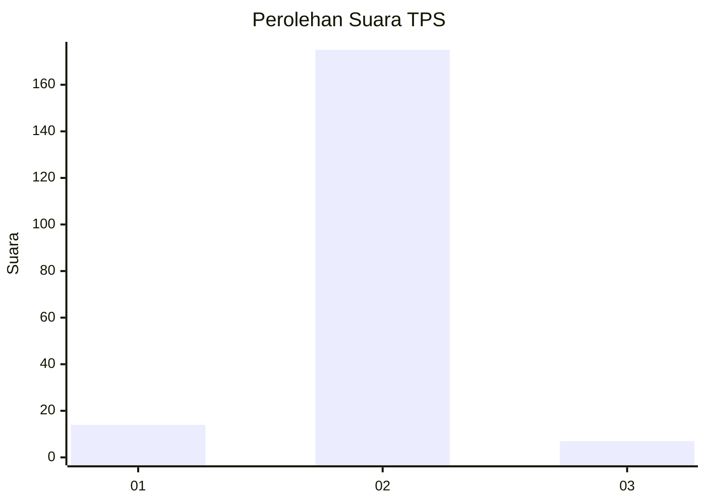
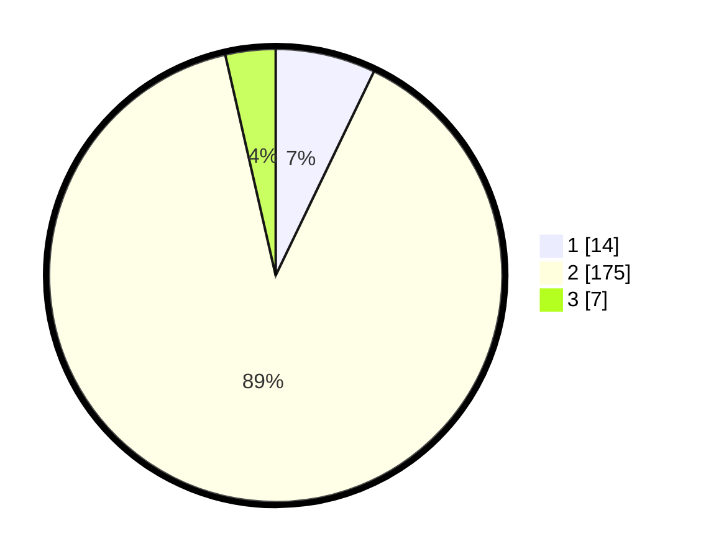

# Hasil

## Grafik

## Tabel

| No. | Nama Paslon    | Suara | Suara (raw) | Persentase |
|:--- |:-------------- | -----:| -----------:| ----------:|
| 1   | ANIES MUHAIMIN | 14    | [14][p-1]   | 7,14       |
| 2   | PRABOWO GIBRAN | 175   | [175][p-2]  | 89,29      |
| 3   | GANJAR MAHFUD  | 7     | [7][p-3]    | 3,57       |

[p-1]: https://github.com/gigit-pemilu/pemilu-2024/blob/main/pilpres/hitung-suara/sub/32-jawa-barat/sub/01-bogor/sub/35-sukajaya/sub/2009-pasir-madang/sub/001-tps/sub/paslon-1.txt
[p-2]: https://github.com/gigit-pemilu/pemilu-2024/blob/main/pilpres/hitung-suara/sub/32-jawa-barat/sub/01-bogor/sub/35-sukajaya/sub/2009-pasir-madang/sub/001-tps/sub/paslon-2.txt
[p-3]: https://github.com/gigit-pemilu/pemilu-2024/blob/main/pilpres/hitung-suara/sub/32-jawa-barat/sub/01-bogor/sub/35-sukajaya/sub/2009-pasir-madang/sub/001-tps/sub/paslon-3.txt

## Foto C Plano

https://sirekap-obj-formc.kpu.go.id/3bfa/pemilu/ppwp/32/01/35/20/09/3201352009001-20240215-101331--c8fdfee6-275b-4f92-a5c9-7cab7a418ae6.jpg

https://sirekap-obj-formc.kpu.go.id/3bfa/pemilu/ppwp/32/01/35/20/09/3201352009001-20240216-140303--8b49fe7b-7f8b-47d9-a079-ee73ea725ae6.jpg

https://sirekap-obj-formc.kpu.go.id/3bfa/pemilu/ppwp/32/01/35/20/09/3201352009001-20240216-140302--98481dde-6a1f-46c1-800f-263cce144319.jpg

## Metadata

| Key        | Value               |
| ---------- | ------------------- |
| Time Stamp | 2024-02-17 01:30:00 |

