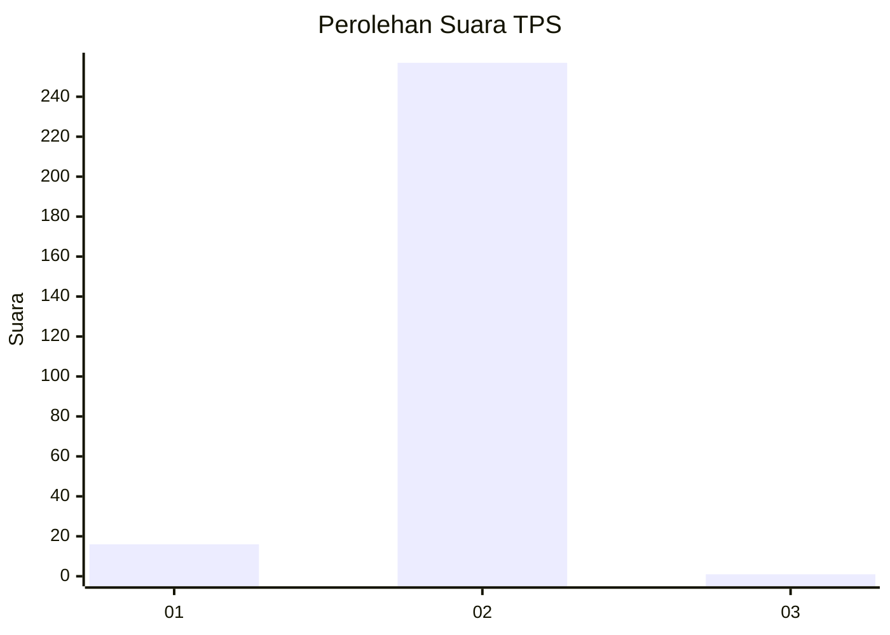
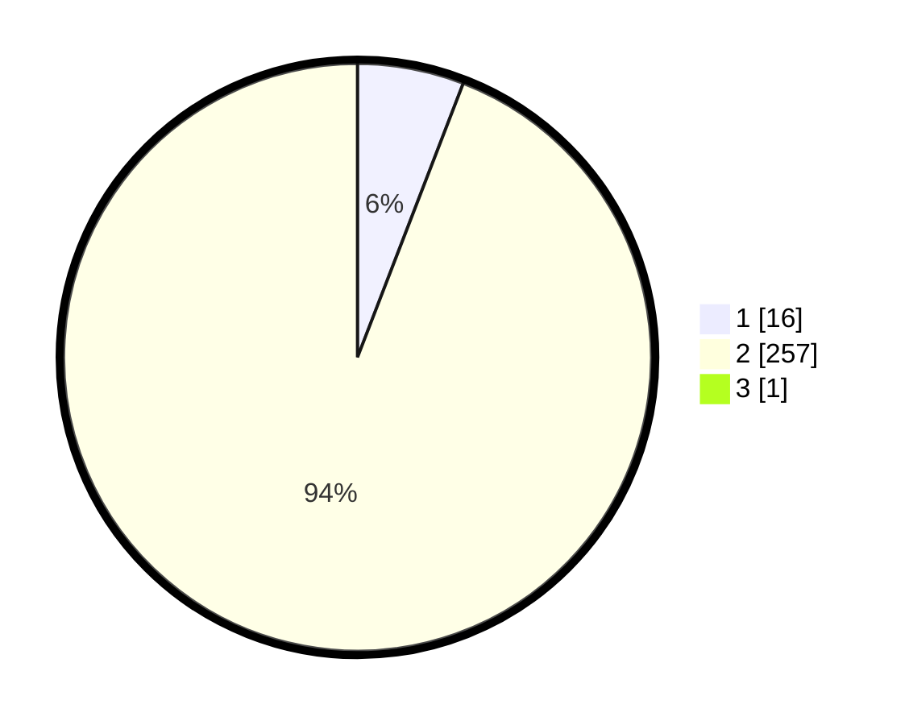

# Hasil

## Grafik

## Tabel

| No. | Nama Paslon    | Suara | Suara (raw) | Persentase |
|:--- |:-------------- | -----:| -----------:| ----------:|
| 1   | ANIES MUHAIMIN | 16    | [16][p-1]   | 5,84       |
| 2   | PRABOWO GIBRAN | 257   | [257][p-2]  | 93,80      |
| 3   | GANJAR MAHFUD  | 1     | [1][p-3]    | 0,36       |

[p-1]: https://github.com/gigit-pemilu/pemilu-2024/blob/main/pilpres/hitung-suara/sub/32-jawa-barat/sub/01-bogor/sub/35-sukajaya/sub/2009-pasir-madang/sub/003-tps/sub/paslon-1.txt
[p-2]: https://github.com/gigit-pemilu/pemilu-2024/blob/main/pilpres/hitung-suara/sub/32-jawa-barat/sub/01-bogor/sub/35-sukajaya/sub/2009-pasir-madang/sub/003-tps/sub/paslon-2.txt
[p-3]: https://github.com/gigit-pemilu/pemilu-2024/blob/main/pilpres/hitung-suara/sub/32-jawa-barat/sub/01-bogor/sub/35-sukajaya/sub/2009-pasir-madang/sub/003-tps/sub/paslon-3.txt

## Foto C Plano

https://sirekap-obj-formc.kpu.go.id/a2ee/pemilu/ppwp/32/01/35/20/09/3201352009003-20240214-225511--774e0207-3b7d-4048-8ca1-efe4467ddf71.jpg

https://sirekap-obj-formc.kpu.go.id/a2ee/pemilu/ppwp/32/01/35/20/09/3201352009003-20240214-225856--85efd8aa-4be4-416f-a6a4-f7aece9bd86e.jpg

https://sirekap-obj-formc.kpu.go.id/a2ee/pemilu/ppwp/32/01/35/20/09/3201352009003-20240214-230427--5614791b-6d25-49de-8717-89cb704a45e7.jpg

## Metadata

| Key        | Value               |
| ---------- | ------------------- |
| Time Stamp | 2024-02-15 15:00:29 |

