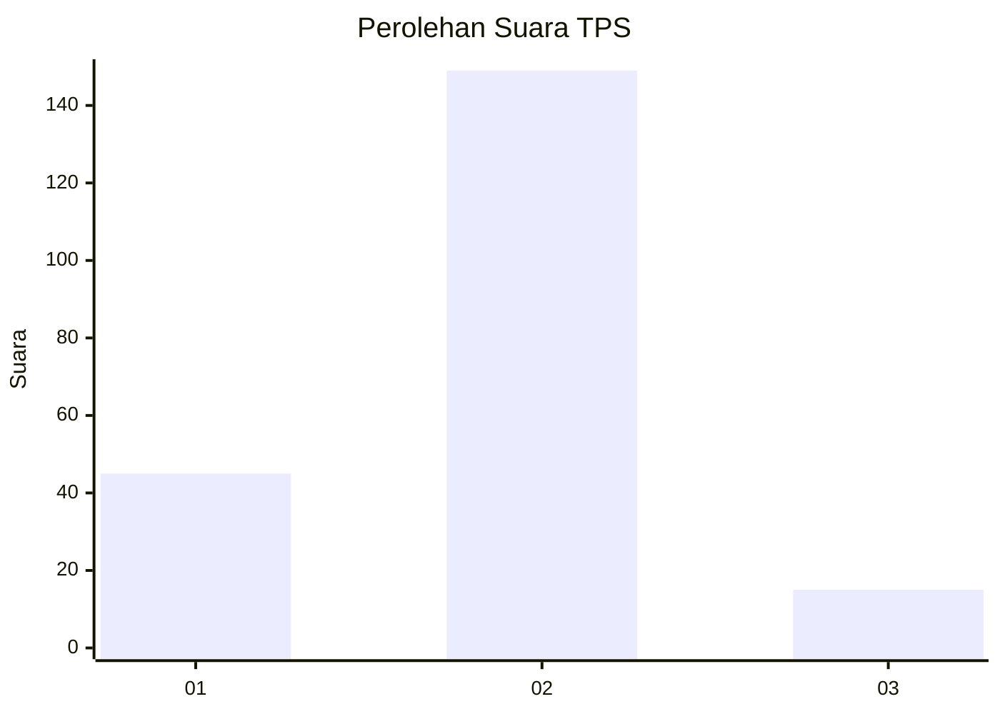

# Hasil

## Grafik

## Tabel

| No. | Nama Paslon    | Suara | Suara (raw) | Persentase |
|:--- |:-------------- | -----:| -----------:| ----------:|
| 1   | ANIES MUHAIMIN | 45    | [45][p-1]   | 21,53      |
| 2   | PRABOWO GIBRAN | 149   | [149][p-2]  | 71,29      |
| 3   | GANJAR MAHFUD  | 15    | [15][p-3]   | 7,18       |

[p-1]: https://github.com/gigit-pemilu/pemilu-2024-32-jawa-barat/blob/main/pilpres/hitung-suara/sub/32-jawa-barat/sub/01-bogor/sub/36-tanjungsari/sub/2001-tanjungsari/sub/001-tps/sub/paslon-1.txt
[p-2]: https://github.com/gigit-pemilu/pemilu-2024-32-jawa-barat/blob/main/pilpres/hitung-suara/sub/32-jawa-barat/sub/01-bogor/sub/36-tanjungsari/sub/2001-tanjungsari/sub/001-tps/sub/paslon-2.txt
[p-3]: https://github.com/gigit-pemilu/pemilu-2024-32-jawa-barat/blob/main/pilpres/hitung-suara/sub/32-jawa-barat/sub/01-bogor/sub/36-tanjungsari/sub/2001-tanjungsari/sub/001-tps/sub/paslon-3.txt

## Foto C Plano

https://sirekap-obj-formc.kpu.go.id/25d9/pemilu/ppwp/32/01/36/20/01/3201362001001-20240215-012004--4d65bd75-5a8d-415e-bdcf-d573f5711fb3.jpg

https://sirekap-obj-formc.kpu.go.id/25d9/pemilu/ppwp/32/01/36/20/01/3201362001001-20240215-012021--5abf200c-083b-47ba-b278-07889f4f63ab.jpg

https://sirekap-obj-formc.kpu.go.id/25d9/pemilu/ppwp/32/01/36/20/01/3201362001001-20240215-012028--4252cc17-ef4c-4ef6-bde5-9257da278d7a.jpg

## Metadata

| Key        | Value               |
| ---------- | ------------------- |
| Time Stamp | 2024-02-15 20:00:44 |

