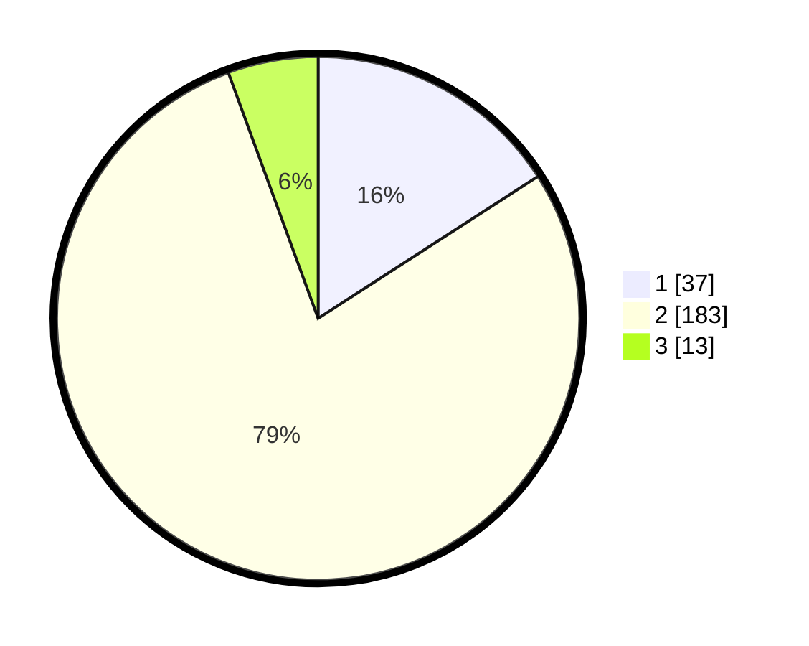

# Hasil

## Grafik

## Tabel

| No. | Nama Paslon    | Suara | Suara (raw) | Persentase |
|:--- |:-------------- | -----:| -----------:| ----------:|
| 1   | ANIES MUHAIMIN | 37    | [37][p-1]   | 15,88      |
| 2   | PRABOWO GIBRAN | 183   | [183][p-2]  | 78,54      |
| 3   | GANJAR MAHFUD  | 13    | [13][p-3]   | 5,58       |

[p-1]: https://github.com/gigit-pemilu/pemilu-2024/blob/main/pilpres/hitung-suara/sub/32-jawa-barat/sub/01-bogor/sub/36-tanjungsari/sub/2001-tanjungsari/sub/005-tps/sub/paslon-1.txt
[p-2]: https://github.com/gigit-pemilu/pemilu-2024/blob/main/pilpres/hitung-suara/sub/32-jawa-barat/sub/01-bogor/sub/36-tanjungsari/sub/2001-tanjungsari/sub/005-tps/sub/paslon-2.txt
[p-3]: https://github.com/gigit-pemilu/pemilu-2024/blob/main/pilpres/hitung-suara/sub/32-jawa-barat/sub/01-bogor/sub/36-tanjungsari/sub/2001-tanjungsari/sub/005-tps/sub/paslon-3.txt

## Foto C Plano

https://sirekap-obj-formc.kpu.go.id/e57e/pemilu/ppwp/32/01/36/20/01/3201362001005-20240214-201322--b4ad6c8e-e751-40b8-85b3-af890b4fac30.jpg

https://sirekap-obj-formc.kpu.go.id/e57e/pemilu/ppwp/32/01/36/20/01/3201362001005-20240214-201434--04dd0fbb-8627-483f-80de-740eb04e4e95.jpg

https://sirekap-obj-formc.kpu.go.id/e57e/pemilu/ppwp/32/01/36/20/01/3201362001005-20240214-201531--813152d1-f336-43c7-b318-62192b2ebbe4.jpg

## Metadata

| Key        | Value               |
| ---------- | ------------------- |
| Time Stamp | 2024-02-15 20:00:44 |

