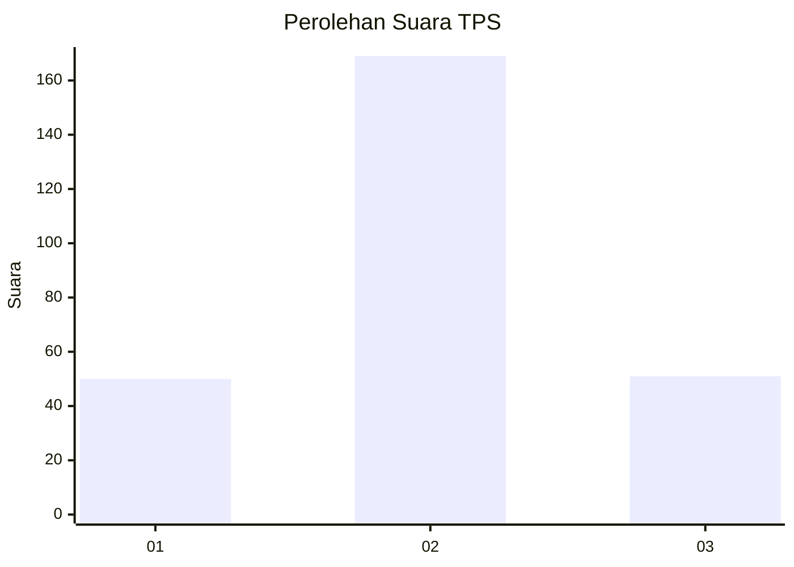
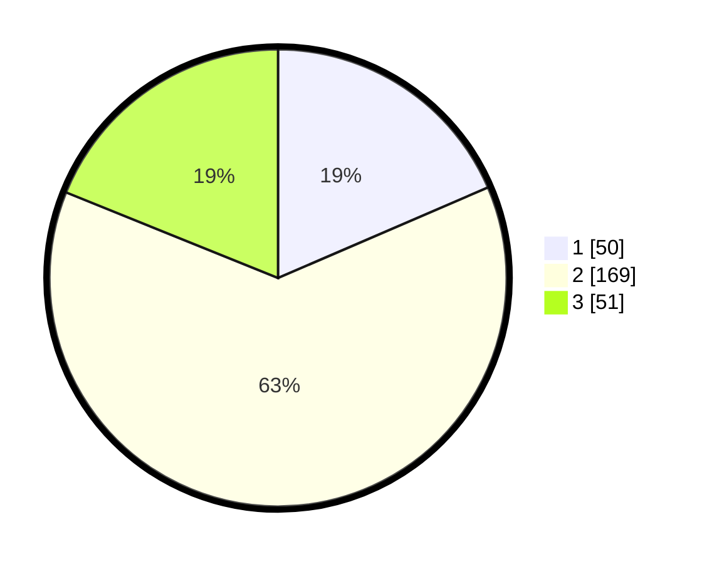

# Hasil

## Grafik

## Tabel

| No. | Nama Paslon    | Suara | Suara (raw) | Persentase |
|:--- |:-------------- | -----:| -----------:| ----------:|
| 1   | ANIES MUHAIMIN | 50    | [50][p-1]   | 18,52      |
| 2   | PRABOWO GIBRAN | 169   | [169][p-2]  | 62,59      |
| 3   | GANJAR MAHFUD  | 51    | [51][p-3]   | 18,89      |

[p-1]: https://github.com/gigit-pemilu/pemilu-2024/blob/main/pilpres/hitung-suara/sub/32-jawa-barat/sub/01-bogor/sub/37-tajurhalang/sub/2001-tajurhalang/sub/022-tps/sub/paslon-1.txt
[p-2]: https://github.com/gigit-pemilu/pemilu-2024/blob/main/pilpres/hitung-suara/sub/32-jawa-barat/sub/01-bogor/sub/37-tajurhalang/sub/2001-tajurhalang/sub/022-tps/sub/paslon-2.txt
[p-3]: https://github.com/gigit-pemilu/pemilu-2024/blob/main/pilpres/hitung-suara/sub/32-jawa-barat/sub/01-bogor/sub/37-tajurhalang/sub/2001-tajurhalang/sub/022-tps/sub/paslon-3.txt

## Foto C Plano

https://sirekap-obj-formc.kpu.go.id/e61c/pemilu/ppwp/32/01/37/20/01/3201372001022-20240214-155907--76491536-57c7-4d5f-92c4-4b3c2f7f4c64.jpg

https://sirekap-obj-formc.kpu.go.id/e61c/pemilu/ppwp/32/01/37/20/01/3201372001022-20240214-155742--7bb99941-c9b5-49b4-a115-2105ed62c2cd.jpg

https://sirekap-obj-formc.kpu.go.id/e61c/pemilu/ppwp/32/01/37/20/01/3201372001022-20240214-155828--a0a5c803-e03f-40a0-a1a7-9c564d27e0f9.jpg

## Metadata

| Key        | Value               |
| ---------- | ------------------- |
| Time Stamp | 2024-02-15 22:00:27 |

