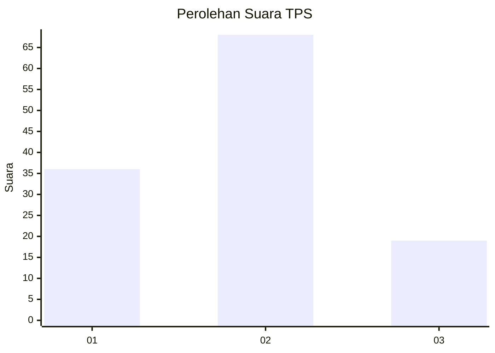
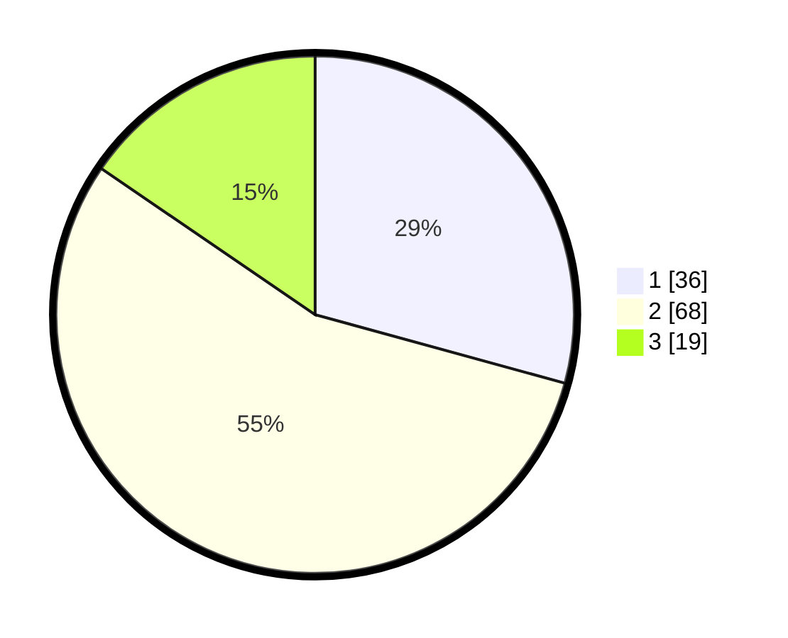

# Hasil

## Grafik

## Tabel

| No. | Nama Paslon    | Suara | Suara (raw) | Persentase |
|:--- |:-------------- | -----:| -----------:| ----------:|
| 1   | ANIES MUHAIMIN | 36    | [36][p-1]   | 29,27      |
| 2   | PRABOWO GIBRAN | 68    | [68][p-2]   | 55,28      |
| 3   | GANJAR MAHFUD  | 19    | [19][p-3]   | 15,45      |

[p-1]: https://github.com/gigit-pemilu/pemilu-2024/blob/main/pilpres/hitung-suara/sub/32-jawa-barat/sub/01-bogor/sub/37-tajurhalang/sub/2006-tonjong/sub/028-tps/sub/paslon-1.txt
[p-2]: https://github.com/gigit-pemilu/pemilu-2024/blob/main/pilpres/hitung-suara/sub/32-jawa-barat/sub/01-bogor/sub/37-tajurhalang/sub/2006-tonjong/sub/028-tps/sub/paslon-2.txt
[p-3]: https://github.com/gigit-pemilu/pemilu-2024/blob/main/pilpres/hitung-suara/sub/32-jawa-barat/sub/01-bogor/sub/37-tajurhalang/sub/2006-tonjong/sub/028-tps/sub/paslon-3.txt

## Foto C Plano

https://sirekap-obj-formc.kpu.go.id/e76a/pemilu/ppwp/32/01/37/20/06/3201372006028-20240214-230609--6a51a61d-70a9-441c-aff3-7eb850d4a59c.jpg

https://sirekap-obj-formc.kpu.go.id/e76a/pemilu/ppwp/32/01/37/20/06/3201372006028-20240214-225543--a3f23ff4-dcd7-4e2a-b797-512b22e7abc0.jpg

https://sirekap-obj-formc.kpu.go.id/e76a/pemilu/ppwp/32/01/37/20/06/3201372006028-20240214-230712--0021d4e9-00f8-4711-9bfd-b675d4117eb1.jpg

## Metadata

| Key        | Value               |
| ---------- | ------------------- |
| Time Stamp | 2024-02-19 06:16:00 |

