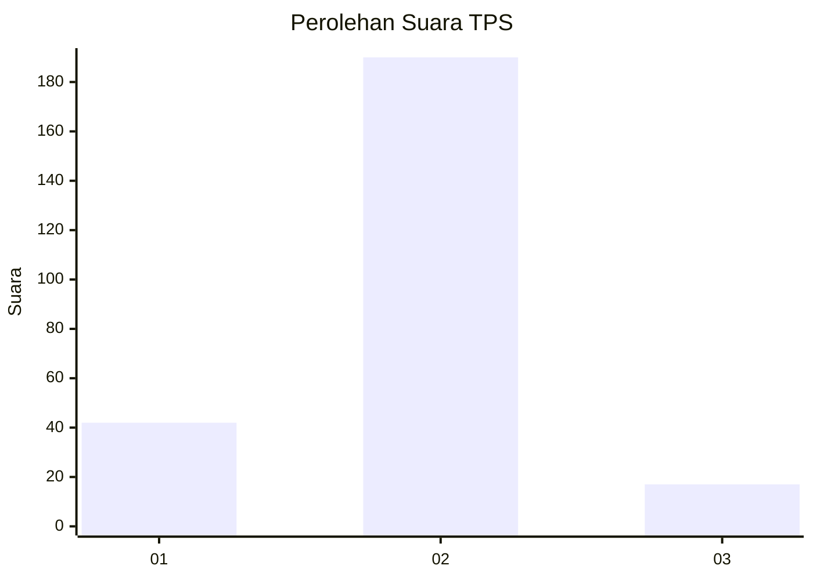
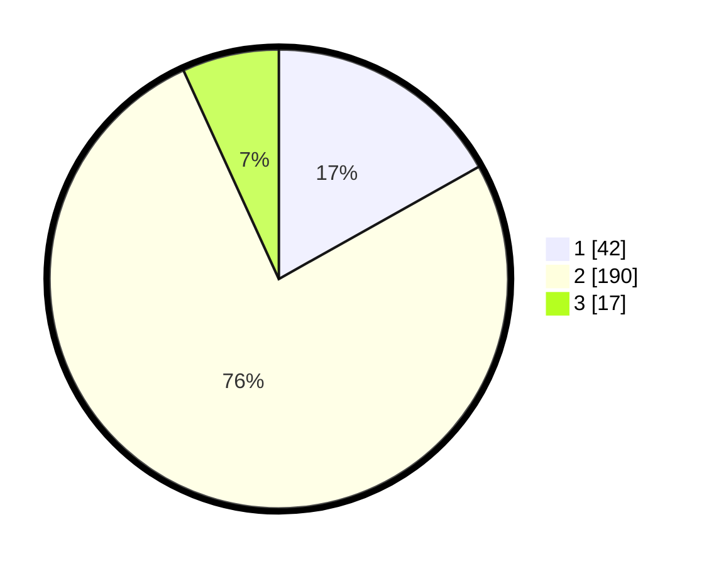

# Hasil

## Grafik

## Tabel

| No. | Nama Paslon    | Suara | Suara (raw) | Persentase |
|:--- |:-------------- | -----:| -----------:| ----------:|
| 1   | ANIES MUHAIMIN | 42    | [42][p-1]   | 16,87      |
| 2   | PRABOWO GIBRAN | 190   | [190][p-2]  | 76,31      |
| 3   | GANJAR MAHFUD  | 17    | [17][p-3]   | 6,83       |

[p-1]: https://github.com/gigit-pemilu/pemilu-2024/blob/main/pilpres/hitung-suara/sub/32-jawa-barat/sub/01-bogor/sub/38-cigombong/sub/2001-cigombong/sub/002-tps/sub/paslon-1.txt
[p-2]: https://github.com/gigit-pemilu/pemilu-2024/blob/main/pilpres/hitung-suara/sub/32-jawa-barat/sub/01-bogor/sub/38-cigombong/sub/2001-cigombong/sub/002-tps/sub/paslon-2.txt
[p-3]: https://github.com/gigit-pemilu/pemilu-2024/blob/main/pilpres/hitung-suara/sub/32-jawa-barat/sub/01-bogor/sub/38-cigombong/sub/2001-cigombong/sub/002-tps/sub/paslon-3.txt

## Foto C Plano

https://sirekap-obj-formc.kpu.go.id/647e/pemilu/ppwp/32/01/38/20/01/3201382001002-20240215-003758--19344e82-02d7-4b37-88c6-9cf5b719e552.jpg

https://sirekap-obj-formc.kpu.go.id/647e/pemilu/ppwp/32/01/38/20/01/3201382001002-20240216-104905--2e666a37-1163-46b4-bcf3-3fadcb044fa5.jpg

https://sirekap-obj-formc.kpu.go.id/647e/pemilu/ppwp/32/01/38/20/01/3201382001002-20240216-104902--39d9923f-58c1-43a0-a3a6-98feb659b18f.jpg

## Metadata

| Key        | Value               |
| ---------- | ------------------- |
| Time Stamp | 2024-02-16 12:51:22 |

