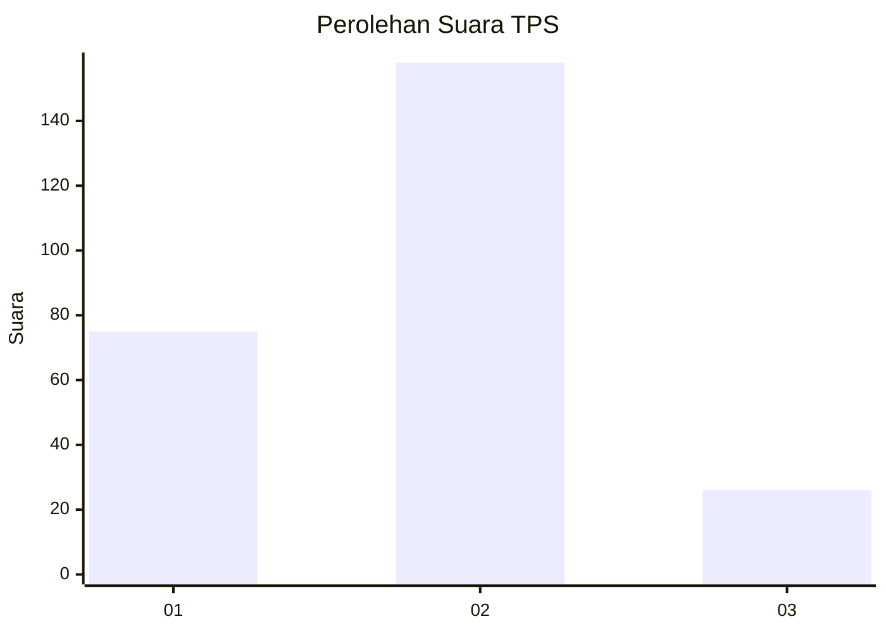
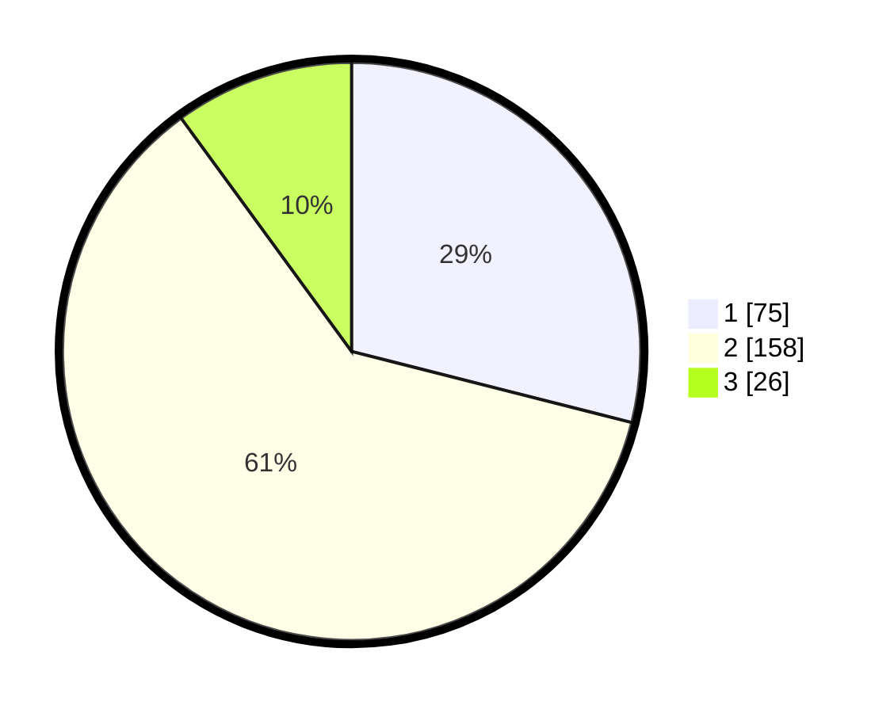

# Hasil

## Grafik

## Tabel

| No. | Nama Paslon    | Suara | Suara (raw) | Persentase |
|:--- |:-------------- | -----:| -----------:| ----------:|
| 1   | ANIES MUHAIMIN | 75    | [75][p-1]   | 28,96      |
| 2   | PRABOWO GIBRAN | 158   | [158][p-2]  | 61,00      |
| 3   | GANJAR MAHFUD  | 26    | [26][p-3]   | 10,04      |

[p-1]: https://github.com/gigit-pemilu/pemilu-2024/blob/main/pilpres/hitung-suara/sub/32-jawa-barat/sub/01-bogor/sub/38-cigombong/sub/2001-cigombong/sub/003-tps/sub/paslon-1.txt
[p-2]: https://github.com/gigit-pemilu/pemilu-2024/blob/main/pilpres/hitung-suara/sub/32-jawa-barat/sub/01-bogor/sub/38-cigombong/sub/2001-cigombong/sub/003-tps/sub/paslon-2.txt
[p-3]: https://github.com/gigit-pemilu/pemilu-2024/blob/main/pilpres/hitung-suara/sub/32-jawa-barat/sub/01-bogor/sub/38-cigombong/sub/2001-cigombong/sub/003-tps/sub/paslon-3.txt

## Foto C Plano

https://sirekap-obj-formc.kpu.go.id/0065/pemilu/ppwp/32/01/38/20/01/3201382001003-20240214-232243--2ce3558a-84d7-4660-9929-f306a102edfb.jpg

https://sirekap-obj-formc.kpu.go.id/0065/pemilu/ppwp/32/01/38/20/01/3201382001003-20240214-232435--e743a766-b080-4a90-9057-cf80318b0569.jpg

https://sirekap-obj-formc.kpu.go.id/0065/pemilu/ppwp/32/01/38/20/01/3201382001003-20240214-232331--bcec4f04-f06c-4c02-a210-55b0efd018cf.jpg

## Metadata

| Key        | Value               |
| ---------- | ------------------- |
| Time Stamp | 2024-02-15 21:01:18 |

