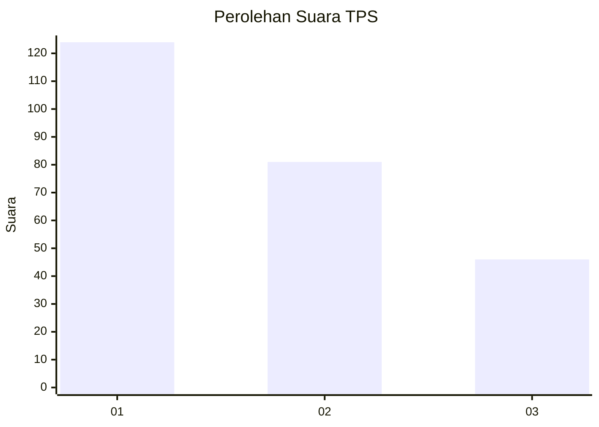
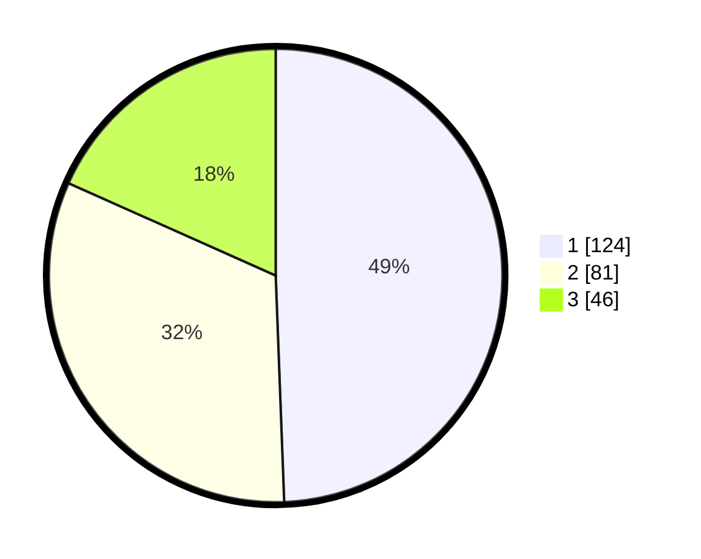

# Hasil

## Grafik

## Tabel

| No. | Nama Paslon    | Suara | Suara (raw) | Persentase |
|:--- |:-------------- | -----:| -----------:| ----------:|
| 1   | ANIES MUHAIMIN | 124   | [124][p-1]  | 49,40      |
| 2   | PRABOWO GIBRAN | 81    | [81][p-2]   | 32,27      |
| 3   | GANJAR MAHFUD  | 46    | [46][p-3]   | 18,33      |

[p-1]: https://github.com/gigit-pemilu/pemilu-2024/blob/main/pilpres/hitung-suara/sub/32-jawa-barat/sub/01-bogor/sub/38-cigombong/sub/2003-ciburuy/sub/016-tps/sub/paslon-1.txt
[p-2]: https://github.com/gigit-pemilu/pemilu-2024/blob/main/pilpres/hitung-suara/sub/32-jawa-barat/sub/01-bogor/sub/38-cigombong/sub/2003-ciburuy/sub/016-tps/sub/paslon-2.txt
[p-3]: https://github.com/gigit-pemilu/pemilu-2024/blob/main/pilpres/hitung-suara/sub/32-jawa-barat/sub/01-bogor/sub/38-cigombong/sub/2003-ciburuy/sub/016-tps/sub/paslon-3.txt

## Foto C Plano

https://sirekap-obj-formc.kpu.go.id/cae9/pemilu/ppwp/32/01/38/20/03/3201382003016-20240214-214203--97054473-ea2c-4274-bda7-89cbeaccab20.jpg

https://sirekap-obj-formc.kpu.go.id/cae9/pemilu/ppwp/32/01/38/20/03/3201382003016-20240214-214455--3e622cb4-c6a1-49a1-9031-0c8469a98a5d.jpg

https://sirekap-obj-formc.kpu.go.id/cae9/pemilu/ppwp/32/01/38/20/03/3201382003016-20240214-214058--2f14592a-01af-4110-ba10-3924cc5d1910.jpg

## Metadata

| Key        | Value               |
| ---------- | ------------------- |
| Time Stamp | 2024-02-15 21:01:18 |

