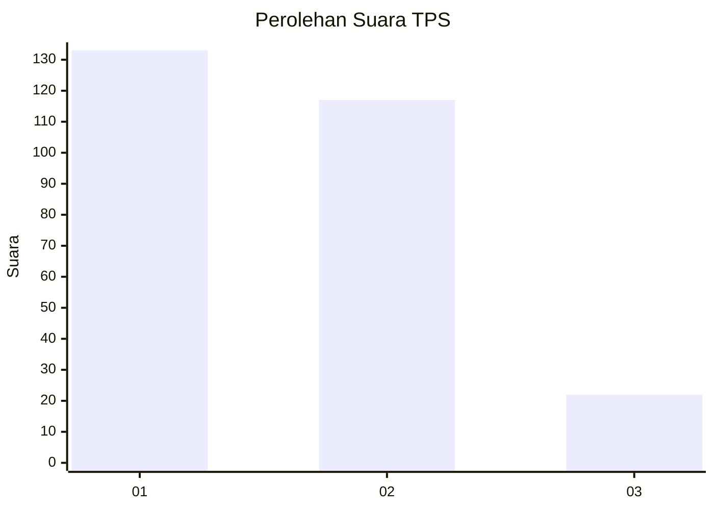
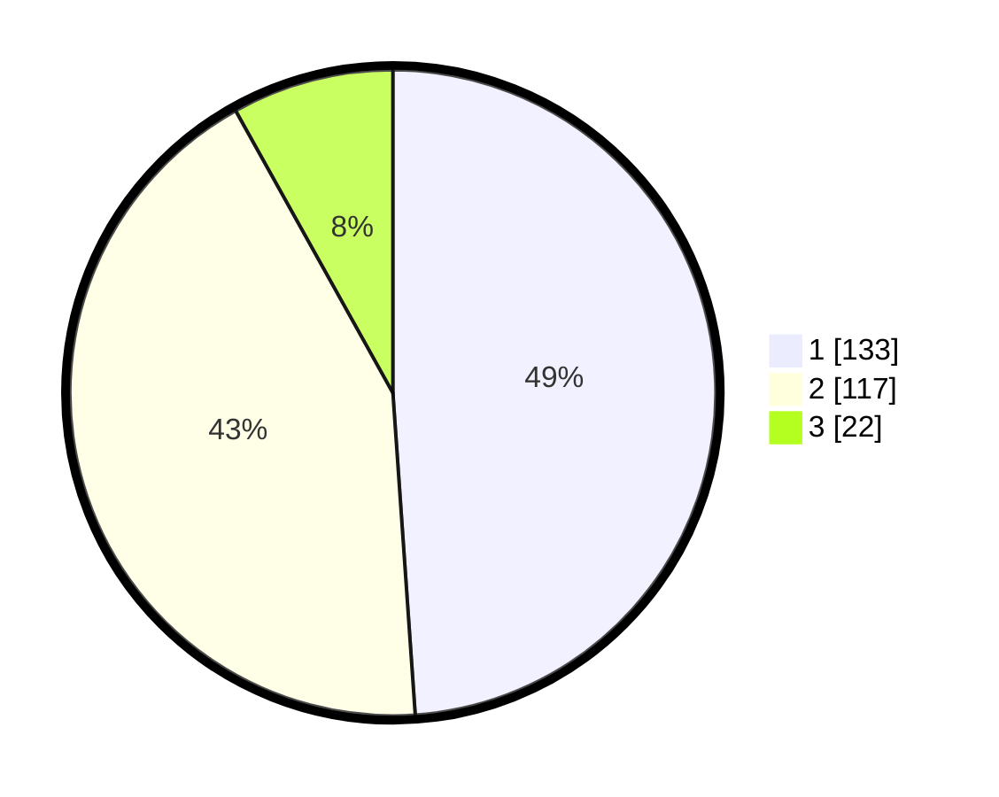

# Hasil

## Grafik

## Tabel

| No. | Nama Paslon    | Suara | Suara (raw) | Persentase |
|:--- |:-------------- | -----:| -----------:| ----------:|
| 1   | ANIES MUHAIMIN | 133   | [133][p-1]  | 48,90      |
| 2   | PRABOWO GIBRAN | 117   | [117][p-2]  | 43,01      |
| 3   | GANJAR MAHFUD  | 22    | [22][p-3]   | 8,09       |

[p-1]: https://github.com/gigit-pemilu/pemilu-2024-32-jawa-barat/blob/main/pilpres/hitung-suara/sub/32-jawa-barat/sub/01-bogor/sub/38-cigombong/sub/2004-srogol/sub/012-tps/sub/paslon-1.txt
[p-2]: https://github.com/gigit-pemilu/pemilu-2024-32-jawa-barat/blob/main/pilpres/hitung-suara/sub/32-jawa-barat/sub/01-bogor/sub/38-cigombong/sub/2004-srogol/sub/012-tps/sub/paslon-2.txt
[p-3]: https://github.com/gigit-pemilu/pemilu-2024-32-jawa-barat/blob/main/pilpres/hitung-suara/sub/32-jawa-barat/sub/01-bogor/sub/38-cigombong/sub/2004-srogol/sub/012-tps/sub/paslon-3.txt

## Foto C Plano

https://sirekap-obj-formc.kpu.go.id/de78/pemilu/ppwp/32/01/38/20/04/3201382004012-20240215-121053--2ee9bdaf-0b2d-4cfe-ad00-96d5292b0ae1.jpg

https://sirekap-obj-formc.kpu.go.id/de78/pemilu/ppwp/32/01/38/20/04/3201382004012-20240215-121503--6b5a8736-93d9-43a1-bcb6-50f6f7404e1e.jpg

https://sirekap-obj-formc.kpu.go.id/de78/pemilu/ppwp/32/01/38/20/04/3201382004012-20240215-121552--c529f430-2ed0-4f62-9a6b-074fb1206084.jpg

## Metadata

| Key        | Value               |
| ---------- | ------------------- |
| Time Stamp | 2024-02-16 16:25:10 |

