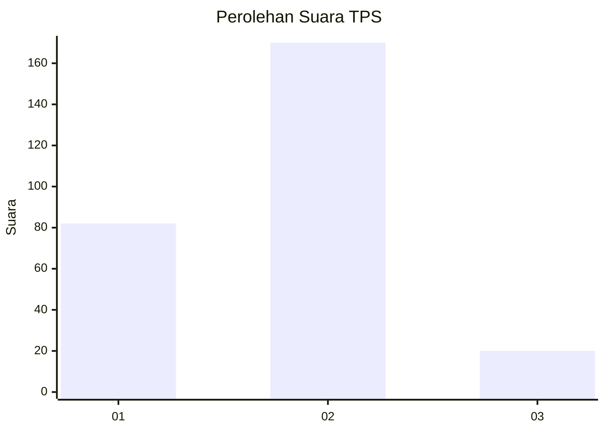
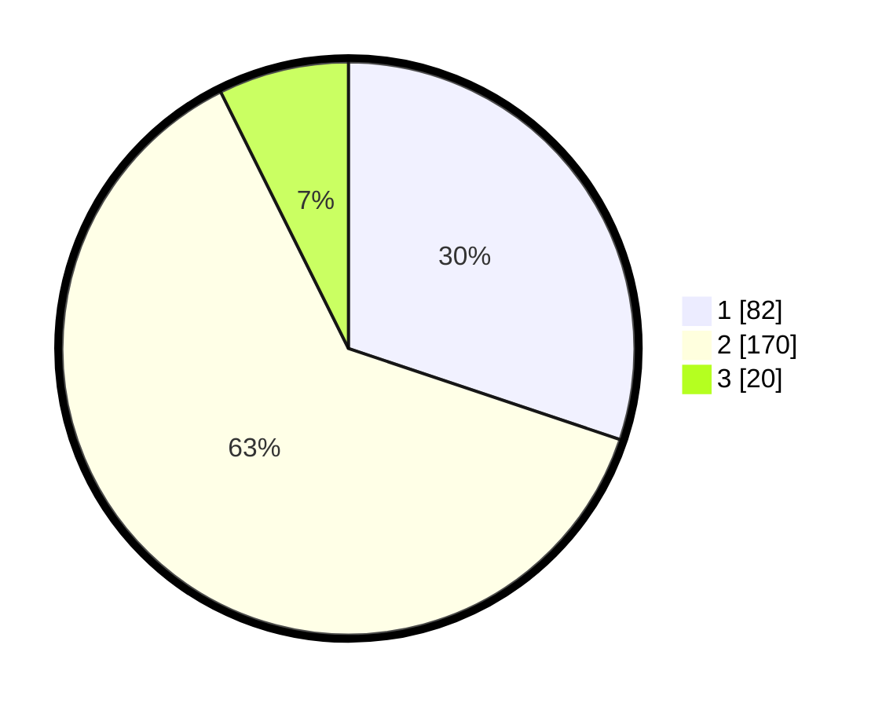

# Hasil

## Grafik

## Tabel

| No. | Nama Paslon    | Suara | Suara (raw) | Persentase |
|:--- |:-------------- | -----:| -----------:| ----------:|
| 1   | ANIES MUHAIMIN | 82    | [82][p-1]   | 30,15      |
| 2   | PRABOWO GIBRAN | 170   | [170][p-2]  | 62,50      |
| 3   | GANJAR MAHFUD  | 20    | [20][p-3]   | 7,35       |

[p-1]: https://github.com/gigit-pemilu/pemilu-2024-32-jawa-barat/blob/main/pilpres/hitung-suara/sub/32-jawa-barat/sub/01-bogor/sub/38-cigombong/sub/2004-srogol/sub/015-tps/sub/paslon-1.txt
[p-2]: https://github.com/gigit-pemilu/pemilu-2024-32-jawa-barat/blob/main/pilpres/hitung-suara/sub/32-jawa-barat/sub/01-bogor/sub/38-cigombong/sub/2004-srogol/sub/015-tps/sub/paslon-2.txt
[p-3]: https://github.com/gigit-pemilu/pemilu-2024-32-jawa-barat/blob/main/pilpres/hitung-suara/sub/32-jawa-barat/sub/01-bogor/sub/38-cigombong/sub/2004-srogol/sub/015-tps/sub/paslon-3.txt

## Foto C Plano

https://sirekap-obj-formc.kpu.go.id/a770/pemilu/ppwp/32/01/38/20/04/3201382004015-20240215-014421--39d48b83-3afa-4628-86d0-02eed15058a3.jpg

https://sirekap-obj-formc.kpu.go.id/a770/pemilu/ppwp/32/01/38/20/04/3201382004015-20240215-014703--a8ee1c14-eb02-4cea-af75-61ecb5e49c8f.jpg

https://sirekap-obj-formc.kpu.go.id/a770/pemilu/ppwp/32/01/38/20/04/3201382004015-20240215-014810--df7cef2d-1da4-4a55-8a2e-20a7e8b50a0f.jpg

## Metadata

| Key        | Value               |
| ---------- | ------------------- |
| Time Stamp | 2024-02-16 16:25:10 |

