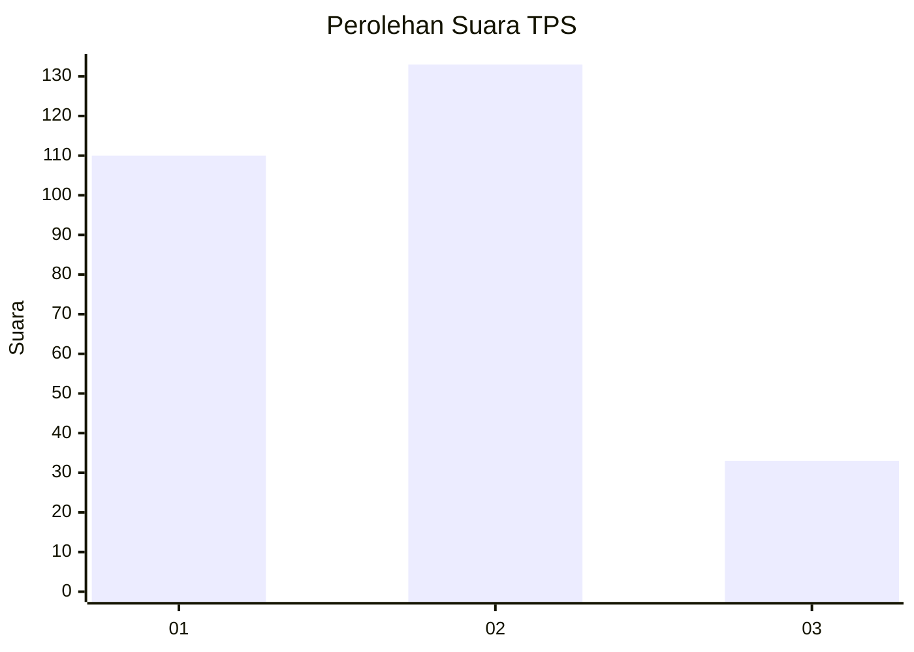
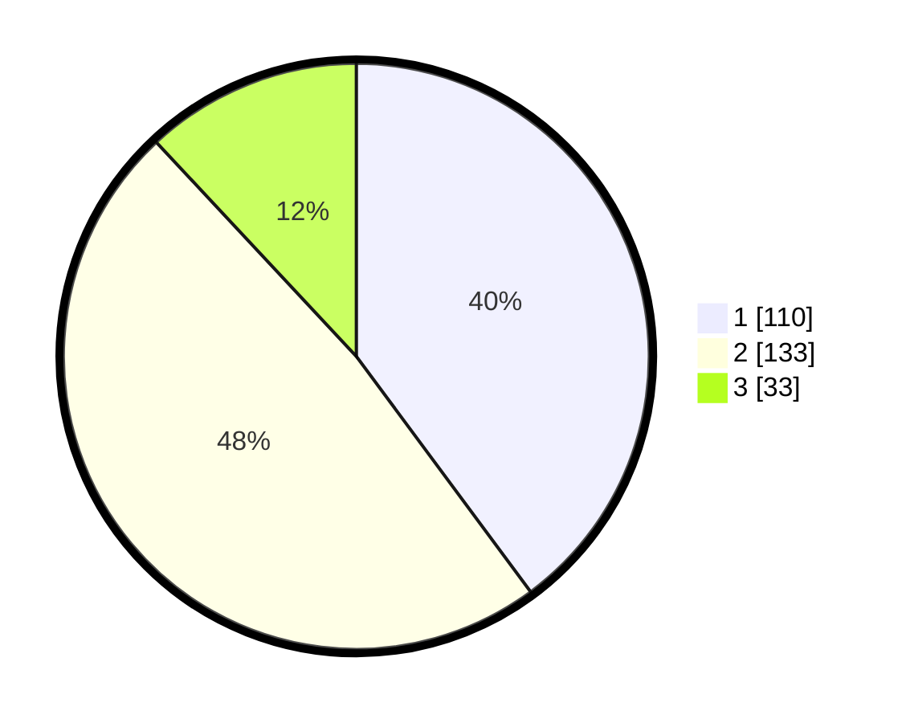

# Hasil

## Grafik

## Tabel

| No. | Nama Paslon    | Suara | Suara (raw) | Persentase |
|:--- |:-------------- | -----:| -----------:| ----------:|
| 1   | ANIES MUHAIMIN | 110   | [110][p-1]  | 39,86      |
| 2   | PRABOWO GIBRAN | 133   | [133][p-2]  | 48,19      |
| 3   | GANJAR MAHFUD  | 33    | [33][p-3]   | 11,96      |

[p-1]: https://github.com/gigit-pemilu/pemilu-2024/blob/main/pilpres/hitung-suara/sub/32-jawa-barat/sub/01-bogor/sub/38-cigombong/sub/2004-srogol/sub/016-tps/sub/paslon-1.txt
[p-2]: https://github.com/gigit-pemilu/pemilu-2024/blob/main/pilpres/hitung-suara/sub/32-jawa-barat/sub/01-bogor/sub/38-cigombong/sub/2004-srogol/sub/016-tps/sub/paslon-2.txt
[p-3]: https://github.com/gigit-pemilu/pemilu-2024/blob/main/pilpres/hitung-suara/sub/32-jawa-barat/sub/01-bogor/sub/38-cigombong/sub/2004-srogol/sub/016-tps/sub/paslon-3.txt

## Foto C Plano

https://sirekap-obj-formc.kpu.go.id/3961/pemilu/ppwp/32/01/38/20/04/3201382004016-20240214-233234--130ba663-bc46-4f09-8849-5388354ff5a3.jpg

https://sirekap-obj-formc.kpu.go.id/3961/pemilu/ppwp/32/01/38/20/04/3201382004016-20240214-234047--316a4ad2-8ea8-42dd-a0e2-d3836b3b590d.jpg

https://sirekap-obj-formc.kpu.go.id/3961/pemilu/ppwp/32/01/38/20/04/3201382004016-20240214-234424--8e95239b-71d5-4546-b866-7ffc0b478ade.jpg

## Metadata

| Key        | Value               |
| ---------- | ------------------- |
| Time Stamp | 2024-02-16 16:25:10 |

