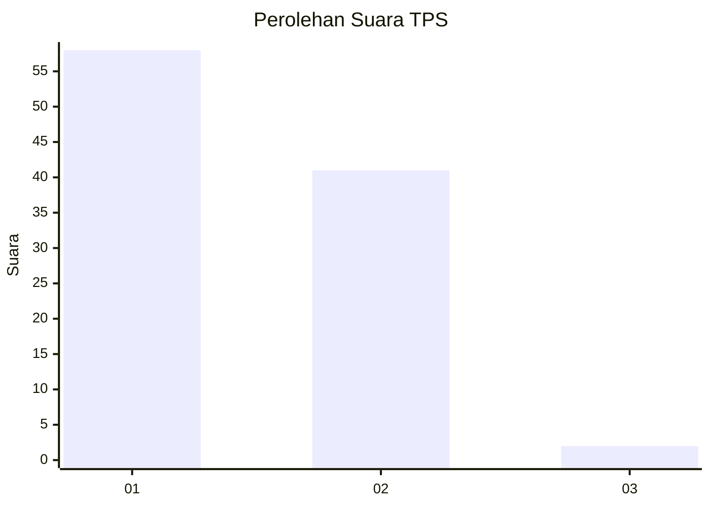
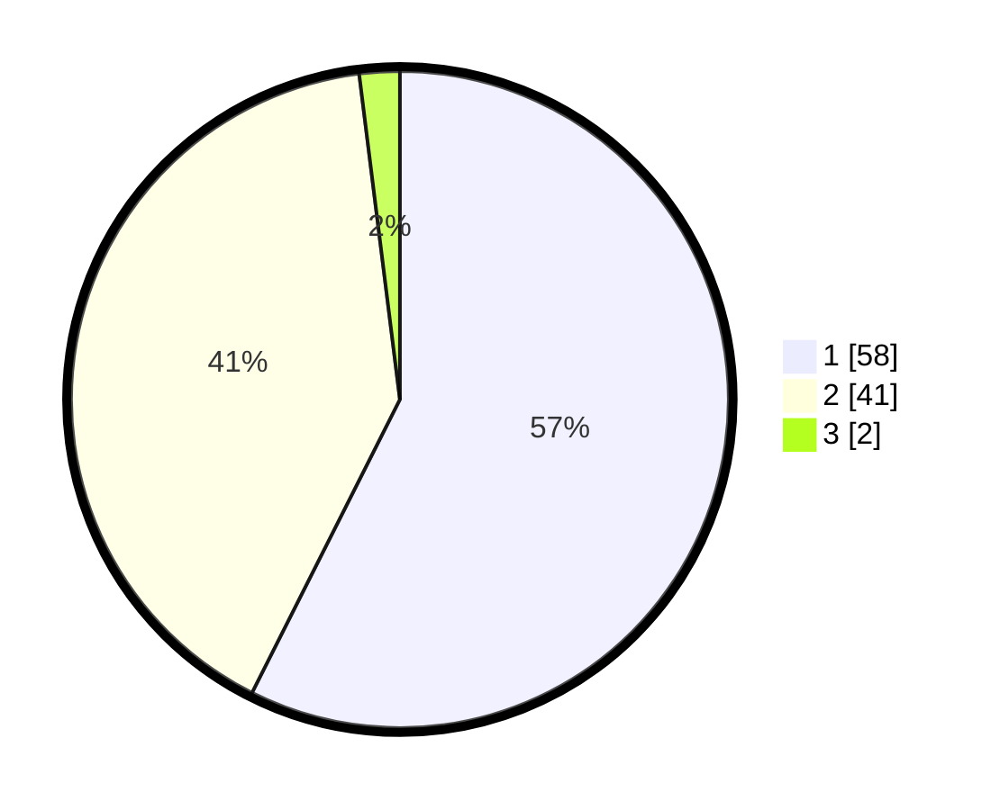

# Hasil

## Grafik

## Tabel

| No. | Nama Paslon    | Suara | Suara (raw) | Persentase |
|:--- |:-------------- | -----:| -----------:| ----------:|
| 1   | ANIES MUHAIMIN | 58    | [58][p-1]   | 57,43      |
| 2   | PRABOWO GIBRAN | 41    | [41][p-2]   | 40,59      |
| 3   | GANJAR MAHFUD  | 2     | [2][p-3]    | 1,98       |

[p-1]: https://github.com/gigit-pemilu/pemilu-2024/blob/main/pilpres/hitung-suara/sub/32-jawa-barat/sub/01-bogor/sub/38-cigombong/sub/2005-cisalada/sub/011-tps/sub/paslon-1.txt
[p-2]: https://github.com/gigit-pemilu/pemilu-2024/blob/main/pilpres/hitung-suara/sub/32-jawa-barat/sub/01-bogor/sub/38-cigombong/sub/2005-cisalada/sub/011-tps/sub/paslon-2.txt
[p-3]: https://github.com/gigit-pemilu/pemilu-2024/blob/main/pilpres/hitung-suara/sub/32-jawa-barat/sub/01-bogor/sub/38-cigombong/sub/2005-cisalada/sub/011-tps/sub/paslon-3.txt

## Foto C Plano

https://sirekap-obj-formc.kpu.go.id/0518/pemilu/ppwp/32/01/38/20/05/3201382005011-20240214-235224--524dbd26-0e52-41e5-9fce-c548b82a3dbf.jpg

https://sirekap-obj-formc.kpu.go.id/0518/pemilu/ppwp/32/01/38/20/05/3201382005011-20240214-235406--a76613a5-b0b2-4209-818d-9a39bde4671d.jpg

https://sirekap-obj-formc.kpu.go.id/0518/pemilu/ppwp/32/01/38/20/05/3201382005011-20240214-235431--fe4614ca-5ae4-4d71-adfa-c7280f60639e.jpg

## Metadata

| Key        | Value               |
| ---------- | ------------------- |
| Time Stamp | 2024-02-15 21:30:27 |

