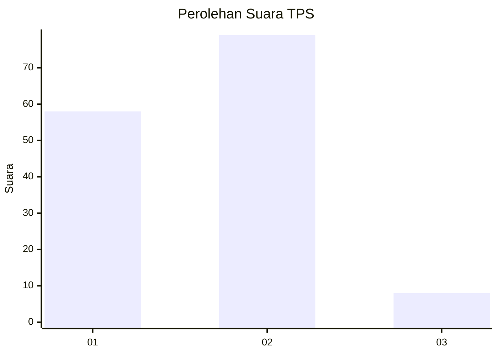
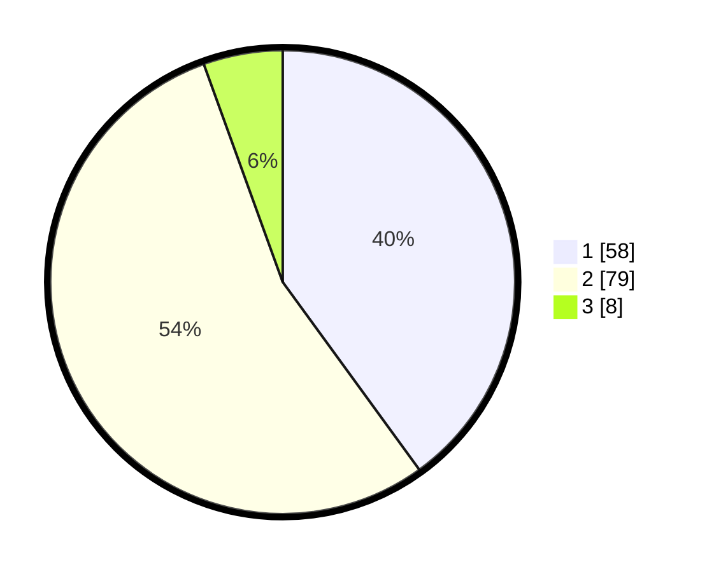

# Hasil

## Grafik

## Tabel

| No. | Nama Paslon    | Suara | Suara (raw) | Persentase |
|:--- |:-------------- | -----:| -----------:| ----------:|
| 1   | ANIES MUHAIMIN | 58    | [58][p-1]   | 40,00      |
| 2   | PRABOWO GIBRAN | 79    | [79][p-2]   | 54,48      |
| 3   | GANJAR MAHFUD  | 8     | [8][p-3]    | 5,52       |

[p-1]: https://github.com/gigit-pemilu/pemilu-2024/blob/main/pilpres/hitung-suara/sub/32-jawa-barat/sub/01-bogor/sub/39-leuwisadeng/sub/2001-leuwisadeng/sub/006-tps/sub/paslon-1.txt
[p-2]: https://github.com/gigit-pemilu/pemilu-2024/blob/main/pilpres/hitung-suara/sub/32-jawa-barat/sub/01-bogor/sub/39-leuwisadeng/sub/2001-leuwisadeng/sub/006-tps/sub/paslon-2.txt
[p-3]: https://github.com/gigit-pemilu/pemilu-2024/blob/main/pilpres/hitung-suara/sub/32-jawa-barat/sub/01-bogor/sub/39-leuwisadeng/sub/2001-leuwisadeng/sub/006-tps/sub/paslon-3.txt

## Foto C Plano

https://sirekap-obj-formc.kpu.go.id/c5c3/pemilu/ppwp/32/01/39/20/01/3201392001006-20240220-131210--036b3d36-2a4a-40f8-9e09-db5aef645223.jpg

https://sirekap-obj-formc.kpu.go.id/c5c3/pemilu/ppwp/32/01/39/20/01/3201392001006-20240220-131406--0e5bc1c8-21ca-451f-b7cc-8e55eb176900.jpg

https://sirekap-obj-formc.kpu.go.id/c5c3/pemilu/ppwp/32/01/39/20/01/3201392001006-20240220-131707--1fdffd2c-c4ec-4b17-a9a7-a55c76c85890.jpg

## Metadata

| Key        | Value               |
| ---------- | ------------------- |
| Time Stamp | 2024-02-25 11:00:00 |

