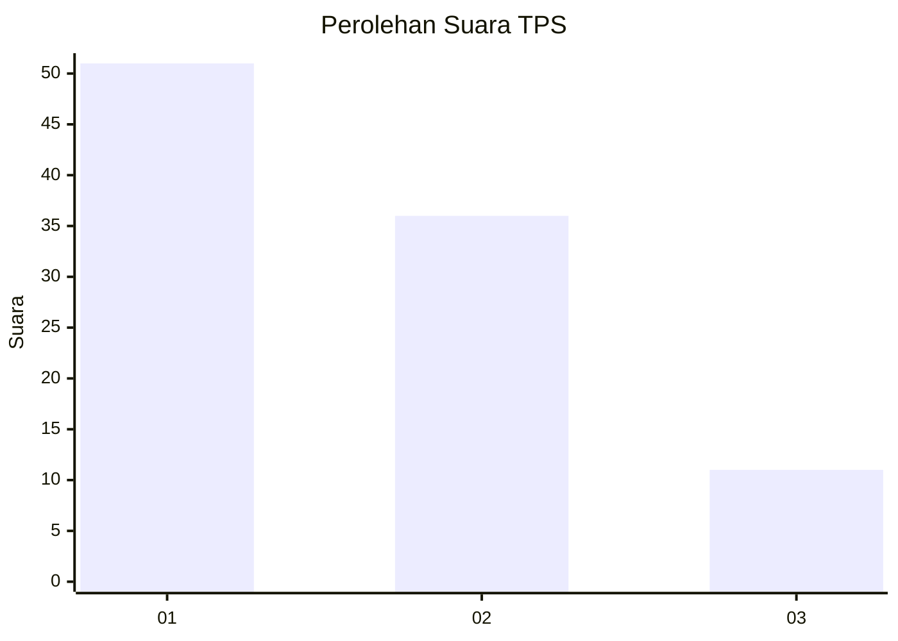
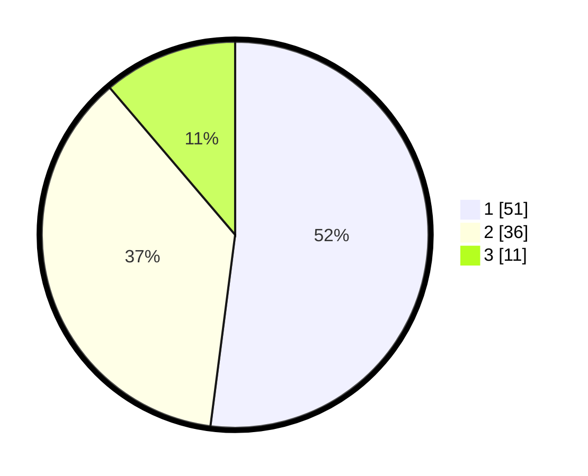

# Hasil

## Grafik

## Tabel

| No. | Nama Paslon    | Suara | Suara (raw) | Persentase |
|:--- |:-------------- | -----:| -----------:| ----------:|
| 1   | ANIES MUHAIMIN | 51    | [51][p-1]   | 52,04      |
| 2   | PRABOWO GIBRAN | 36    | [36][p-2]   | 36,73      |
| 3   | GANJAR MAHFUD  | 11    | [11][p-3]   | 11,22      |

[p-1]: https://github.com/gigit-pemilu/pemilu-2024-32-jawa-barat/blob/main/pilpres/hitung-suara/sub/32-jawa-barat/sub/02-sukabumi/sub/01-palabuhanratu/sub/2003-citepus/sub/025-tps/sub/paslon-1.txt
[p-2]: https://github.com/gigit-pemilu/pemilu-2024-32-jawa-barat/blob/main/pilpres/hitung-suara/sub/32-jawa-barat/sub/02-sukabumi/sub/01-palabuhanratu/sub/2003-citepus/sub/025-tps/sub/paslon-2.txt
[p-3]: https://github.com/gigit-pemilu/pemilu-2024-32-jawa-barat/blob/main/pilpres/hitung-suara/sub/32-jawa-barat/sub/02-sukabumi/sub/01-palabuhanratu/sub/2003-citepus/sub/025-tps/sub/paslon-3.txt

## Foto C Plano

https://sirekap-obj-formc.kpu.go.id/7196/pemilu/ppwp/32/02/01/20/03/3202012003025-20240214-141740--803a74ca-8b68-4651-a0c6-5d4c08073bb4.jpg

https://sirekap-obj-formc.kpu.go.id/7196/pemilu/ppwp/32/02/01/20/03/3202012003025-20240214-141014--fbeb8b96-1647-43a9-8c1b-3b4db8d1d1e6.jpg

https://sirekap-obj-formc.kpu.go.id/7196/pemilu/ppwp/32/02/01/20/03/3202012003025-20240214-201559--c0f9f6dc-717c-4678-a702-18fcd242b50c.jpg

## Metadata

| Key        | Value               |
| ---------- | ------------------- |
| Time Stamp | 2024-02-15 15:00:29 |

