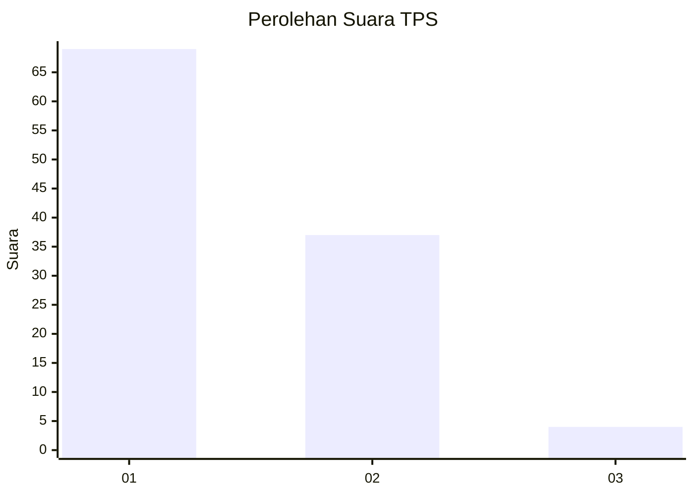
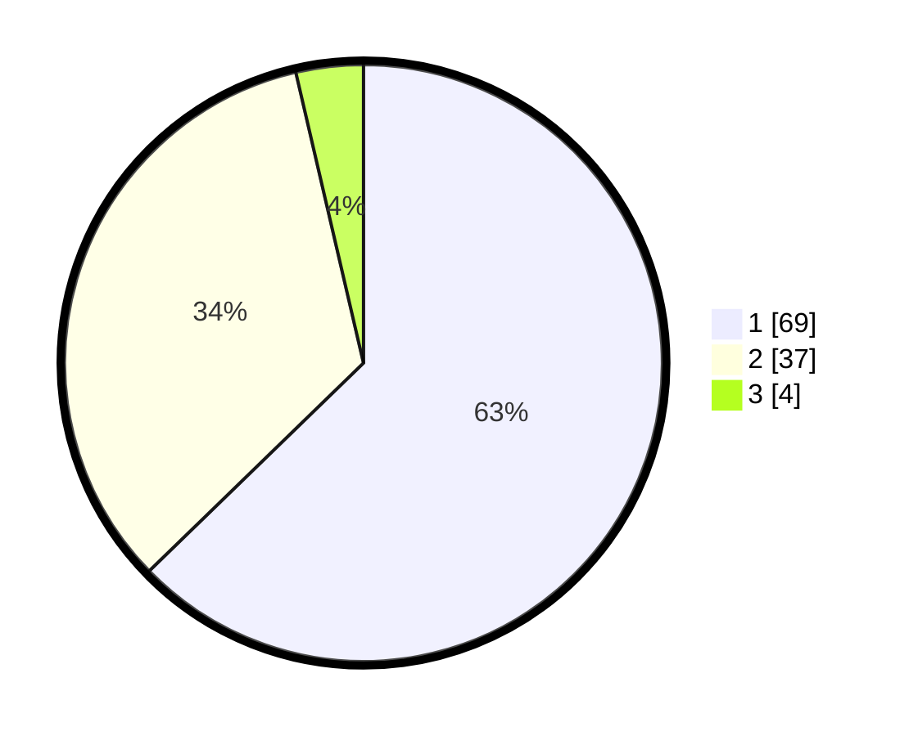

# Hasil

## Grafik

## Tabel

| No. | Nama Paslon    | Suara | Suara (raw) | Persentase |
|:--- |:-------------- | -----:| -----------:| ----------:|
| 1   | ANIES MUHAIMIN | 69    | [69][p-1]   | 62,73      |
| 2   | PRABOWO GIBRAN | 37    | [37][p-2]   | 33,64      |
| 3   | GANJAR MAHFUD  | 4     | [4][p-3]    | 3,64       |

[p-1]: https://github.com/gigit-pemilu/pemilu-2024/blob/main/pilpres/hitung-suara/sub/32-jawa-barat/sub/02-sukabumi/sub/01-palabuhanratu/sub/2003-citepus/sub/032-tps/sub/paslon-1.txt
[p-2]: https://github.com/gigit-pemilu/pemilu-2024/blob/main/pilpres/hitung-suara/sub/32-jawa-barat/sub/02-sukabumi/sub/01-palabuhanratu/sub/2003-citepus/sub/032-tps/sub/paslon-2.txt
[p-3]: https://github.com/gigit-pemilu/pemilu-2024/blob/main/pilpres/hitung-suara/sub/32-jawa-barat/sub/02-sukabumi/sub/01-palabuhanratu/sub/2003-citepus/sub/032-tps/sub/paslon-3.txt

## Foto C Plano

https://sirekap-obj-formc.kpu.go.id/3660/pemilu/ppwp/32/02/01/20/03/3202012003032-20240216-193846--e2e7c140-3742-4f26-b7e2-73ee7eb18e11.jpg

https://sirekap-obj-formc.kpu.go.id/3660/pemilu/ppwp/32/02/01/20/03/3202012003032-20240216-194621--d123b588-b042-4bbb-b215-577b317a6d0b.jpg

https://sirekap-obj-formc.kpu.go.id/3660/pemilu/ppwp/32/02/01/20/03/3202012003032-20240214-204051--34d1c83d-7425-4579-a230-90b11d4340ec.jpg

## Metadata

| Key        | Value               |
| ---------- | ------------------- |
| Time Stamp | 2024-02-17 09:00:02 |

