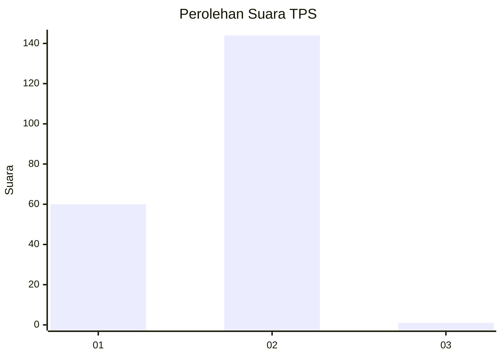
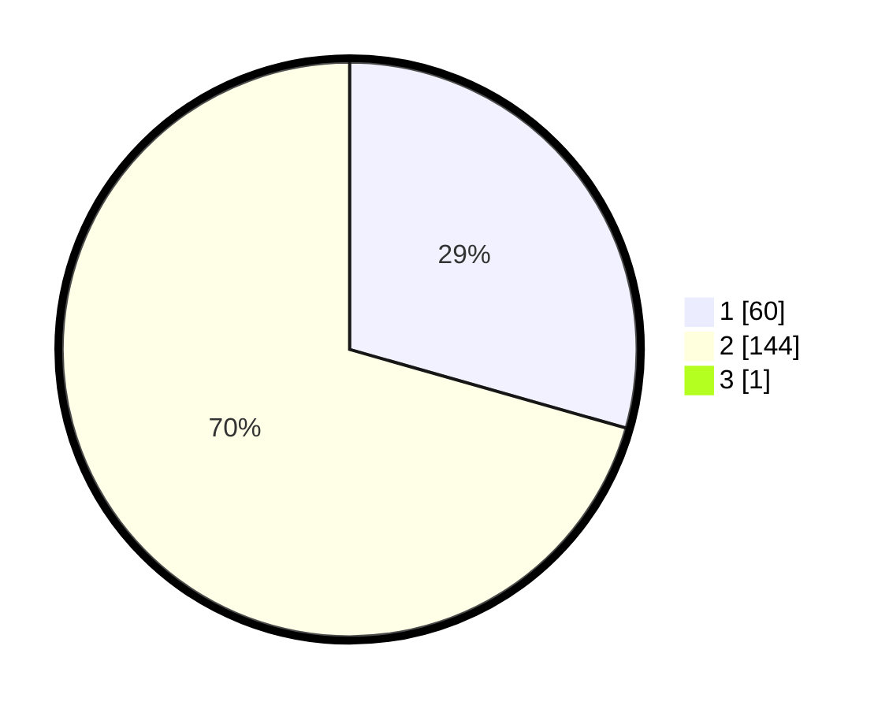

# Hasil

## Grafik

## Tabel

| No. | Nama Paslon    | Suara | Suara (raw) | Persentase |
|:--- |:-------------- | -----:| -----------:| ----------:|
| 1   | ANIES MUHAIMIN | 60    | [60][p-1]   | 29,27      |
| 2   | PRABOWO GIBRAN | 144   | [144][p-2]  | 70,24      |
| 3   | GANJAR MAHFUD  | 1     | [1][p-3]    | 0,49       |

[p-1]: https://github.com/gigit-pemilu/pemilu-2024-32-jawa-barat/blob/main/pilpres/hitung-suara/sub/32-jawa-barat/sub/02-sukabumi/sub/02-simpenan/sub/2001-cidadap/sub/001-tps/sub/paslon-1.txt
[p-2]: https://github.com/gigit-pemilu/pemilu-2024-32-jawa-barat/blob/main/pilpres/hitung-suara/sub/32-jawa-barat/sub/02-sukabumi/sub/02-simpenan/sub/2001-cidadap/sub/001-tps/sub/paslon-2.txt
[p-3]: https://github.com/gigit-pemilu/pemilu-2024-32-jawa-barat/blob/main/pilpres/hitung-suara/sub/32-jawa-barat/sub/02-sukabumi/sub/02-simpenan/sub/2001-cidadap/sub/001-tps/sub/paslon-3.txt

## Foto C Plano

https://sirekap-obj-formc.kpu.go.id/c0d0/pemilu/ppwp/32/02/02/20/01/3202022001001-20240215-000628--987b0258-d0a8-4cb8-b709-0f00ce9356e1.jpg

https://sirekap-obj-formc.kpu.go.id/c0d0/pemilu/ppwp/32/02/02/20/01/3202022001001-20240215-001221--f15548ca-4608-498d-a7d8-2b6d573b4bb5.jpg

https://sirekap-obj-formc.kpu.go.id/c0d0/pemilu/ppwp/32/02/02/20/01/3202022001001-20240215-001302--c006ffbf-9853-40b0-b413-1a4ea10c8e17.jpg

## Metadata

| Key        | Value               |
| ---------- | ------------------- |
| Time Stamp | 2024-02-15 15:00:29 |

