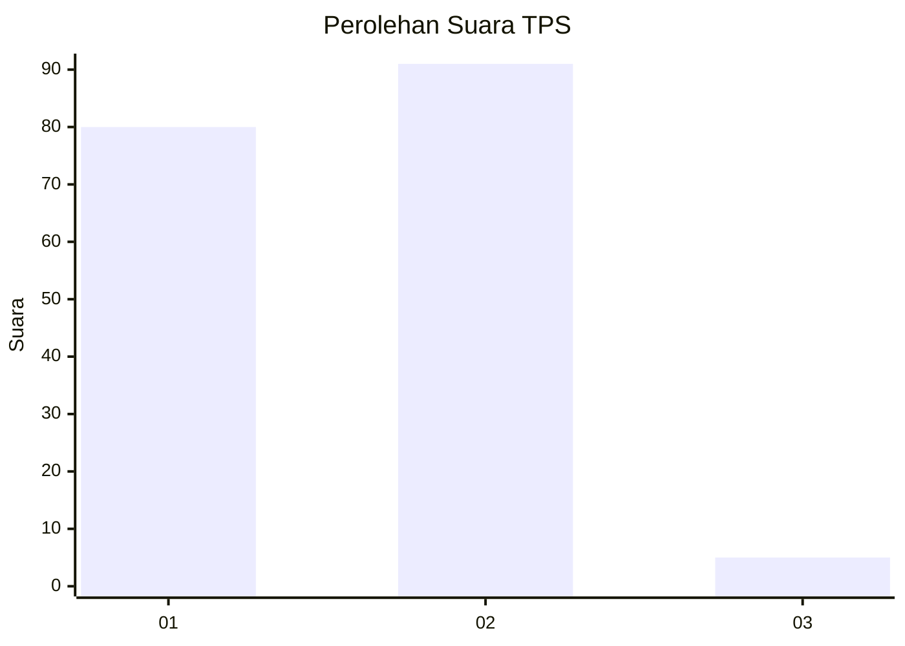
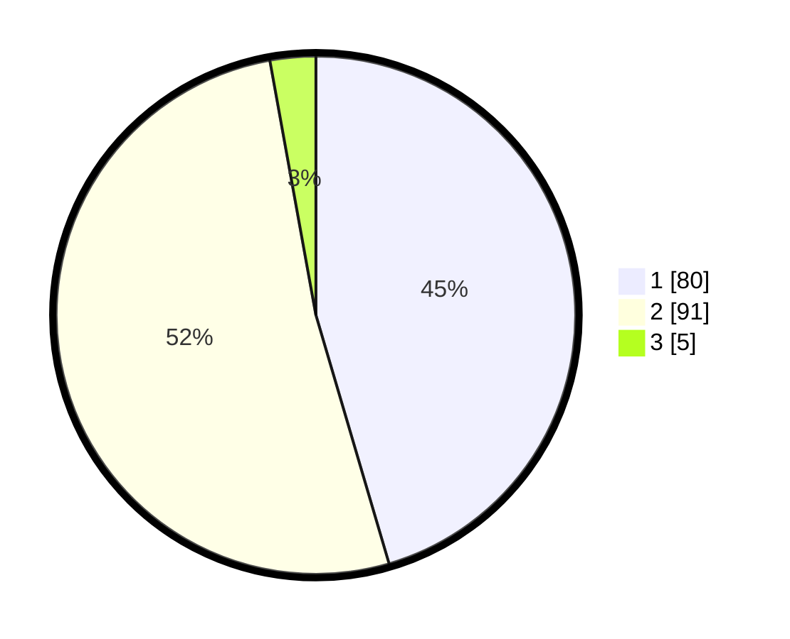

# Hasil

## Grafik

## Tabel

| No. | Nama Paslon    | Suara | Suara (raw) | Persentase |
|:--- |:-------------- | -----:| -----------:| ----------:|
| 1   | ANIES MUHAIMIN | 80    | [80][p-1]   | 45,45      |
| 2   | PRABOWO GIBRAN | 91    | [91][p-2]   | 51,70      |
| 3   | GANJAR MAHFUD  | 5     | [5][p-3]    | 2,84       |

[p-1]: https://github.com/gigit-pemilu/pemilu-2024/blob/main/pilpres/hitung-suara/sub/32-jawa-barat/sub/02-sukabumi/sub/02-simpenan/sub/2001-cidadap/sub/006-tps/sub/paslon-1.txt
[p-2]: https://github.com/gigit-pemilu/pemilu-2024/blob/main/pilpres/hitung-suara/sub/32-jawa-barat/sub/02-sukabumi/sub/02-simpenan/sub/2001-cidadap/sub/006-tps/sub/paslon-2.txt
[p-3]: https://github.com/gigit-pemilu/pemilu-2024/blob/main/pilpres/hitung-suara/sub/32-jawa-barat/sub/02-sukabumi/sub/02-simpenan/sub/2001-cidadap/sub/006-tps/sub/paslon-3.txt

## Foto C Plano

https://sirekap-obj-formc.kpu.go.id/9c94/pemilu/ppwp/32/02/02/20/01/3202022001006-20240214-213201--4e45abee-5950-4ceb-899f-907d7308d004.jpg

https://sirekap-obj-formc.kpu.go.id/9c94/pemilu/ppwp/32/02/02/20/01/3202022001006-20240214-232600--ba075b84-88dc-4b0b-b1b9-5042b854777f.jpg

https://sirekap-obj-formc.kpu.go.id/9c94/pemilu/ppwp/32/02/02/20/01/3202022001006-20240214-213428--55a2960c-9818-45a8-93c3-9c8f6bf69ab6.jpg

## Metadata

| Key        | Value               |
| ---------- | ------------------- |
| Time Stamp | 2024-02-16 11:00:29 |

