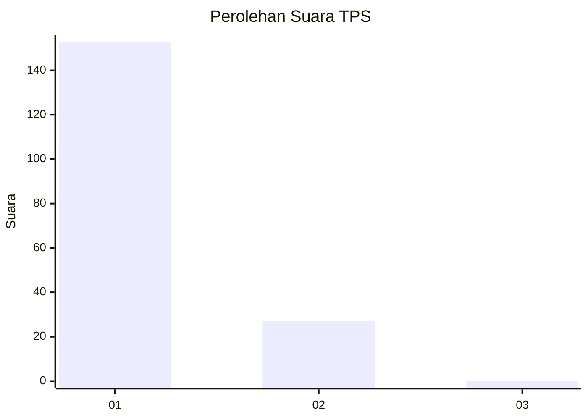
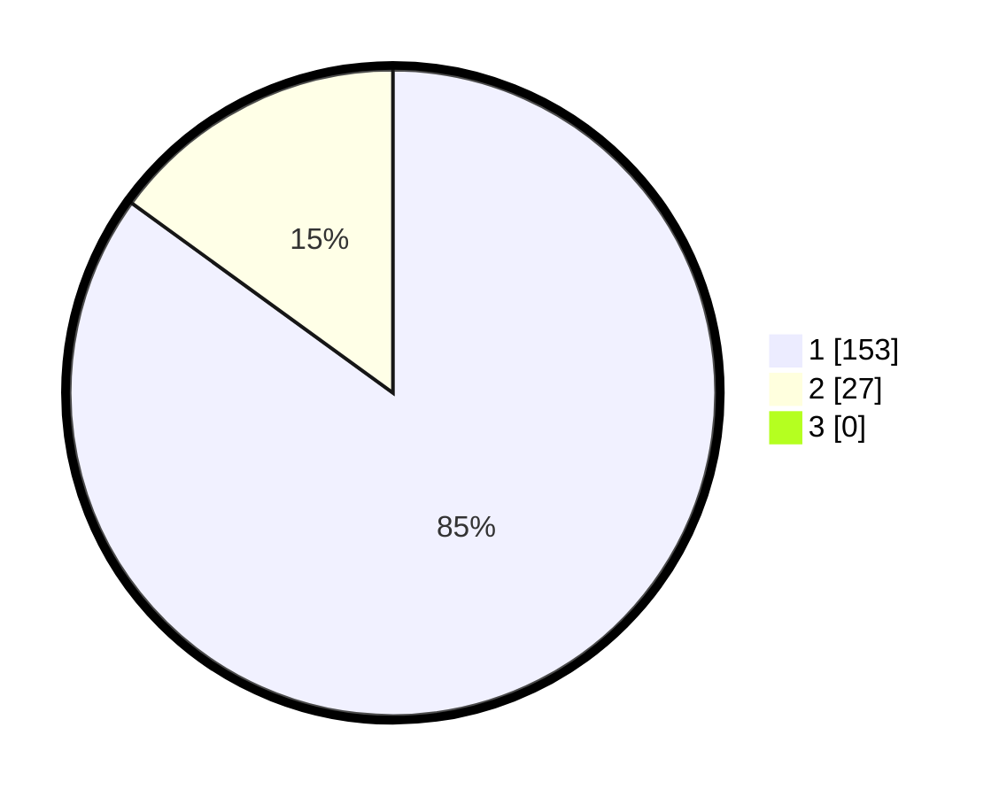

# Hasil

## Grafik

## Tabel

| No. | Nama Paslon    | Suara | Suara (raw) | Persentase |
|:--- |:-------------- | -----:| -----------:| ----------:|
| 1   | ANIES MUHAIMIN | 153   | [153][p-1]  | 85,00      |
| 2   | PRABOWO GIBRAN | 27    | [27][p-2]   | 15,00      |
| 3   | GANJAR MAHFUD  | 0     | [0][p-3]    | 0,00       |

[p-1]: https://github.com/gigit-pemilu/pemilu-2024-32-jawa-barat/blob/main/pilpres/hitung-suara/sub/32-jawa-barat/sub/02-sukabumi/sub/02-simpenan/sub/2001-cidadap/sub/050-tps/sub/paslon-1.txt
[p-2]: https://github.com/gigit-pemilu/pemilu-2024-32-jawa-barat/blob/main/pilpres/hitung-suara/sub/32-jawa-barat/sub/02-sukabumi/sub/02-simpenan/sub/2001-cidadap/sub/050-tps/sub/paslon-2.txt
[p-3]: https://github.com/gigit-pemilu/pemilu-2024-32-jawa-barat/blob/main/pilpres/hitung-suara/sub/32-jawa-barat/sub/02-sukabumi/sub/02-simpenan/sub/2001-cidadap/sub/050-tps/sub/paslon-3.txt

## Foto C Plano

https://sirekap-obj-formc.kpu.go.id/6ebe/pemilu/ppwp/32/02/02/20/01/3202022001050-20240215-090627--83329bb4-6370-4cd5-b71d-2f213b6da06e.jpg

https://sirekap-obj-formc.kpu.go.id/6ebe/pemilu/ppwp/32/02/02/20/01/3202022001050-20240215-091624--cee7f97a-6eea-4ce2-ba46-bd80ea7aa8e0.jpg

https://sirekap-obj-formc.kpu.go.id/6ebe/pemilu/ppwp/32/02/02/20/01/3202022001050-20240215-091238--1c1c1bfd-afd4-4189-a4dd-c444a9922472.jpg

## Metadata

| Key        | Value               |
| ---------- | ------------------- |
| Time Stamp | 2024-02-17 13:37:34 |

