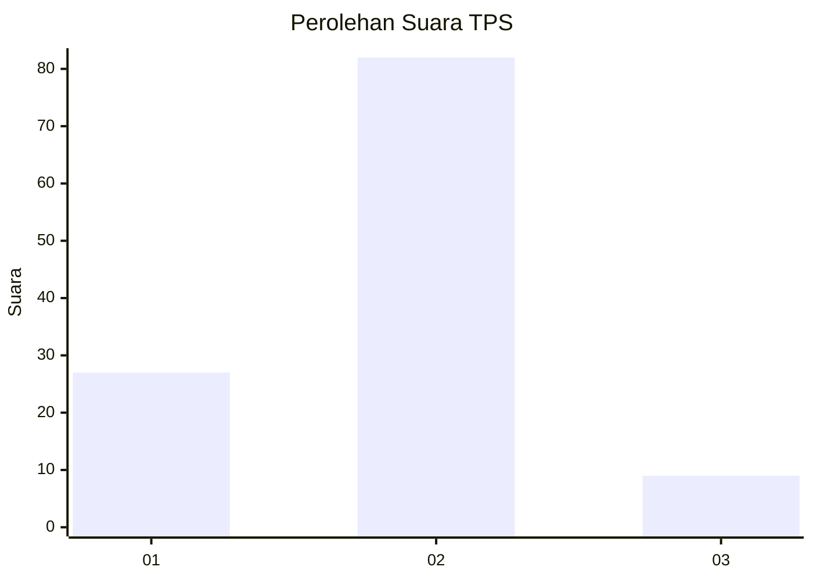
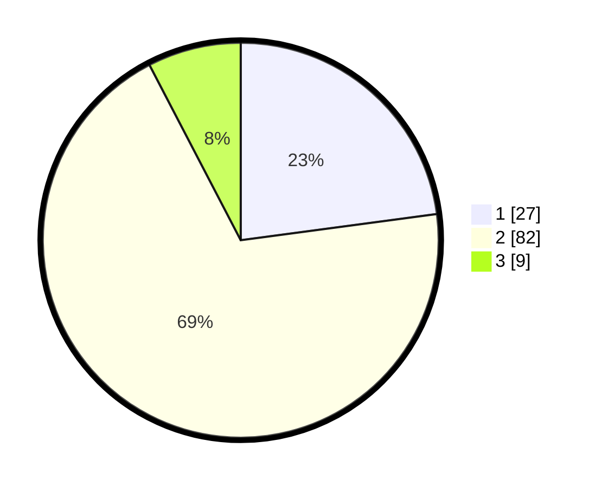

# Hasil

## Grafik

## Tabel

| No. | Nama Paslon    | Suara | Suara (raw) | Persentase |
|:--- |:-------------- | -----:| -----------:| ----------:|
| 1   | ANIES MUHAIMIN | 27    | [27][p-1]   | 22,88      |
| 2   | PRABOWO GIBRAN | 82    | [82][p-2]   | 69,49      |
| 3   | GANJAR MAHFUD  | 9     | [9][p-3]    | 7,63       |

[p-1]: https://github.com/gigit-pemilu/pemilu-2024-32-jawa-barat/blob/main/pilpres/hitung-suara/sub/32-jawa-barat/sub/02-sukabumi/sub/03-cikakak/sub/2001-cikakak/sub/001-tps/sub/paslon-1.txt
[p-2]: https://github.com/gigit-pemilu/pemilu-2024-32-jawa-barat/blob/main/pilpres/hitung-suara/sub/32-jawa-barat/sub/02-sukabumi/sub/03-cikakak/sub/2001-cikakak/sub/001-tps/sub/paslon-2.txt
[p-3]: https://github.com/gigit-pemilu/pemilu-2024-32-jawa-barat/blob/main/pilpres/hitung-suara/sub/32-jawa-barat/sub/02-sukabumi/sub/03-cikakak/sub/2001-cikakak/sub/001-tps/sub/paslon-3.txt

## Foto C Plano

https://sirekap-obj-formc.kpu.go.id/3b52/pemilu/ppwp/32/02/03/20/01/3202032001001-20240214-194626--1639c048-5ef8-4f8c-a48a-c3a2c3fe2e49.jpg

https://sirekap-obj-formc.kpu.go.id/3b52/pemilu/ppwp/32/02/03/20/01/3202032001001-20240214-194710--8a85d5a3-ae96-43ee-b0bc-7e276a3a6927.jpg

https://sirekap-obj-formc.kpu.go.id/3b52/pemilu/ppwp/32/02/03/20/01/3202032001001-20240214-194752--a9a9d1a1-c340-4d74-b054-16c378899730.jpg

## Metadata

| Key        | Value               |
| ---------- | ------------------- |
| Time Stamp | 2024-02-15 16:30:25 |

