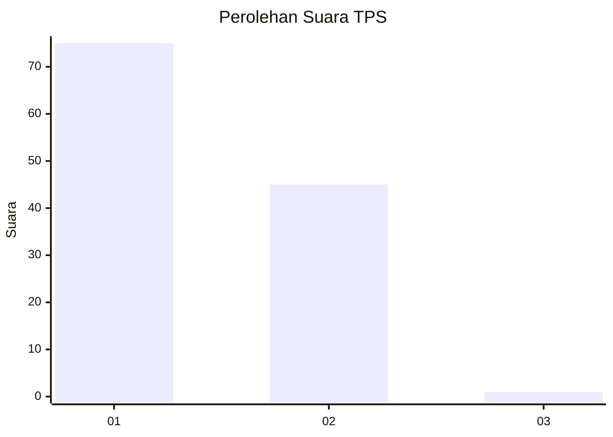
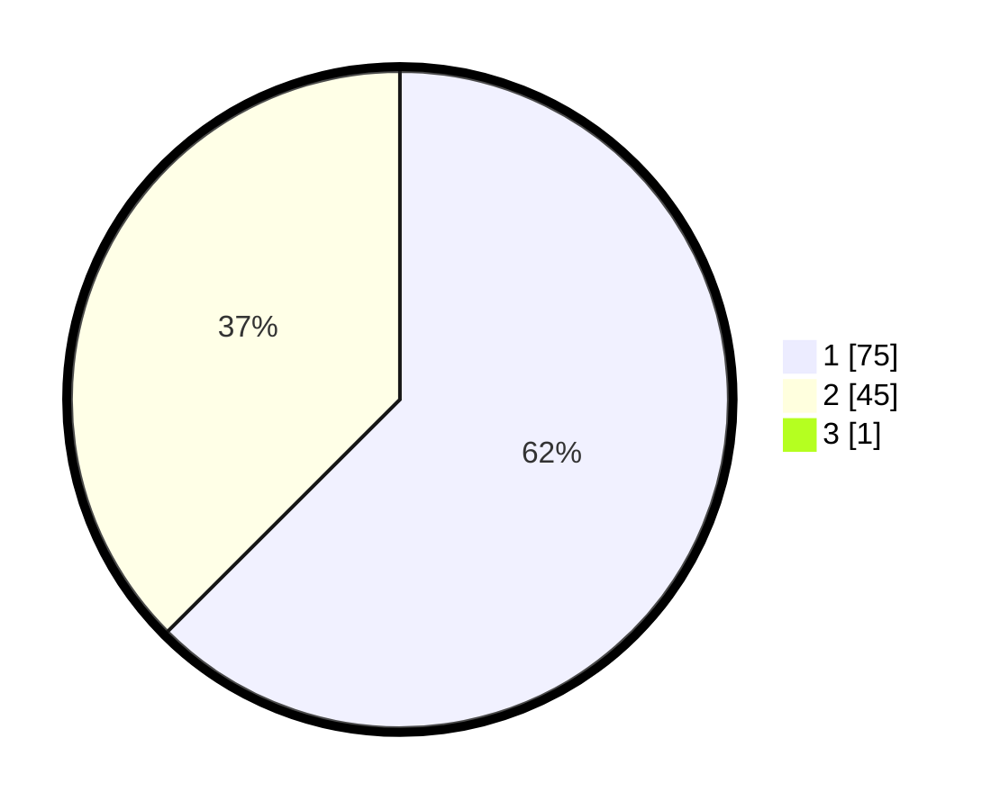

# Hasil

## Grafik

## Tabel

| No. | Nama Paslon    | Suara | Suara (raw) | Persentase |
|:--- |:-------------- | -----:| -----------:| ----------:|
| 1   | ANIES MUHAIMIN | 75    | [75][p-1]   | 61,98      |
| 2   | PRABOWO GIBRAN | 45    | [45][p-2]   | 37,19      |
| 3   | GANJAR MAHFUD  | 1     | [1][p-3]    | 0,83       |

[p-1]: https://github.com/gigit-pemilu/pemilu-2024/blob/main/pilpres/hitung-suara/sub/32-jawa-barat/sub/02-sukabumi/sub/03-cikakak/sub/2003-ridogalih/sub/017-tps/sub/paslon-1.txt
[p-2]: https://github.com/gigit-pemilu/pemilu-2024/blob/main/pilpres/hitung-suara/sub/32-jawa-barat/sub/02-sukabumi/sub/03-cikakak/sub/2003-ridogalih/sub/017-tps/sub/paslon-2.txt
[p-3]: https://github.com/gigit-pemilu/pemilu-2024/blob/main/pilpres/hitung-suara/sub/32-jawa-barat/sub/02-sukabumi/sub/03-cikakak/sub/2003-ridogalih/sub/017-tps/sub/paslon-3.txt

## Foto C Plano

https://sirekap-obj-formc.kpu.go.id/c504/pemilu/ppwp/32/02/03/20/03/3202032003017-20240215-182405--78001523-77cd-4841-a3b4-f4a47123b3e7.jpg

https://sirekap-obj-formc.kpu.go.id/c504/pemilu/ppwp/32/02/03/20/03/3202032003017-20240215-192659--10c53885-1ce1-4b9c-b4c4-8a06d1083153.jpg

https://sirekap-obj-formc.kpu.go.id/c504/pemilu/ppwp/32/02/03/20/03/3202032003017-20240215-193013--aaabd90c-07a1-40a4-a516-acc21b210db2.jpg

## Metadata

| Key        | Value               |
| ---------- | ------------------- |
| Time Stamp | 2024-02-16 12:51:22 |

