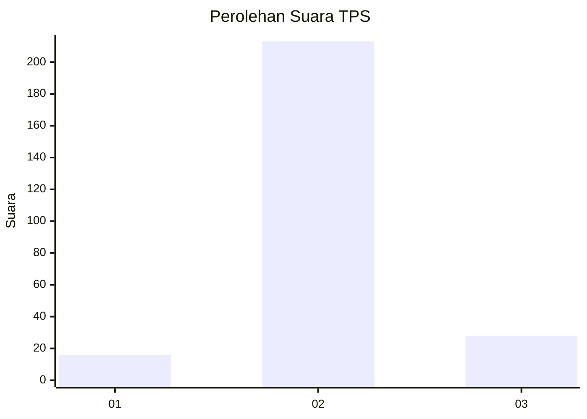
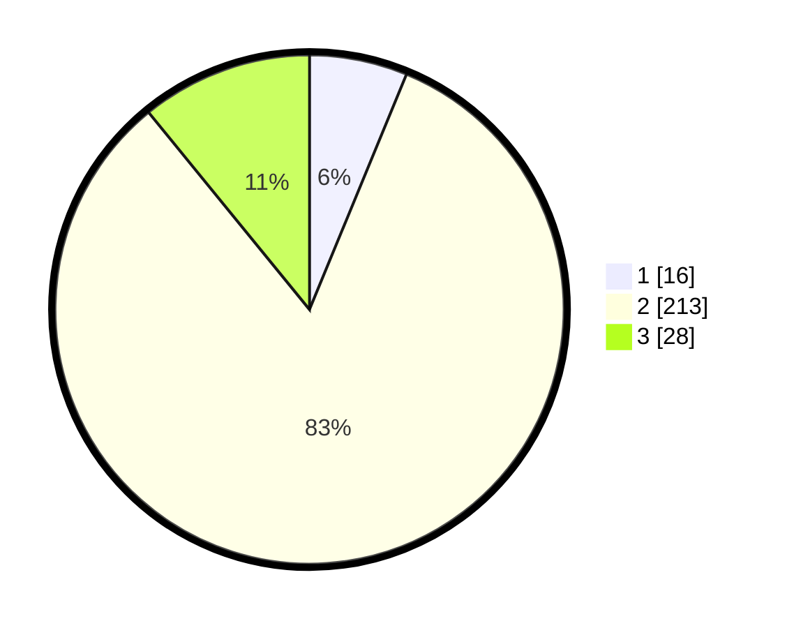

# Hasil

## Grafik

## Tabel

| No. | Nama Paslon    | Suara | Suara (raw) | Persentase |
|:--- |:-------------- | -----:| -----------:| ----------:|
| 1   | ANIES MUHAIMIN | 16    | [16][p-1]   | 6,23       |
| 2   | PRABOWO GIBRAN | 213   | [213][p-2]  | 82,88      |
| 3   | GANJAR MAHFUD  | 28    | [28][p-3]   | 10,89      |

[p-1]: https://github.com/gigit-pemilu/pemilu-2024/blob/main/pilpres/hitung-suara/sub/32-jawa-barat/sub/02-sukabumi/sub/03-cikakak/sub/2006-margalaksana/sub/002-tps/sub/paslon-1.txt
[p-2]: https://github.com/gigit-pemilu/pemilu-2024/blob/main/pilpres/hitung-suara/sub/32-jawa-barat/sub/02-sukabumi/sub/03-cikakak/sub/2006-margalaksana/sub/002-tps/sub/paslon-2.txt
[p-3]: https://github.com/gigit-pemilu/pemilu-2024/blob/main/pilpres/hitung-suara/sub/32-jawa-barat/sub/02-sukabumi/sub/03-cikakak/sub/2006-margalaksana/sub/002-tps/sub/paslon-3.txt

## Foto C Plano

https://sirekap-obj-formc.kpu.go.id/2513/pemilu/ppwp/32/02/03/20/06/3202032006002-20240215-180057--1f1d8f11-f3da-4b88-a1c5-eff13f27554f.jpg

https://sirekap-obj-formc.kpu.go.id/2513/pemilu/ppwp/32/02/03/20/06/3202032006002-20240215-180308--88d57b3e-0f56-40d1-85e1-47cec778e8fa.jpg

https://sirekap-obj-formc.kpu.go.id/2513/pemilu/ppwp/32/02/03/20/06/3202032006002-20240215-180459--b156dbcc-de48-4507-b34f-0ec9e3157e11.jpg

## Metadata

| Key        | Value               |
| ---------- | ------------------- |
| Time Stamp | 2024-02-16 12:51:22 |

