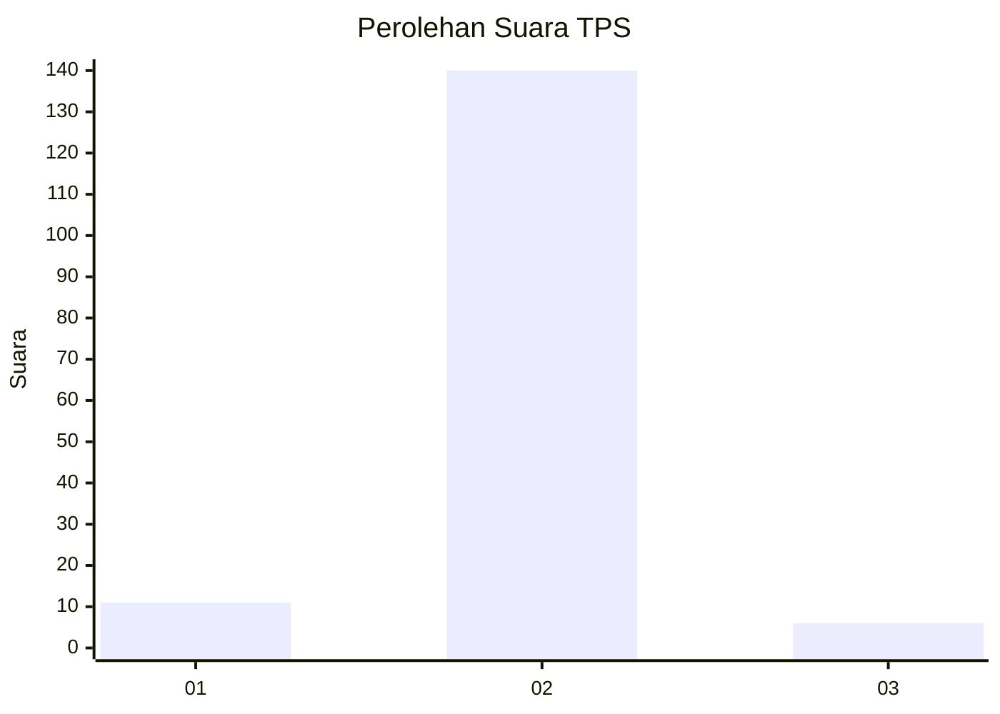
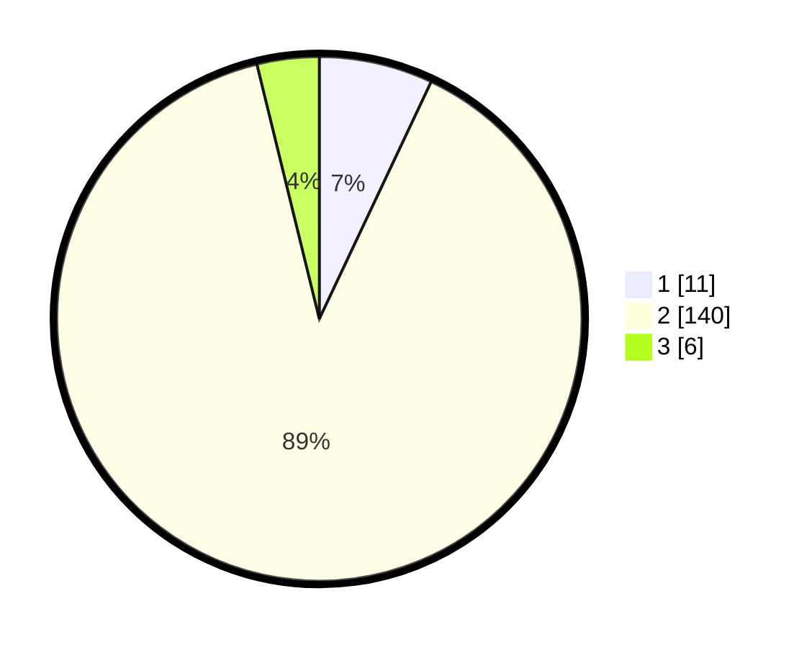

# Hasil

## Grafik

## Tabel

| No. | Nama Paslon    | Suara | Suara (raw) | Persentase |
|:--- |:-------------- | -----:| -----------:| ----------:|
| 1   | ANIES MUHAIMIN | 11    | [11][p-1]   | 7,01       |
| 2   | PRABOWO GIBRAN | 140   | [140][p-2]  | 89,17      |
| 3   | GANJAR MAHFUD  | 6     | [6][p-3]    | 3,82       |

[p-1]: https://github.com/gigit-pemilu/pemilu-2024/blob/main/pilpres/hitung-suara/sub/32-jawa-barat/sub/02-sukabumi/sub/04-bantargadung/sub/2003-bojonggaling/sub/002-tps/sub/paslon-1.txt
[p-2]: https://github.com/gigit-pemilu/pemilu-2024/blob/main/pilpres/hitung-suara/sub/32-jawa-barat/sub/02-sukabumi/sub/04-bantargadung/sub/2003-bojonggaling/sub/002-tps/sub/paslon-2.txt
[p-3]: https://github.com/gigit-pemilu/pemilu-2024/blob/main/pilpres/hitung-suara/sub/32-jawa-barat/sub/02-sukabumi/sub/04-bantargadung/sub/2003-bojonggaling/sub/002-tps/sub/paslon-3.txt

## Foto C Plano

https://sirekap-obj-formc.kpu.go.id/2b9b/pemilu/ppwp/32/02/04/20/03/3202042003002-20240215-204843--9c23b934-cc27-4e1c-a87f-b007bc7a9adf.jpg

https://sirekap-obj-formc.kpu.go.id/2b9b/pemilu/ppwp/32/02/04/20/03/3202042003002-20240215-205755--4f16a6e6-9114-40cc-8377-3817190c19e6.jpg

https://sirekap-obj-formc.kpu.go.id/2b9b/pemilu/ppwp/32/02/04/20/03/3202042003002-20240215-205918--7f2f34d2-d1f4-4405-9762-4f896870c0b0.jpg

## Metadata

| Key        | Value               |
| ---------- | ------------------- |
| Time Stamp | 2024-02-16 12:51:22 |

