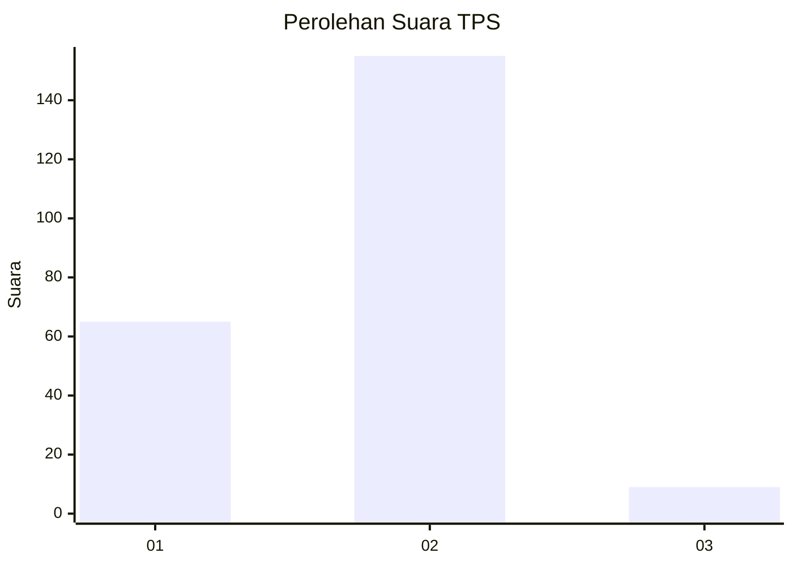
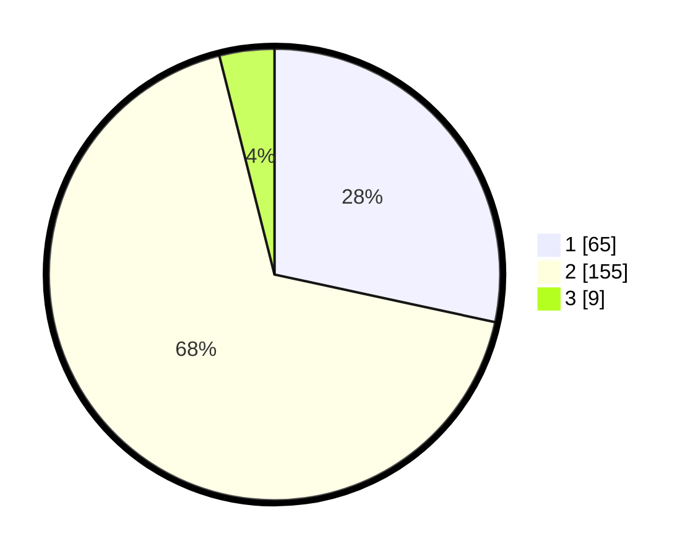

# Hasil

## Grafik

## Tabel

| No. | Nama Paslon    | Suara | Suara (raw) | Persentase |
|:--- |:-------------- | -----:| -----------:| ----------:|
| 1   | ANIES MUHAIMIN | 65    | [65][p-1]   | 28,38      |
| 2   | PRABOWO GIBRAN | 155   | [155][p-2]  | 67,69      |
| 3   | GANJAR MAHFUD  | 9     | [9][p-3]    | 3,93       |

[p-1]: https://github.com/gigit-pemilu/pemilu-2024-32-jawa-barat/blob/main/pilpres/hitung-suara/sub/32-jawa-barat/sub/02-sukabumi/sub/05-cisolok/sub/2001-cisolok/sub/004-tps/sub/paslon-1.txt
[p-2]: https://github.com/gigit-pemilu/pemilu-2024-32-jawa-barat/blob/main/pilpres/hitung-suara/sub/32-jawa-barat/sub/02-sukabumi/sub/05-cisolok/sub/2001-cisolok/sub/004-tps/sub/paslon-2.txt
[p-3]: https://github.com/gigit-pemilu/pemilu-2024-32-jawa-barat/blob/main/pilpres/hitung-suara/sub/32-jawa-barat/sub/02-sukabumi/sub/05-cisolok/sub/2001-cisolok/sub/004-tps/sub/paslon-3.txt

## Foto C Plano

https://sirekap-obj-formc.kpu.go.id/121c/pemilu/ppwp/32/02/05/20/01/3202052001004-20240215-003454--6e47dba3-cec0-42be-b50f-fe4b8994a7c2.jpg

https://sirekap-obj-formc.kpu.go.id/121c/pemilu/ppwp/32/02/05/20/01/3202052001004-20240215-003955--f2580b69-c065-472e-b143-1dd59c5966a8.jpg

https://sirekap-obj-formc.kpu.go.id/121c/pemilu/ppwp/32/02/05/20/01/3202052001004-20240215-004007--62f97b88-bbf4-487b-a08a-3d92520c817c.jpg

## Metadata

| Key        | Value               |
| ---------- | ------------------- |
| Time Stamp | 2024-02-16 14:00:34 |

