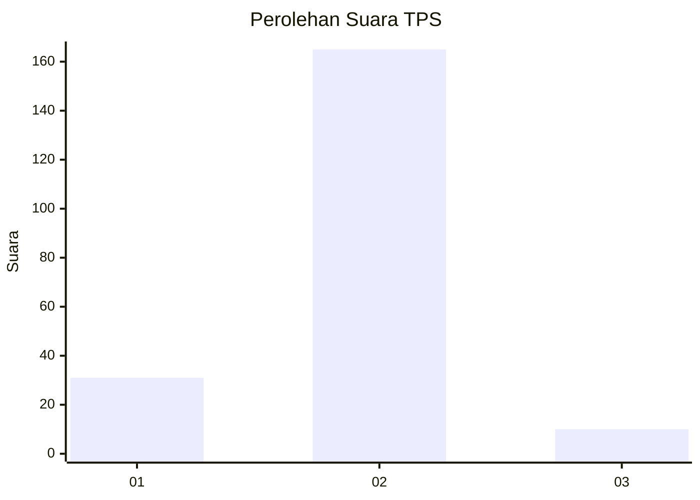
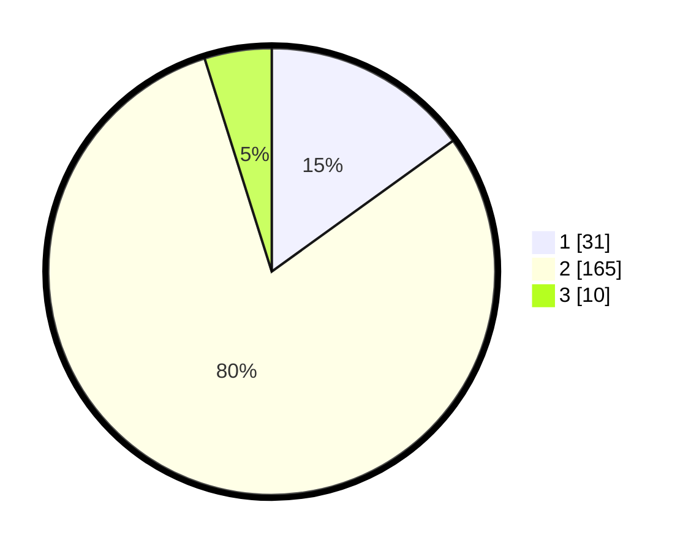

# Hasil

## Grafik

## Tabel

| No. | Nama Paslon    | Suara | Suara (raw) | Persentase |
|:--- |:-------------- | -----:| -----------:| ----------:|
| 1   | ANIES MUHAIMIN | 31    | [31][p-1]   | 15,05      |
| 2   | PRABOWO GIBRAN | 165   | [165][p-2]  | 80,10      |
| 3   | GANJAR MAHFUD  | 10    | [10][p-3]   | 4,85       |

[p-1]: https://github.com/gigit-pemilu/pemilu-2024-32-jawa-barat/blob/main/pilpres/hitung-suara/sub/32-jawa-barat/sub/02-sukabumi/sub/05-cisolok/sub/2001-cisolok/sub/005-tps/sub/paslon-1.txt
[p-2]: https://github.com/gigit-pemilu/pemilu-2024-32-jawa-barat/blob/main/pilpres/hitung-suara/sub/32-jawa-barat/sub/02-sukabumi/sub/05-cisolok/sub/2001-cisolok/sub/005-tps/sub/paslon-2.txt
[p-3]: https://github.com/gigit-pemilu/pemilu-2024-32-jawa-barat/blob/main/pilpres/hitung-suara/sub/32-jawa-barat/sub/02-sukabumi/sub/05-cisolok/sub/2001-cisolok/sub/005-tps/sub/paslon-3.txt

## Foto C Plano

https://sirekap-obj-formc.kpu.go.id/d443/pemilu/ppwp/32/02/05/20/01/3202052001005-20240215-074908--c033e2d3-d6d6-4d92-b1c1-44f5362e599a.jpg

https://sirekap-obj-formc.kpu.go.id/d443/pemilu/ppwp/32/02/05/20/01/3202052001005-20240215-075106--efae2691-5fbf-453d-8d6e-ac362107346e.jpg

https://sirekap-obj-formc.kpu.go.id/d443/pemilu/ppwp/32/02/05/20/01/3202052001005-20240215-075001--a6476d4e-120f-4ffe-81e4-b8bbf68457bd.jpg

## Metadata

| Key        | Value               |
| ---------- | ------------------- |
| Time Stamp | 2024-02-16 14:00:34 |

