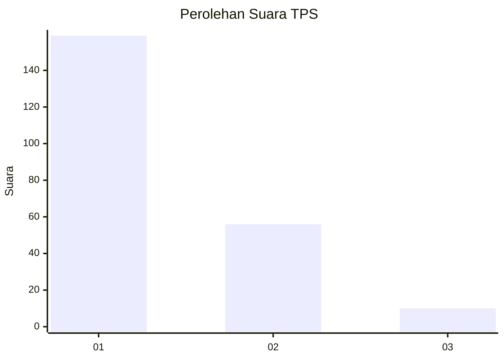
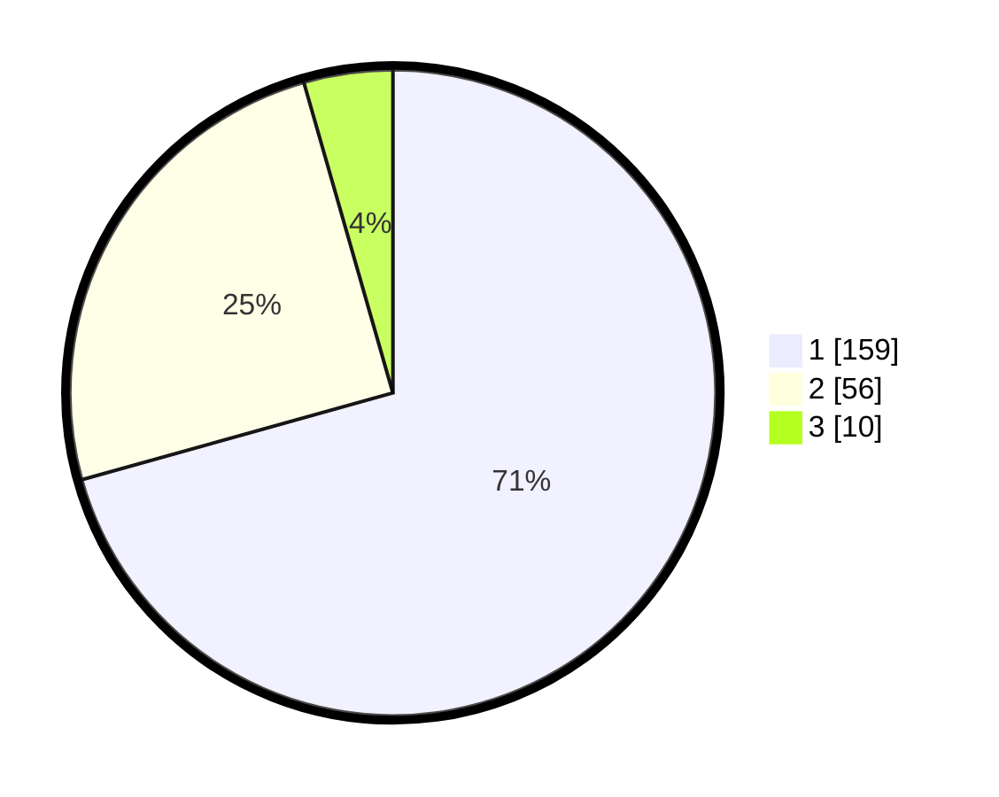

# Hasil

## Grafik

## Tabel

| No. | Nama Paslon    | Suara | Suara (raw) | Persentase |
|:--- |:-------------- | -----:| -----------:| ----------:|
| 1   | ANIES MUHAIMIN | 159   | [159][p-1]  | 70,67      |
| 2   | PRABOWO GIBRAN | 56    | [56][p-2]   | 24,89      |
| 3   | GANJAR MAHFUD  | 10    | [10][p-3]   | 4,44       |

[p-1]: https://github.com/gigit-pemilu/pemilu-2024/blob/main/pilpres/hitung-suara/sub/32-jawa-barat/sub/02-sukabumi/sub/05-cisolok/sub/2005-caringin/sub/012-tps/sub/paslon-1.txt
[p-2]: https://github.com/gigit-pemilu/pemilu-2024/blob/main/pilpres/hitung-suara/sub/32-jawa-barat/sub/02-sukabumi/sub/05-cisolok/sub/2005-caringin/sub/012-tps/sub/paslon-2.txt
[p-3]: https://github.com/gigit-pemilu/pemilu-2024/blob/main/pilpres/hitung-suara/sub/32-jawa-barat/sub/02-sukabumi/sub/05-cisolok/sub/2005-caringin/sub/012-tps/sub/paslon-3.txt

## Foto C Plano

https://sirekap-obj-formc.kpu.go.id/8e35/pemilu/ppwp/32/02/05/20/05/3202052005012-20240215-005616--02920ff3-f8ed-46c8-bcb2-c6463d2984ed.jpg

https://sirekap-obj-formc.kpu.go.id/8e35/pemilu/ppwp/32/02/05/20/05/3202052005012-20240215-010010--e13ad6ff-2daa-453e-a14e-e0c1f56f2a6c.jpg

https://sirekap-obj-formc.kpu.go.id/8e35/pemilu/ppwp/32/02/05/20/05/3202052005012-20240215-021352--022d03f8-6a1f-45d6-ab14-b1ae9cbee900.jpg

## Metadata

| Key        | Value               |
| ---------- | ------------------- |
| Time Stamp | 2024-02-16 14:30:33 |

