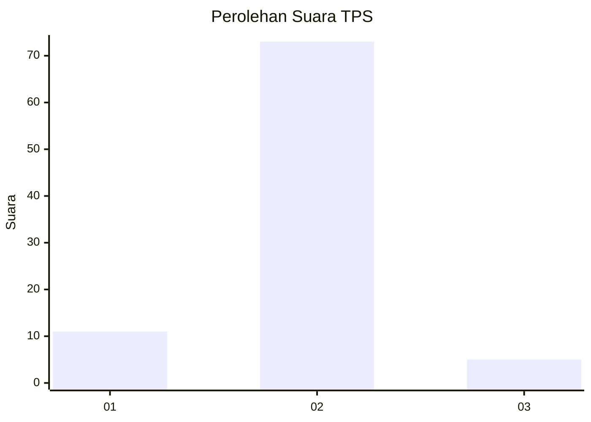
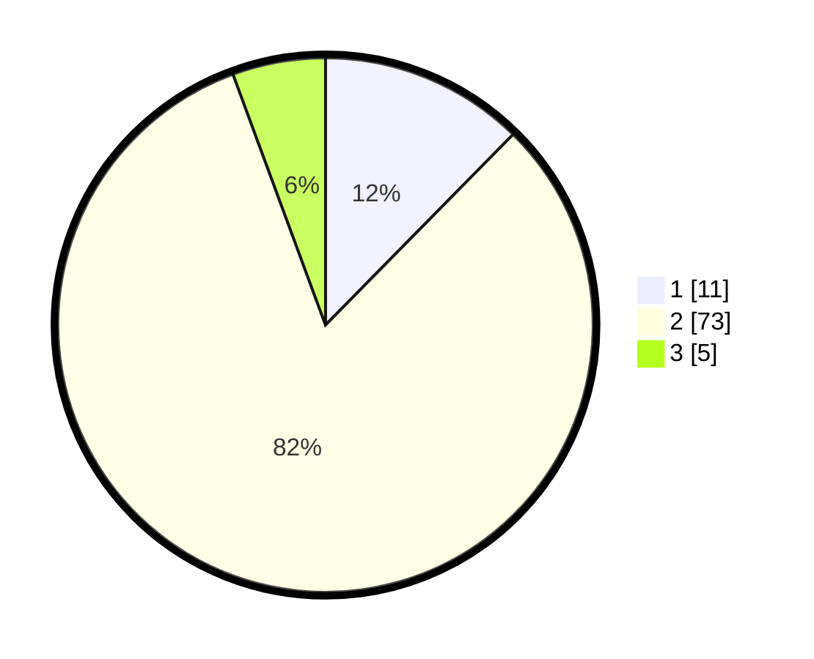

# Hasil

## Grafik

## Tabel

| No. | Nama Paslon    | Suara | Suara (raw) | Persentase |
|:--- |:-------------- | -----:| -----------:| ----------:|
| 1   | ANIES MUHAIMIN | 11    | [11][p-1]   | 12,36      |
| 2   | PRABOWO GIBRAN | 73    | [73][p-2]   | 82,02      |
| 3   | GANJAR MAHFUD  | 5     | [5][p-3]    | 5,62       |

[p-1]: https://github.com/gigit-pemilu/pemilu-2024-32-jawa-barat/blob/main/pilpres/hitung-suara/sub/32-jawa-barat/sub/02-sukabumi/sub/06-cikidang/sub/2001-cikidang/sub/029-tps/sub/paslon-1.txt
[p-2]: https://github.com/gigit-pemilu/pemilu-2024-32-jawa-barat/blob/main/pilpres/hitung-suara/sub/32-jawa-barat/sub/02-sukabumi/sub/06-cikidang/sub/2001-cikidang/sub/029-tps/sub/paslon-2.txt
[p-3]: https://github.com/gigit-pemilu/pemilu-2024-32-jawa-barat/blob/main/pilpres/hitung-suara/sub/32-jawa-barat/sub/02-sukabumi/sub/06-cikidang/sub/2001-cikidang/sub/029-tps/sub/paslon-3.txt

## Foto C Plano

https://sirekap-obj-formc.kpu.go.id/25d4/pemilu/ppwp/32/02/06/20/01/3202062001029-20240214-141000--aedb32f3-98d5-454e-84a7-214611f92631.jpg

https://sirekap-obj-formc.kpu.go.id/25d4/pemilu/ppwp/32/02/06/20/01/3202062001029-20240214-141110--9522c169-f1a8-421d-8129-cd2111d7087b.jpg

https://sirekap-obj-formc.kpu.go.id/25d4/pemilu/ppwp/32/02/06/20/01/3202062001029-20240214-141316--a75afd16-9a67-4d96-9d79-beaca910e191.jpg

## Metadata

| Key        | Value               |
| ---------- | ------------------- |
| Time Stamp | 2024-02-15 12:00:28 |

