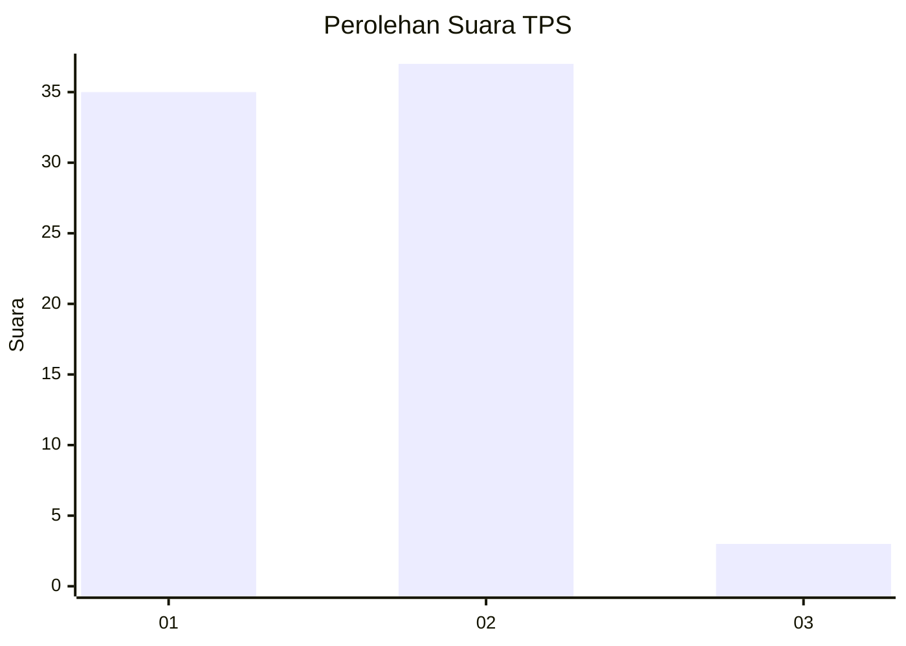
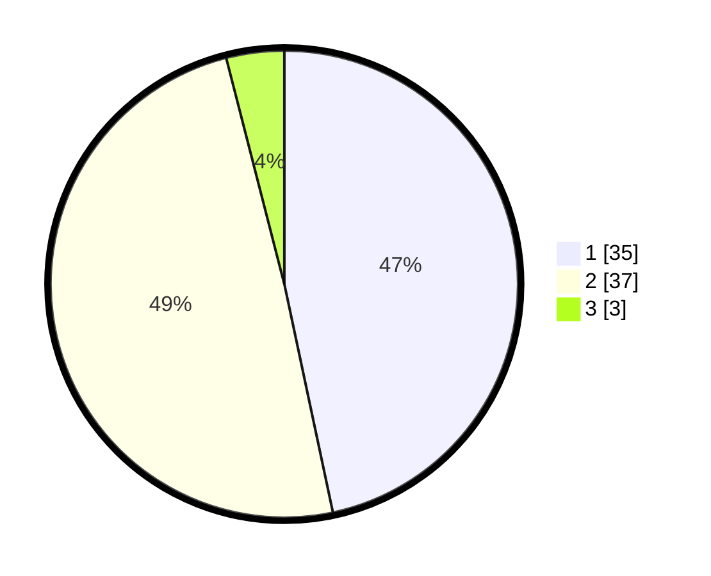

# Hasil

## Grafik

## Tabel

| No. | Nama Paslon    | Suara | Suara (raw) | Persentase |
|:--- |:-------------- | -----:| -----------:| ----------:|
| 1   | ANIES MUHAIMIN | 35    | [35][p-1]   | 46,67      |
| 2   | PRABOWO GIBRAN | 37    | [37][p-2]   | 49,33      |
| 3   | GANJAR MAHFUD  | 3     | [3][p-3]    | 4,00       |

[p-1]: https://github.com/gigit-pemilu/pemilu-2024-32-jawa-barat/blob/main/pilpres/hitung-suara/sub/32-jawa-barat/sub/02-sukabumi/sub/06-cikidang/sub/2011-cijambe/sub/008-tps/sub/paslon-1.txt
[p-2]: https://github.com/gigit-pemilu/pemilu-2024-32-jawa-barat/blob/main/pilpres/hitung-suara/sub/32-jawa-barat/sub/02-sukabumi/sub/06-cikidang/sub/2011-cijambe/sub/008-tps/sub/paslon-2.txt
[p-3]: https://github.com/gigit-pemilu/pemilu-2024-32-jawa-barat/blob/main/pilpres/hitung-suara/sub/32-jawa-barat/sub/02-sukabumi/sub/06-cikidang/sub/2011-cijambe/sub/008-tps/sub/paslon-3.txt

## Foto C Plano

https://sirekap-obj-formc.kpu.go.id/0f4b/pemilu/ppwp/32/02/06/20/11/3202062011008-20240214-222153--9f7aa09b-0900-4cc3-9fb7-303af16bf735.jpg

https://sirekap-obj-formc.kpu.go.id/0f4b/pemilu/ppwp/32/02/06/20/11/3202062011008-20240214-222723--e114e531-b379-46cb-b26a-0696812a90fb.jpg

https://sirekap-obj-formc.kpu.go.id/0f4b/pemilu/ppwp/32/02/06/20/11/3202062011008-20240214-222901--e9fb7c56-90cc-46a4-a55e-5936f023b401.jpg

## Metadata

| Key        | Value               |
| ---------- | ------------------- |
| Time Stamp | 2024-02-15 15:00:29 |

