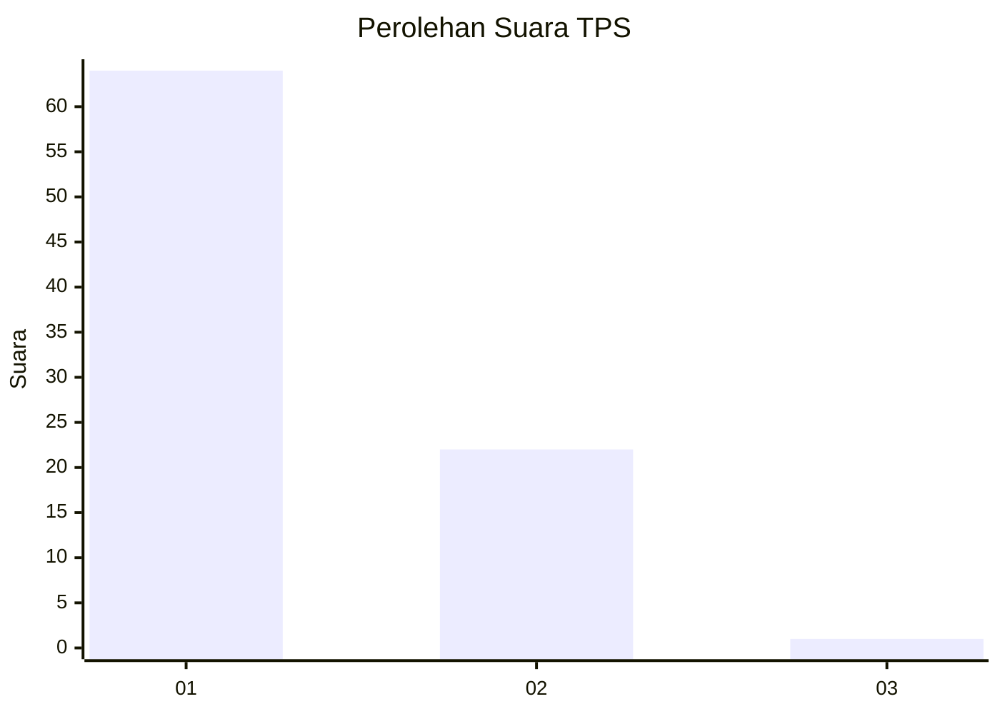
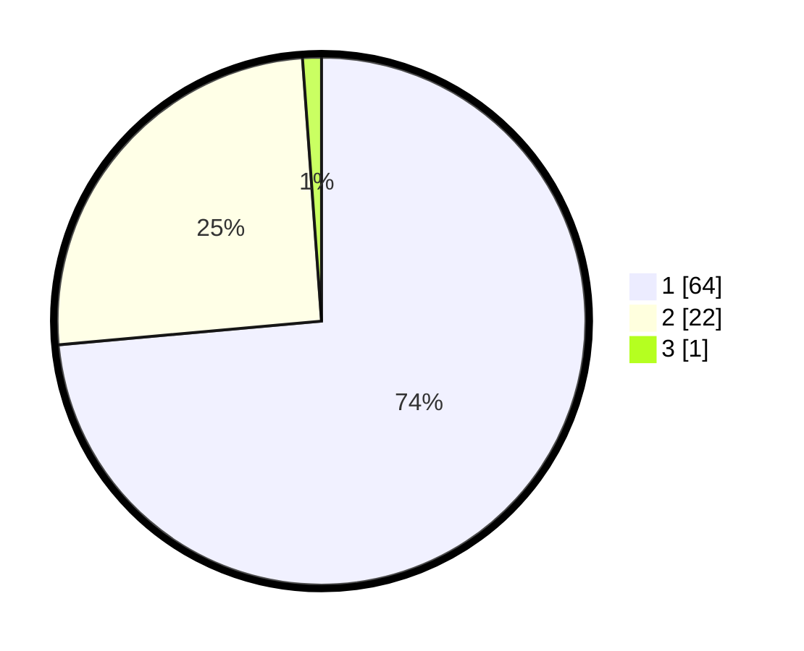

# Hasil

## Grafik

## Tabel

| No. | Nama Paslon    | Suara | Suara (raw) | Persentase |
|:--- |:-------------- | -----:| -----------:| ----------:|
| 1   | ANIES MUHAIMIN | 64    | [64][p-1]   | 73,56      |
| 2   | PRABOWO GIBRAN | 22    | [22][p-2]   | 25,29      |
| 3   | GANJAR MAHFUD  | 1     | [1][p-3]    | 1,15       |

[p-1]: https://github.com/gigit-pemilu/pemilu-2024/blob/main/pilpres/hitung-suara/sub/32-jawa-barat/sub/02-sukabumi/sub/06-cikidang/sub/2011-cijambe/sub/011-tps/sub/paslon-1.txt
[p-2]: https://github.com/gigit-pemilu/pemilu-2024/blob/main/pilpres/hitung-suara/sub/32-jawa-barat/sub/02-sukabumi/sub/06-cikidang/sub/2011-cijambe/sub/011-tps/sub/paslon-2.txt
[p-3]: https://github.com/gigit-pemilu/pemilu-2024/blob/main/pilpres/hitung-suara/sub/32-jawa-barat/sub/02-sukabumi/sub/06-cikidang/sub/2011-cijambe/sub/011-tps/sub/paslon-3.txt

## Foto C Plano

https://sirekap-obj-formc.kpu.go.id/e1e1/pemilu/ppwp/32/02/06/20/11/3202062011011-20240218-205413--d7c935d1-7a1a-4e69-a3e1-f91bb3a04fa8.jpg

https://sirekap-obj-formc.kpu.go.id/e1e1/pemilu/ppwp/32/02/06/20/11/3202062011011-20240218-212904--7496906c-f307-4b92-a7d0-7c808f61e67e.jpg

https://sirekap-obj-formc.kpu.go.id/e1e1/pemilu/ppwp/32/02/06/20/11/3202062011011-20240218-195608--7c8a77b7-1e4b-4755-9c57-86a0a03998f8.jpg

## Metadata

| Key        | Value               |
| ---------- | ------------------- |
| Time Stamp | 2024-02-19 10:00:00 |

