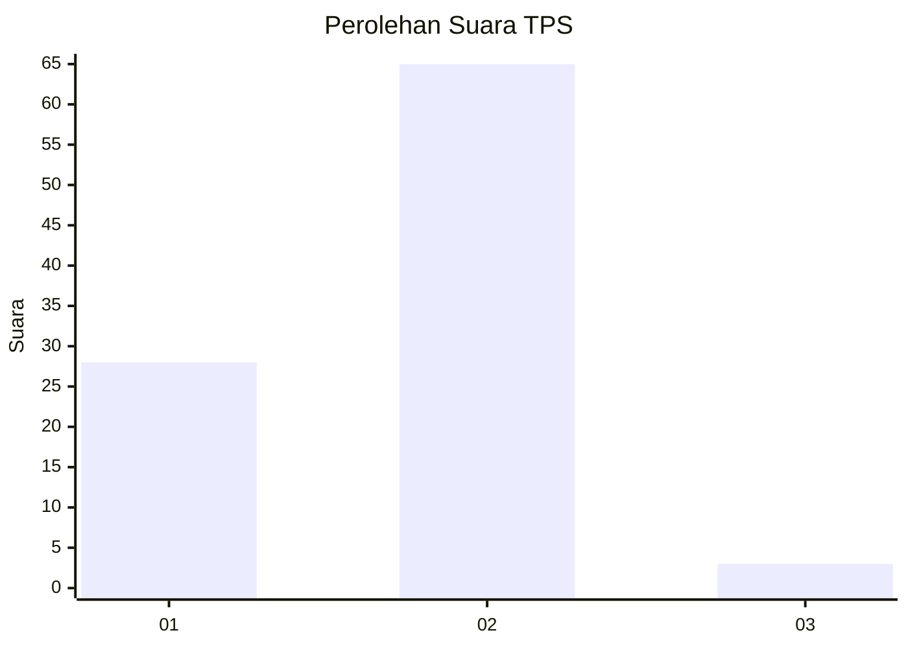
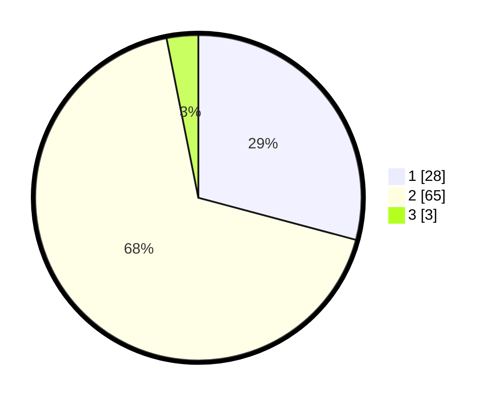

# Hasil

## Grafik

## Tabel

| No. | Nama Paslon    | Suara | Suara (raw) | Persentase |
|:--- |:-------------- | -----:| -----------:| ----------:|
| 1   | ANIES MUHAIMIN | 28    | [28][p-1]   | 29,17      |
| 2   | PRABOWO GIBRAN | 65    | [65][p-2]   | 67,71      |
| 3   | GANJAR MAHFUD  | 3     | [3][p-3]    | 3,13       |

[p-1]: https://github.com/gigit-pemilu/pemilu-2024/blob/main/pilpres/hitung-suara/sub/32-jawa-barat/sub/02-sukabumi/sub/06-cikidang/sub/2011-cijambe/sub/012-tps/sub/paslon-1.txt
[p-2]: https://github.com/gigit-pemilu/pemilu-2024/blob/main/pilpres/hitung-suara/sub/32-jawa-barat/sub/02-sukabumi/sub/06-cikidang/sub/2011-cijambe/sub/012-tps/sub/paslon-2.txt
[p-3]: https://github.com/gigit-pemilu/pemilu-2024/blob/main/pilpres/hitung-suara/sub/32-jawa-barat/sub/02-sukabumi/sub/06-cikidang/sub/2011-cijambe/sub/012-tps/sub/paslon-3.txt

## Foto C Plano

https://sirekap-obj-formc.kpu.go.id/1672/pemilu/ppwp/32/02/06/20/11/3202062011012-20240219-062130--809c2ff4-2262-4ff5-a0ac-bfe0b9e76b65.jpg

https://sirekap-obj-formc.kpu.go.id/1672/pemilu/ppwp/32/02/06/20/11/3202062011012-20240219-115024--5e478a75-d1c9-4e1a-b54a-9012fb68d9d4.jpg

https://sirekap-obj-formc.kpu.go.id/1672/pemilu/ppwp/32/02/06/20/11/3202062011012-20240214-213335--42f55e8b-b285-4a65-8b80-64409e863271.jpg

## Metadata

| Key        | Value               |
| ---------- | ------------------- |
| Time Stamp | 2024-02-19 12:00:00 |

