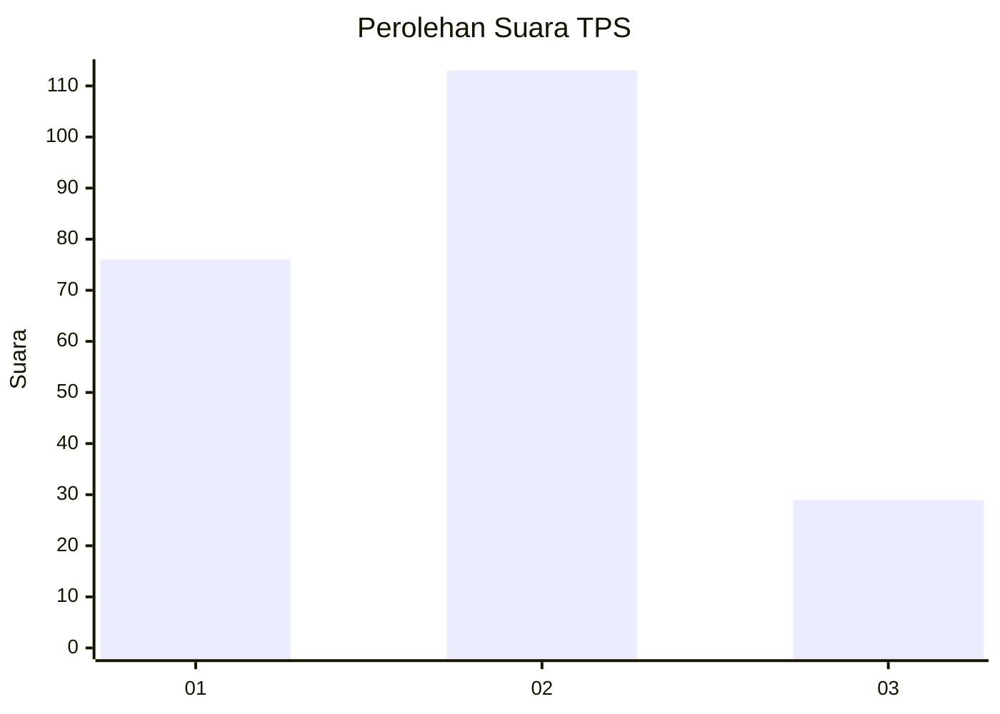
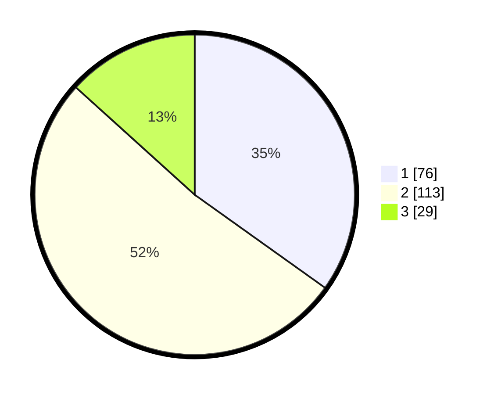

# Hasil

## Grafik

## Tabel

| No. | Nama Paslon    | Suara | Suara (raw) | Persentase |
|:--- |:-------------- | -----:| -----------:| ----------:|
| 1   | ANIES MUHAIMIN | 76    | [76][p-1]   | 34,86      |
| 2   | PRABOWO GIBRAN | 113   | [113][p-2]  | 51,83      |
| 3   | GANJAR MAHFUD  | 29    | [29][p-3]   | 13,30      |

[p-1]: https://github.com/gigit-pemilu/pemilu-2024/blob/main/pilpres/hitung-suara/sub/32-jawa-barat/sub/02-sukabumi/sub/09-warungkiara/sub/2001-warungkiara/sub/002-tps/sub/paslon-1.txt
[p-2]: https://github.com/gigit-pemilu/pemilu-2024/blob/main/pilpres/hitung-suara/sub/32-jawa-barat/sub/02-sukabumi/sub/09-warungkiara/sub/2001-warungkiara/sub/002-tps/sub/paslon-2.txt
[p-3]: https://github.com/gigit-pemilu/pemilu-2024/blob/main/pilpres/hitung-suara/sub/32-jawa-barat/sub/02-sukabumi/sub/09-warungkiara/sub/2001-warungkiara/sub/002-tps/sub/paslon-3.txt

## Foto C Plano

https://sirekap-obj-formc.kpu.go.id/352e/pemilu/ppwp/32/02/09/20/01/3202092001002-20240218-100040--9222aa7f-730f-4503-874b-2c2eb4ac23c9.jpg

https://sirekap-obj-formc.kpu.go.id/352e/pemilu/ppwp/32/02/09/20/01/3202092001002-20240219-111341--c5ebc9cb-3bce-4d67-8e49-02d38d8595b4.jpg

https://sirekap-obj-formc.kpu.go.id/352e/pemilu/ppwp/32/02/09/20/01/3202092001002-20240215-014124--265acfb6-6057-4581-8c55-b01708bd7cc6.jpg

## Metadata

| Key        | Value               |
| ---------- | ------------------- |
| Time Stamp | 2024-02-24 22:31:28 |

