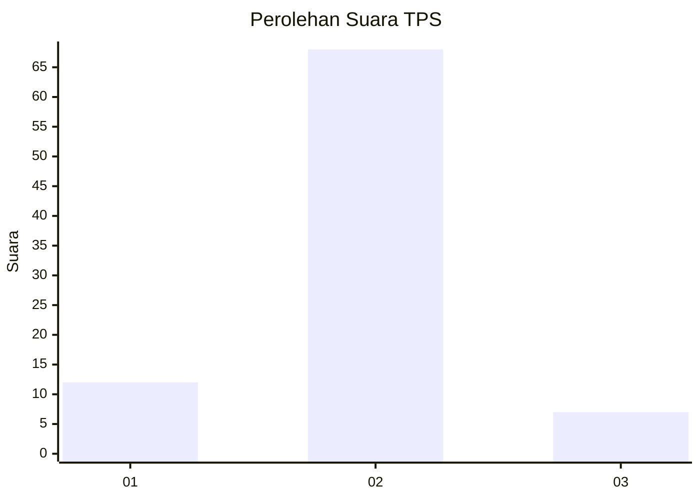
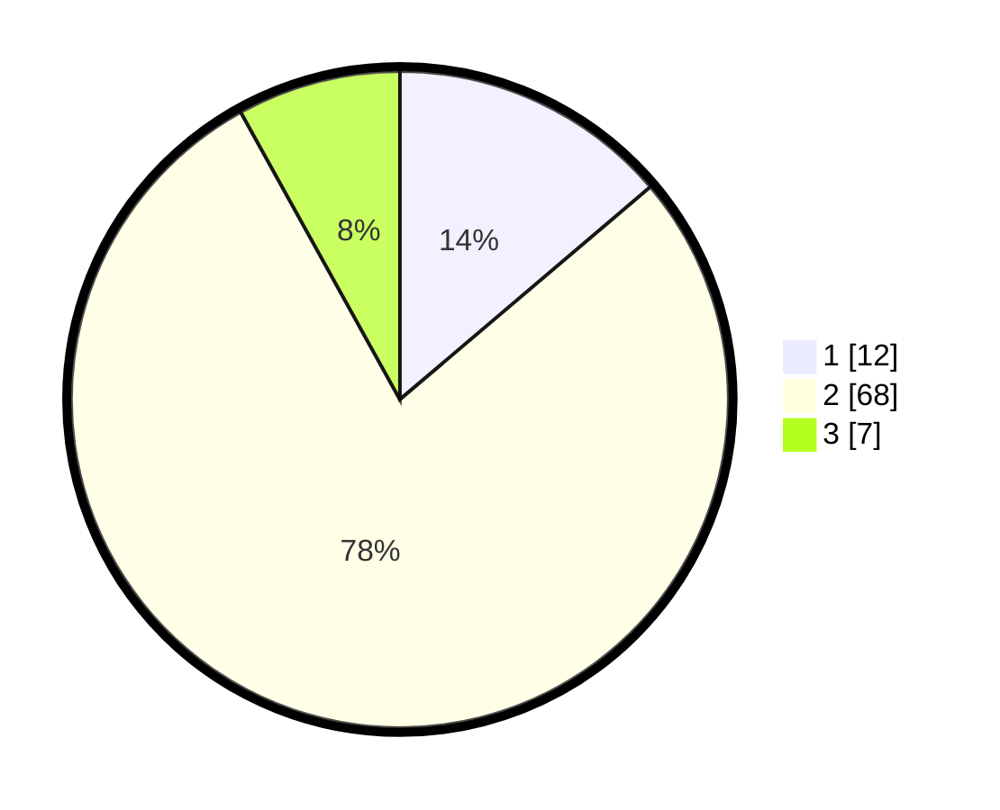

# Hasil

## Grafik

## Tabel

| No. | Nama Paslon    | Suara | Suara (raw) | Persentase |
|:--- |:-------------- | -----:| -----------:| ----------:|
| 1   | ANIES MUHAIMIN | 12    | [12][p-1]   | 13,79      |
| 2   | PRABOWO GIBRAN | 68    | [68][p-2]   | 78,16      |
| 3   | GANJAR MAHFUD  | 7     | [7][p-3]    | 8,05       |

[p-1]: https://github.com/gigit-pemilu/pemilu-2024/blob/main/pilpres/hitung-suara/sub/32-jawa-barat/sub/02-sukabumi/sub/11-cibadak/sub/2002-sekarwangi/sub/017-tps/sub/paslon-1.txt
[p-2]: https://github.com/gigit-pemilu/pemilu-2024/blob/main/pilpres/hitung-suara/sub/32-jawa-barat/sub/02-sukabumi/sub/11-cibadak/sub/2002-sekarwangi/sub/017-tps/sub/paslon-2.txt
[p-3]: https://github.com/gigit-pemilu/pemilu-2024/blob/main/pilpres/hitung-suara/sub/32-jawa-barat/sub/02-sukabumi/sub/11-cibadak/sub/2002-sekarwangi/sub/017-tps/sub/paslon-3.txt

## Foto C Plano

https://sirekap-obj-formc.kpu.go.id/2740/pemilu/ppwp/32/02/11/20/02/3202112002017-20240216-224417--30c5f3d6-eec8-465b-a359-acfc6307310f.jpg

https://sirekap-obj-formc.kpu.go.id/2740/pemilu/ppwp/32/02/11/20/02/3202112002017-20240214-141712--3ea8008f-4b5a-4459-9d4f-11c009ae672e.jpg

https://sirekap-obj-formc.kpu.go.id/2740/pemilu/ppwp/32/02/11/20/02/3202112002017-20240214-222107--4a39eba8-8a8e-47fc-9c25-1728962305bf.jpg

## Metadata

| Key        | Value               |
| ---------- | ------------------- |
| Time Stamp | 2024-02-17 10:00:02 |

