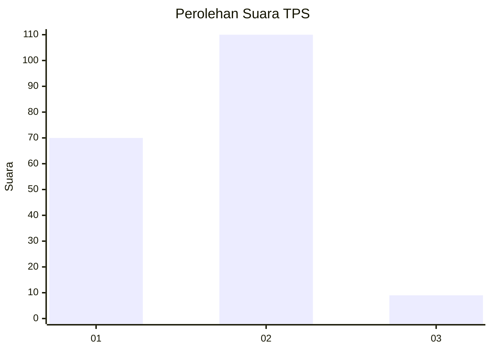
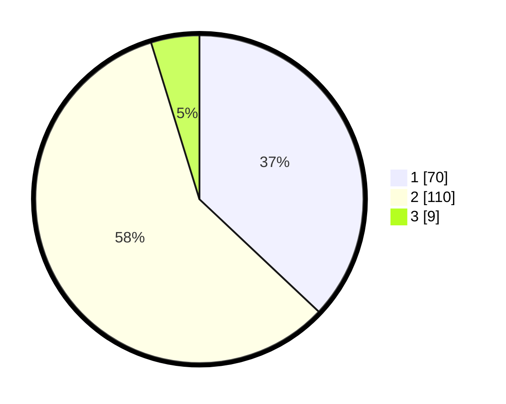

# Hasil

## Grafik

## Tabel

| No. | Nama Paslon    | Suara | Suara (raw) | Persentase |
|:--- |:-------------- | -----:| -----------:| ----------:|
| 1   | ANIES MUHAIMIN | 70    | [70][p-1]   | 37,04      |
| 2   | PRABOWO GIBRAN | 110   | [110][p-2]  | 58,20      |
| 3   | GANJAR MAHFUD  | 9     | [9][p-3]    | 4,76       |

[p-1]: https://github.com/gigit-pemilu/pemilu-2024/blob/main/pilpres/hitung-suara/sub/32-jawa-barat/sub/02-sukabumi/sub/12-nagrak/sub/2001-kalaparea/sub/004-tps/sub/paslon-1.txt
[p-2]: https://github.com/gigit-pemilu/pemilu-2024/blob/main/pilpres/hitung-suara/sub/32-jawa-barat/sub/02-sukabumi/sub/12-nagrak/sub/2001-kalaparea/sub/004-tps/sub/paslon-2.txt
[p-3]: https://github.com/gigit-pemilu/pemilu-2024/blob/main/pilpres/hitung-suara/sub/32-jawa-barat/sub/02-sukabumi/sub/12-nagrak/sub/2001-kalaparea/sub/004-tps/sub/paslon-3.txt

## Foto C Plano

https://sirekap-obj-formc.kpu.go.id/b2a7/pemilu/ppwp/32/02/12/20/01/3202122001004-20240214-200442--be498f02-5f40-4e24-b210-a525e4d9a71e.jpg

https://sirekap-obj-formc.kpu.go.id/b2a7/pemilu/ppwp/32/02/12/20/01/3202122001004-20240214-201439--25984ff9-a74c-49e8-91c8-d18a490d3a80.jpg

https://sirekap-obj-formc.kpu.go.id/b2a7/pemilu/ppwp/32/02/12/20/01/3202122001004-20240214-200513--9a751b60-722d-4b1c-9d9c-c37a2d2fa749.jpg

## Metadata

| Key        | Value               |
| ---------- | ------------------- |
| Time Stamp | 2024-02-15 15:00:29 |

