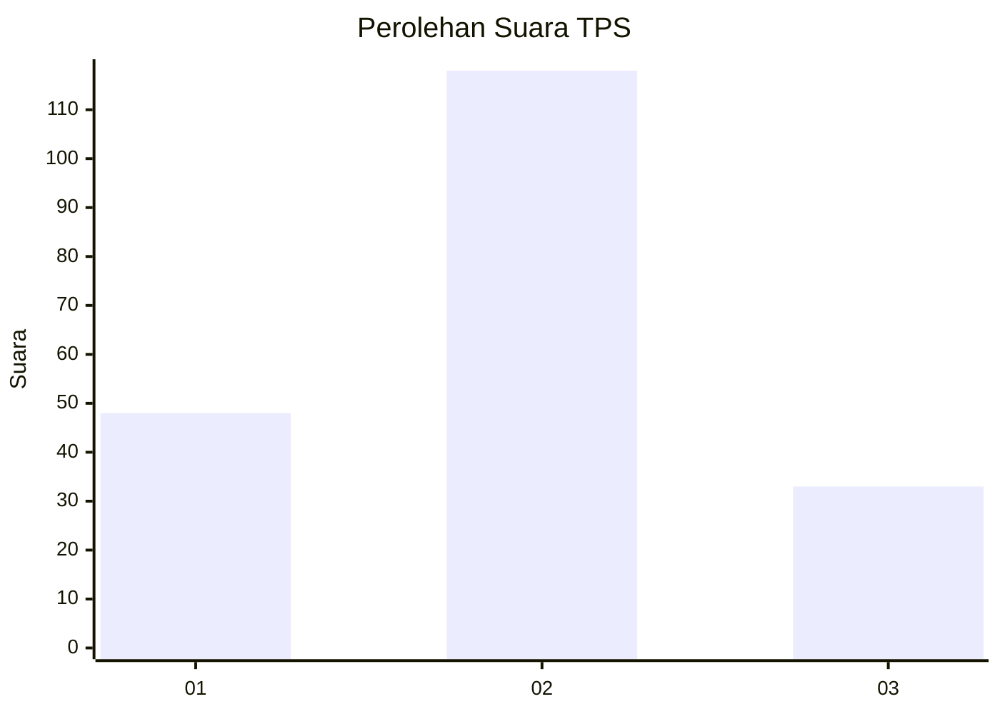

# Hasil

## Grafik

## Tabel

| No. | Nama Paslon    | Suara | Suara (raw) | Persentase |
|:--- |:-------------- | -----:| -----------:| ----------:|
| 1   | ANIES MUHAIMIN | 48    | [48][p-1]   | 24,12      |
| 2   | PRABOWO GIBRAN | 118   | [118][p-2]  | 59,30      |
| 3   | GANJAR MAHFUD  | 33    | [33][p-3]   | 16,58      |

[p-1]: https://github.com/gigit-pemilu/pemilu-2024-32-jawa-barat/blob/main/pilpres/hitung-suara/sub/32-jawa-barat/sub/02-sukabumi/sub/12-nagrak/sub/2001-kalaparea/sub/005-tps/sub/paslon-1.txt
[p-2]: https://github.com/gigit-pemilu/pemilu-2024-32-jawa-barat/blob/main/pilpres/hitung-suara/sub/32-jawa-barat/sub/02-sukabumi/sub/12-nagrak/sub/2001-kalaparea/sub/005-tps/sub/paslon-2.txt
[p-3]: https://github.com/gigit-pemilu/pemilu-2024-32-jawa-barat/blob/main/pilpres/hitung-suara/sub/32-jawa-barat/sub/02-sukabumi/sub/12-nagrak/sub/2001-kalaparea/sub/005-tps/sub/paslon-3.txt

## Foto C Plano

https://sirekap-obj-formc.kpu.go.id/7e0d/pemilu/ppwp/32/02/12/20/01/3202122001005-20240214-213743--405898bb-d356-49d6-89ad-6f11eb75172f.jpg

https://sirekap-obj-formc.kpu.go.id/7e0d/pemilu/ppwp/32/02/12/20/01/3202122001005-20240214-235115--74d0646a-37f6-4d53-8b9e-5cd30d238a65.jpg

https://sirekap-obj-formc.kpu.go.id/7e0d/pemilu/ppwp/32/02/12/20/01/3202122001005-20240214-214511--ed8ae366-e214-4f61-9437-ae18d0643101.jpg

## Metadata

| Key        | Value               |
| ---------- | ------------------- |
| Time Stamp | 2024-02-15 15:00:29 |

