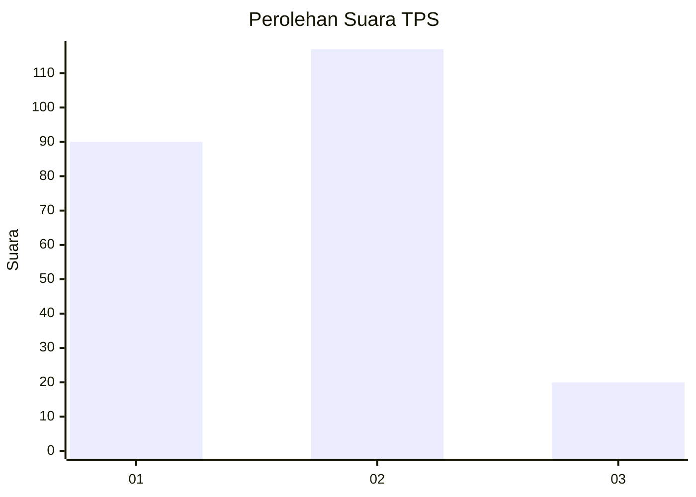
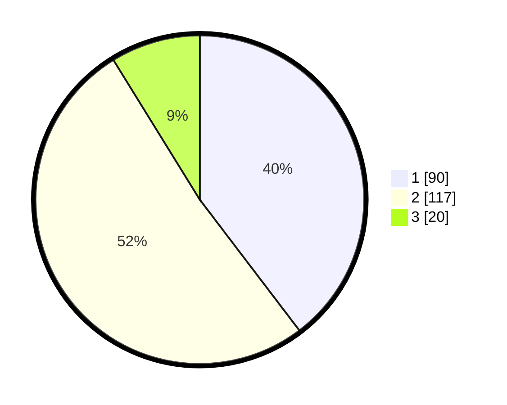

# Hasil

## Grafik

## Tabel

| No. | Nama Paslon    | Suara | Suara (raw) | Persentase |
|:--- |:-------------- | -----:| -----------:| ----------:|
| 1   | ANIES MUHAIMIN | 90    | [90][p-1]   | 39,65      |
| 2   | PRABOWO GIBRAN | 117   | [117][p-2]  | 51,54      |
| 3   | GANJAR MAHFUD  | 20    | [20][p-3]   | 8,81       |

[p-1]: https://github.com/gigit-pemilu/pemilu-2024-32-jawa-barat/blob/main/pilpres/hitung-suara/sub/32-jawa-barat/sub/02-sukabumi/sub/12-nagrak/sub/2001-kalaparea/sub/009-tps/sub/paslon-1.txt
[p-2]: https://github.com/gigit-pemilu/pemilu-2024-32-jawa-barat/blob/main/pilpres/hitung-suara/sub/32-jawa-barat/sub/02-sukabumi/sub/12-nagrak/sub/2001-kalaparea/sub/009-tps/sub/paslon-2.txt
[p-3]: https://github.com/gigit-pemilu/pemilu-2024-32-jawa-barat/blob/main/pilpres/hitung-suara/sub/32-jawa-barat/sub/02-sukabumi/sub/12-nagrak/sub/2001-kalaparea/sub/009-tps/sub/paslon-3.txt

## Foto C Plano

https://sirekap-obj-formc.kpu.go.id/331b/pemilu/ppwp/32/02/12/20/01/3202122001009-20240214-214809--a960b3f5-8f97-4fe6-8589-169f6d72982b.jpg

https://sirekap-obj-formc.kpu.go.id/331b/pemilu/ppwp/32/02/12/20/01/3202122001009-20240214-214825--6cfc74df-b330-4821-a64d-445737be44d6.jpg

https://sirekap-obj-formc.kpu.go.id/331b/pemilu/ppwp/32/02/12/20/01/3202122001009-20240214-214831--bfce9a2a-81a2-49d2-96d4-d09f96e96217.jpg

## Metadata

| Key        | Value               |
| ---------- | ------------------- |
| Time Stamp | 2024-02-15 15:00:29 |

