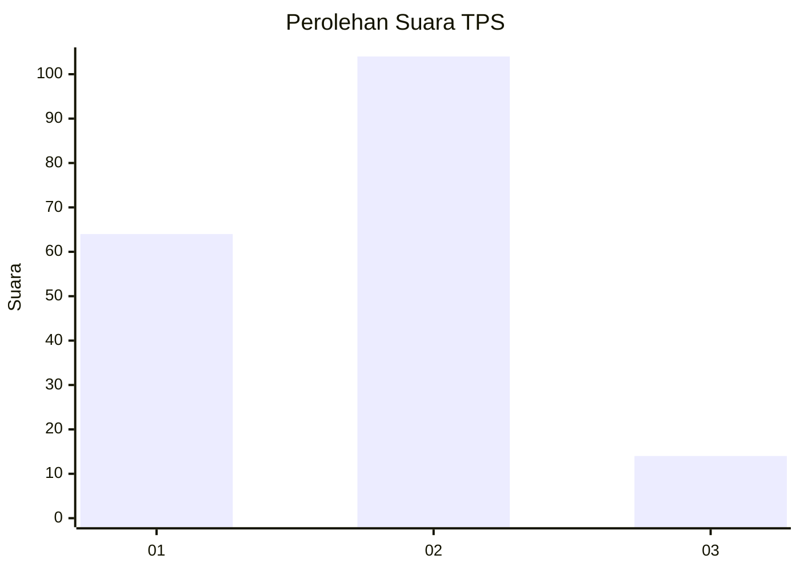
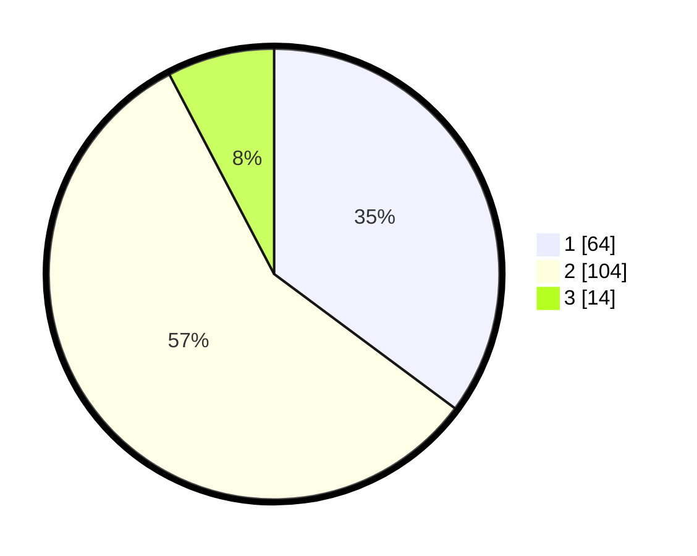

# Hasil

## Grafik

## Tabel

| No. | Nama Paslon    | Suara | Suara (raw) | Persentase |
|:--- |:-------------- | -----:| -----------:| ----------:|
| 1   | ANIES MUHAIMIN | 64    | [64][p-1]   | 35,16      |
| 2   | PRABOWO GIBRAN | 104   | [104][p-2]  | 57,14      |
| 3   | GANJAR MAHFUD  | 14    | [14][p-3]   | 7,69       |

[p-1]: https://github.com/gigit-pemilu/pemilu-2024-32-jawa-barat/blob/main/pilpres/hitung-suara/sub/32-jawa-barat/sub/02-sukabumi/sub/12-nagrak/sub/2001-kalaparea/sub/011-tps/sub/paslon-1.txt
[p-2]: https://github.com/gigit-pemilu/pemilu-2024-32-jawa-barat/blob/main/pilpres/hitung-suara/sub/32-jawa-barat/sub/02-sukabumi/sub/12-nagrak/sub/2001-kalaparea/sub/011-tps/sub/paslon-2.txt
[p-3]: https://github.com/gigit-pemilu/pemilu-2024-32-jawa-barat/blob/main/pilpres/hitung-suara/sub/32-jawa-barat/sub/02-sukabumi/sub/12-nagrak/sub/2001-kalaparea/sub/011-tps/sub/paslon-3.txt

## Foto C Plano

https://sirekap-obj-formc.kpu.go.id/4de8/pemilu/ppwp/32/02/12/20/01/3202122001011-20240214-210733--20ece380-6226-4213-a4be-481d173c971f.jpg

https://sirekap-obj-formc.kpu.go.id/4de8/pemilu/ppwp/32/02/12/20/01/3202122001011-20240214-211133--17806349-cabb-4326-b03b-c4f701bdf0e4.jpg

https://sirekap-obj-formc.kpu.go.id/4de8/pemilu/ppwp/32/02/12/20/01/3202122001011-20240214-211342--95f82a0b-2eb2-4af2-b240-f87204e7ddd0.jpg

## Metadata

| Key        | Value               |
| ---------- | ------------------- |
| Time Stamp | 2024-02-15 15:00:29 |

