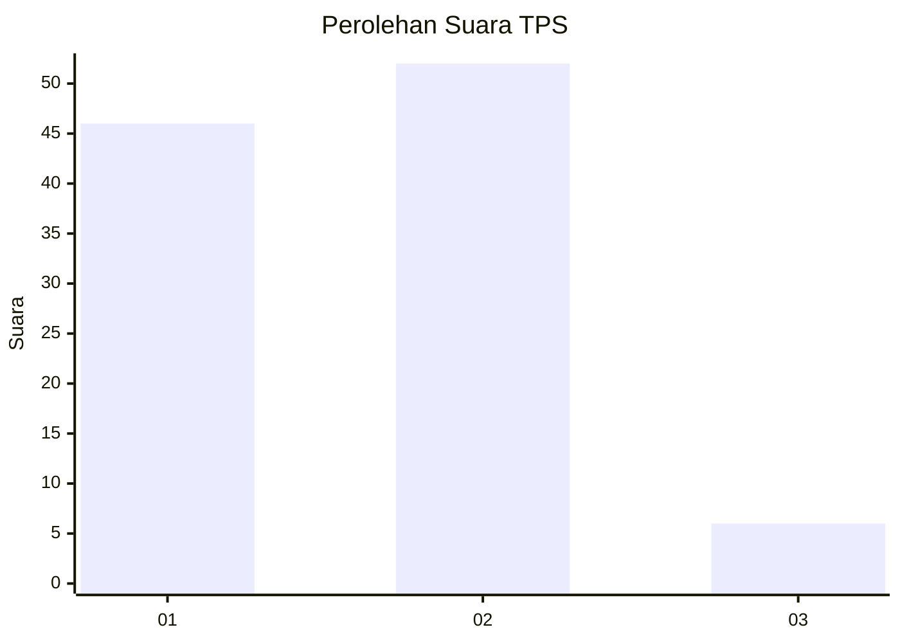
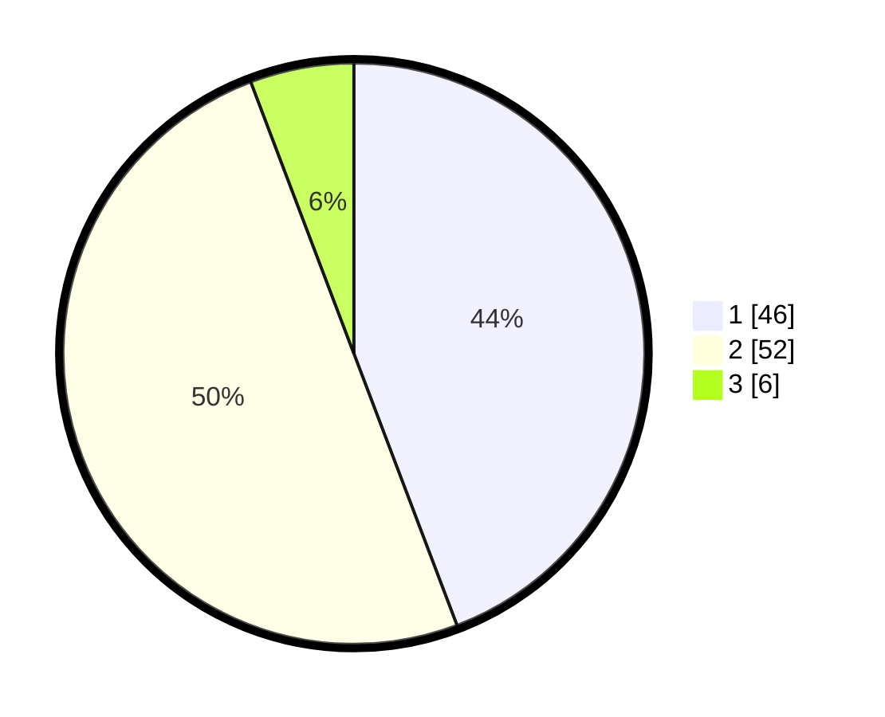

# Hasil

## Grafik

## Tabel

| No. | Nama Paslon    | Suara | Suara (raw) | Persentase |
|:--- |:-------------- | -----:| -----------:| ----------:|
| 1   | ANIES MUHAIMIN | 46    | [46][p-1]   | 44,23      |
| 2   | PRABOWO GIBRAN | 52    | [52][p-2]   | 50,00      |
| 3   | GANJAR MAHFUD  | 6     | [6][p-3]    | 5,77       |

[p-1]: https://github.com/gigit-pemilu/pemilu-2024/blob/main/pilpres/hitung-suara/sub/32-jawa-barat/sub/02-sukabumi/sub/12-nagrak/sub/2003-nagrak-utara/sub/003-tps/sub/paslon-1.txt
[p-2]: https://github.com/gigit-pemilu/pemilu-2024/blob/main/pilpres/hitung-suara/sub/32-jawa-barat/sub/02-sukabumi/sub/12-nagrak/sub/2003-nagrak-utara/sub/003-tps/sub/paslon-2.txt
[p-3]: https://github.com/gigit-pemilu/pemilu-2024/blob/main/pilpres/hitung-suara/sub/32-jawa-barat/sub/02-sukabumi/sub/12-nagrak/sub/2003-nagrak-utara/sub/003-tps/sub/paslon-3.txt

## Foto C Plano

https://sirekap-obj-formc.kpu.go.id/644e/pemilu/ppwp/32/02/12/20/03/3202122003003-20240214-222952--0a1b9854-2ffa-4fde-9b0f-cf1c6bfb56de.jpg

https://sirekap-obj-formc.kpu.go.id/644e/pemilu/ppwp/32/02/12/20/03/3202122003003-20240214-222954--6b3ebc73-2b66-41da-88ab-dfa2b28f75f3.jpg

https://sirekap-obj-formc.kpu.go.id/644e/pemilu/ppwp/32/02/12/20/03/3202122003003-20240215-011045--32ca7bfa-3d8d-4de6-98bc-15783104a4d1.jpg

## Metadata

| Key        | Value               |
| ---------- | ------------------- |
| Time Stamp | 2024-02-16 14:00:34 |

