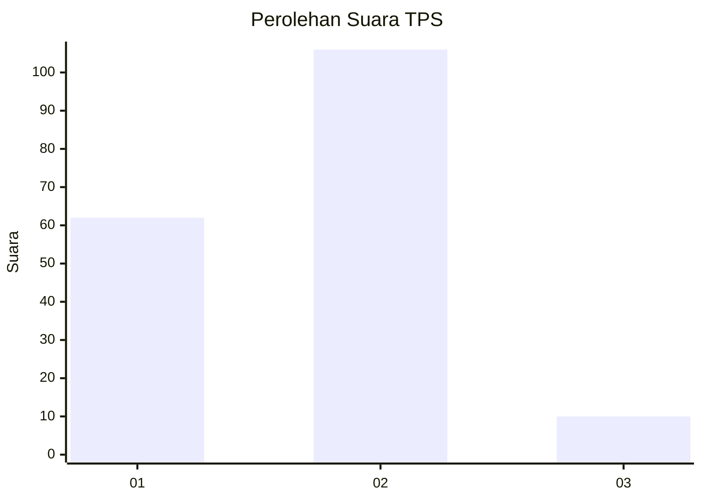
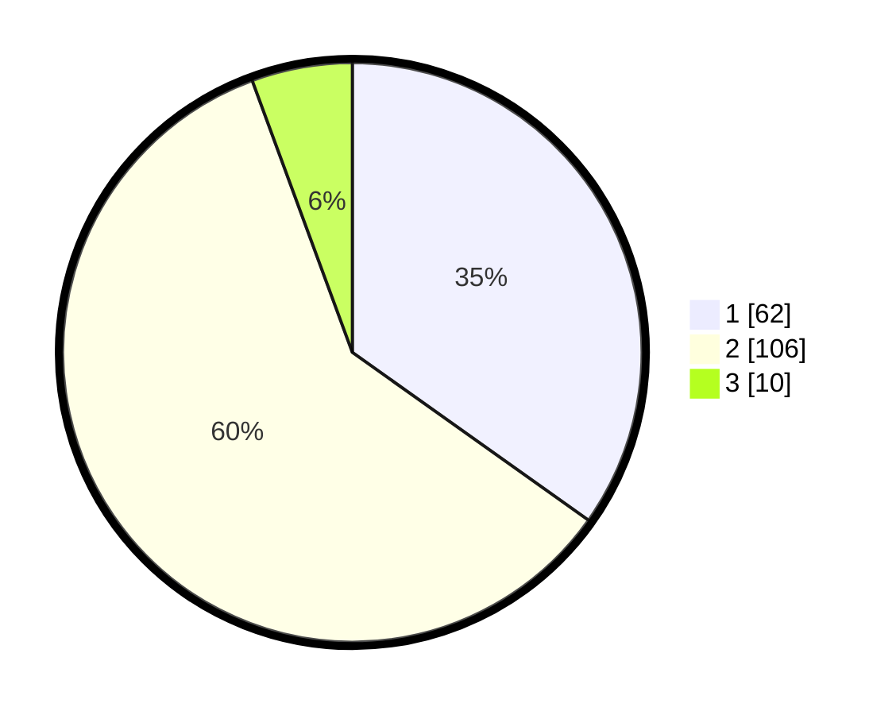

# Hasil

## Grafik

## Tabel

| No. | Nama Paslon    | Suara | Suara (raw) | Persentase |
|:--- |:-------------- | -----:| -----------:| ----------:|
| 1   | ANIES MUHAIMIN | 62    | [62][p-1]   | 34,83      |
| 2   | PRABOWO GIBRAN | 106   | [106][p-2]  | 59,55      |
| 3   | GANJAR MAHFUD  | 10    | [10][p-3]   | 5,62       |

[p-1]: https://github.com/gigit-pemilu/pemilu-2024/blob/main/pilpres/hitung-suara/sub/32-jawa-barat/sub/02-sukabumi/sub/13-parungkuda/sub/2001-parungkuda/sub/001-tps/sub/paslon-1.txt
[p-2]: https://github.com/gigit-pemilu/pemilu-2024/blob/main/pilpres/hitung-suara/sub/32-jawa-barat/sub/02-sukabumi/sub/13-parungkuda/sub/2001-parungkuda/sub/001-tps/sub/paslon-2.txt
[p-3]: https://github.com/gigit-pemilu/pemilu-2024/blob/main/pilpres/hitung-suara/sub/32-jawa-barat/sub/02-sukabumi/sub/13-parungkuda/sub/2001-parungkuda/sub/001-tps/sub/paslon-3.txt

## Foto C Plano

https://sirekap-obj-formc.kpu.go.id/d86d/pemilu/ppwp/32/02/13/20/01/3202132001001-20240214-212150--bc7ef4e8-f383-4bd6-99a4-026bbfdaf7dd.jpg

https://sirekap-obj-formc.kpu.go.id/d86d/pemilu/ppwp/32/02/13/20/01/3202132001001-20240214-212824--6aa97530-abf6-4360-bd7b-efc70cf8d4d8.jpg

https://sirekap-obj-formc.kpu.go.id/d86d/pemilu/ppwp/32/02/13/20/01/3202132001001-20240214-230159--5f282f7d-491c-41fd-9549-499254aa91f0.jpg

## Metadata

| Key        | Value               |
| ---------- | ------------------- |
| Time Stamp | 2024-02-15 19:00:26 |

