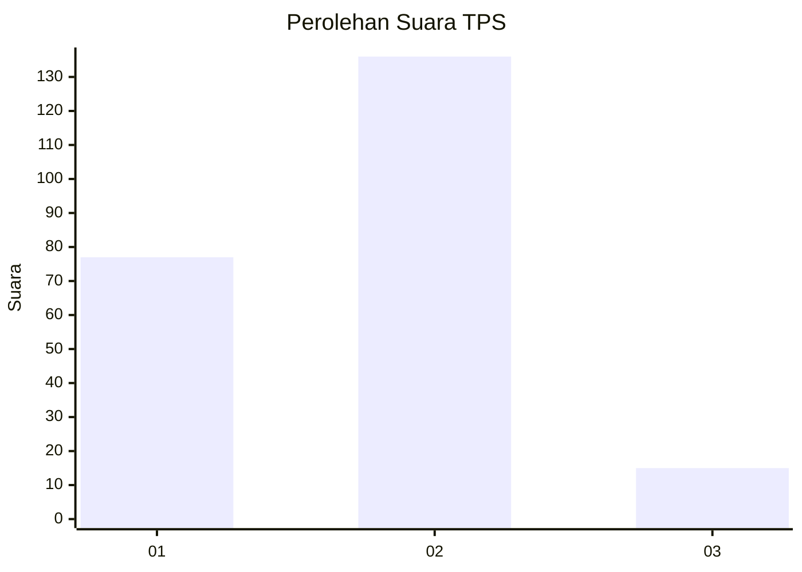
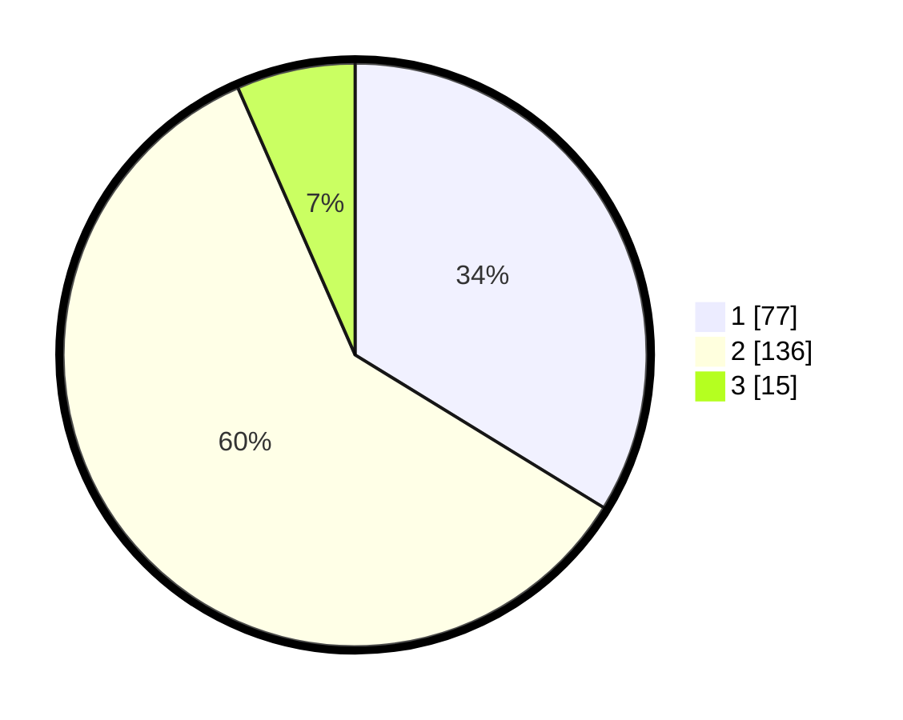

# Hasil

## Grafik

## Tabel

| No. | Nama Paslon    | Suara | Suara (raw) | Persentase |
|:--- |:-------------- | -----:| -----------:| ----------:|
| 1   | ANIES MUHAIMIN | 77    | [77][p-1]   | 33,77      |
| 2   | PRABOWO GIBRAN | 136   | [136][p-2]  | 59,65      |
| 3   | GANJAR MAHFUD  | 15    | [15][p-3]   | 6,58       |

[p-1]: https://github.com/gigit-pemilu/pemilu-2024-32-jawa-barat/blob/main/pilpres/hitung-suara/sub/32-jawa-barat/sub/02-sukabumi/sub/14-bojonggenteng/sub/2001-bojonggenteng/sub/001-tps/sub/paslon-1.txt
[p-2]: https://github.com/gigit-pemilu/pemilu-2024-32-jawa-barat/blob/main/pilpres/hitung-suara/sub/32-jawa-barat/sub/02-sukabumi/sub/14-bojonggenteng/sub/2001-bojonggenteng/sub/001-tps/sub/paslon-2.txt
[p-3]: https://github.com/gigit-pemilu/pemilu-2024-32-jawa-barat/blob/main/pilpres/hitung-suara/sub/32-jawa-barat/sub/02-sukabumi/sub/14-bojonggenteng/sub/2001-bojonggenteng/sub/001-tps/sub/paslon-3.txt

## Foto C Plano

https://sirekap-obj-formc.kpu.go.id/6d71/pemilu/ppwp/32/02/14/20/01/3202142001001-20240217-230218--12b01167-c823-42b8-abbe-5fea84a328ba.jpg

https://sirekap-obj-formc.kpu.go.id/6d71/pemilu/ppwp/32/02/14/20/01/3202142001001-20240217-225658--94a8196f-1f19-483b-bc95-e097b6b11998.jpg

https://sirekap-obj-formc.kpu.go.id/6d71/pemilu/ppwp/32/02/14/20/01/3202142001001-20240217-223459--c8142fb4-cf89-4558-af1b-11547edf1ea1.jpg

## Metadata

| Key        | Value               |
| ---------- | ------------------- |
| Time Stamp | 2024-02-25 18:00:00 |

