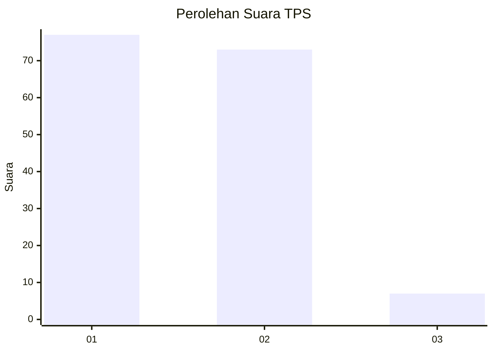
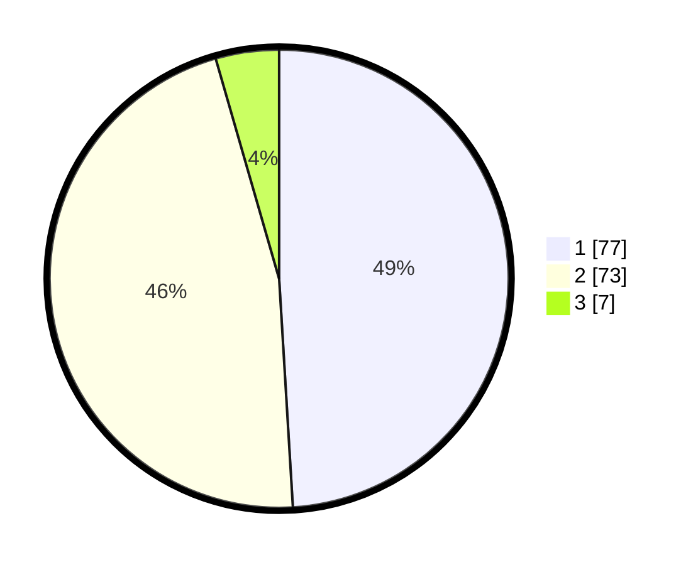

# Hasil

## Grafik

## Tabel

| No. | Nama Paslon    | Suara | Suara (raw) | Persentase |
|:--- |:-------------- | -----:| -----------:| ----------:|
| 1   | ANIES MUHAIMIN | 77    | [77][p-1]   | 49,04      |
| 2   | PRABOWO GIBRAN | 73    | [73][p-2]   | 46,50      |
| 3   | GANJAR MAHFUD  | 7     | [7][p-3]    | 4,46       |

[p-1]: https://github.com/gigit-pemilu/pemilu-2024/blob/main/pilpres/hitung-suara/sub/32-jawa-barat/sub/02-sukabumi/sub/14-bojonggenteng/sub/2001-bojonggenteng/sub/004-tps/sub/paslon-1.txt
[p-2]: https://github.com/gigit-pemilu/pemilu-2024/blob/main/pilpres/hitung-suara/sub/32-jawa-barat/sub/02-sukabumi/sub/14-bojonggenteng/sub/2001-bojonggenteng/sub/004-tps/sub/paslon-2.txt
[p-3]: https://github.com/gigit-pemilu/pemilu-2024/blob/main/pilpres/hitung-suara/sub/32-jawa-barat/sub/02-sukabumi/sub/14-bojonggenteng/sub/2001-bojonggenteng/sub/004-tps/sub/paslon-3.txt

## Foto C Plano

https://sirekap-obj-formc.kpu.go.id/b90a/pemilu/ppwp/32/02/14/20/01/3202142001004-20240217-205706--0e1954e1-ad32-41c1-9f14-1f38b81ae1e7.jpg

https://sirekap-obj-formc.kpu.go.id/b90a/pemilu/ppwp/32/02/14/20/01/3202142001004-20240214-155404--a1fa51f9-441d-408b-adc1-528f69abe970.jpg

https://sirekap-obj-formc.kpu.go.id/b90a/pemilu/ppwp/32/02/14/20/01/3202142001004-20240215-000027--4f96e529-df48-4cfd-98b4-f9abe5cfb46c.jpg

## Metadata

| Key        | Value               |
| ---------- | ------------------- |
| Time Stamp | 2024-02-19 06:16:00 |

