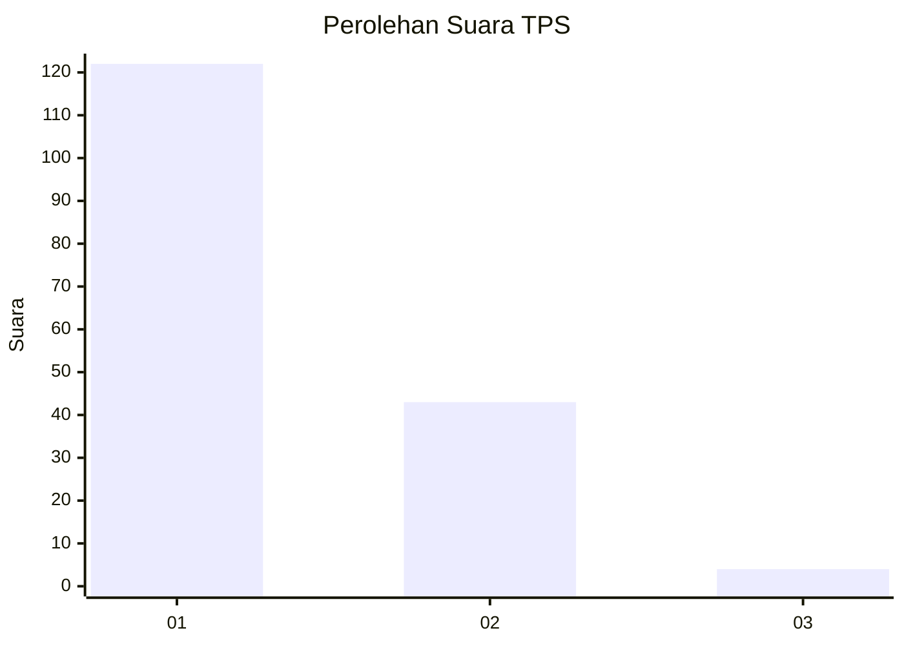
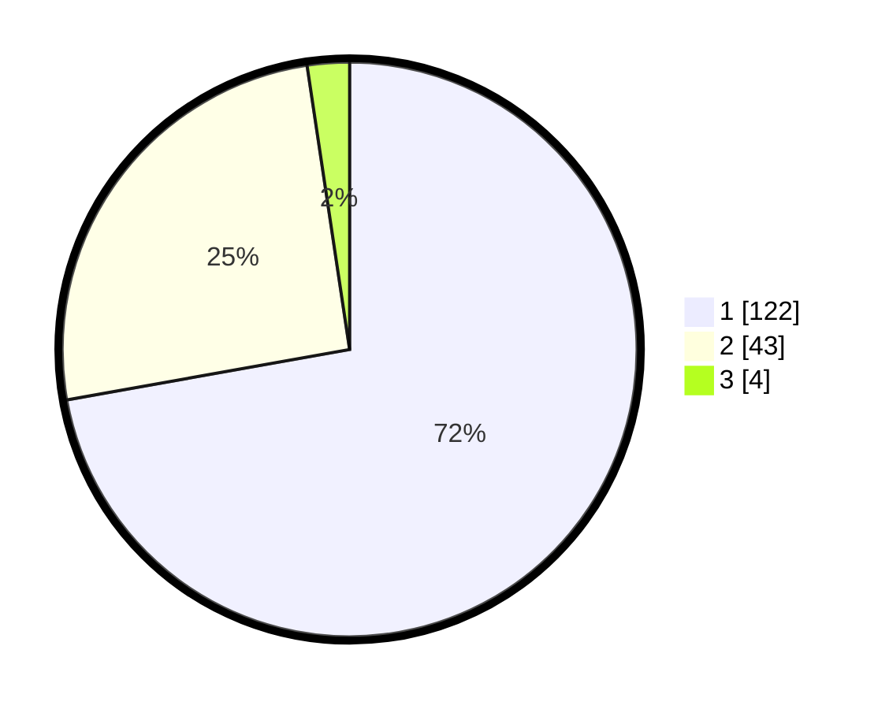

# Hasil

## Grafik

## Tabel

| No. | Nama Paslon    | Suara | Suara (raw) | Persentase |
|:--- |:-------------- | -----:| -----------:| ----------:|
| 1   | ANIES MUHAIMIN | 122   | [122][p-1]  | 72,19      |
| 2   | PRABOWO GIBRAN | 43    | [43][p-2]   | 25,44      |
| 3   | GANJAR MAHFUD  | 4     | [4][p-3]    | 2,37       |

[p-1]: https://github.com/gigit-pemilu/pemilu-2024-32-jawa-barat/blob/main/pilpres/hitung-suara/sub/32-jawa-barat/sub/02-sukabumi/sub/14-bojonggenteng/sub/2004-cipanengah/sub/017-tps/sub/paslon-1.txt
[p-2]: https://github.com/gigit-pemilu/pemilu-2024-32-jawa-barat/blob/main/pilpres/hitung-suara/sub/32-jawa-barat/sub/02-sukabumi/sub/14-bojonggenteng/sub/2004-cipanengah/sub/017-tps/sub/paslon-2.txt
[p-3]: https://github.com/gigit-pemilu/pemilu-2024-32-jawa-barat/blob/main/pilpres/hitung-suara/sub/32-jawa-barat/sub/02-sukabumi/sub/14-bojonggenteng/sub/2004-cipanengah/sub/017-tps/sub/paslon-3.txt

## Foto C Plano

https://sirekap-obj-formc.kpu.go.id/7d62/pemilu/ppwp/32/02/14/20/04/3202142004017-20240214-191154--5cca5638-7c12-4d0a-909a-9d8b8cc9c4ed.jpg

https://sirekap-obj-formc.kpu.go.id/7d62/pemilu/ppwp/32/02/14/20/04/3202142004017-20240214-192108--9744aa94-a289-4dc6-a812-effd14563fe9.jpg

https://sirekap-obj-formc.kpu.go.id/7d62/pemilu/ppwp/32/02/14/20/04/3202142004017-20240214-192204--199a2e8a-74dc-4384-9098-466895f656f9.jpg

## Metadata

| Key        | Value               |
| ---------- | ------------------- |
| Time Stamp | 2024-02-15 12:00:28 |

