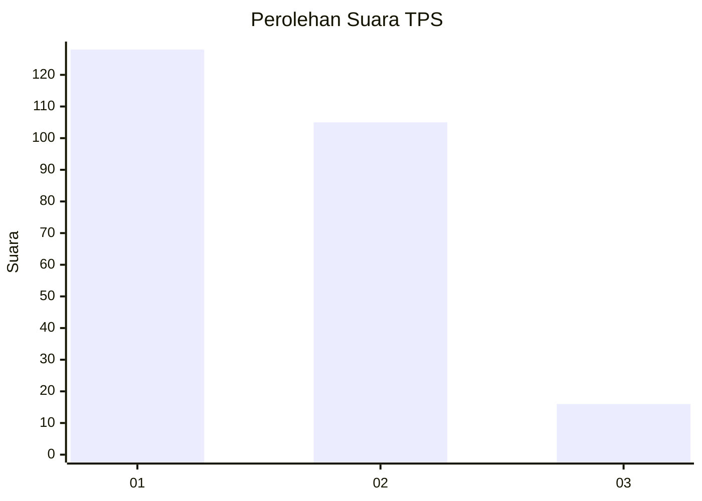
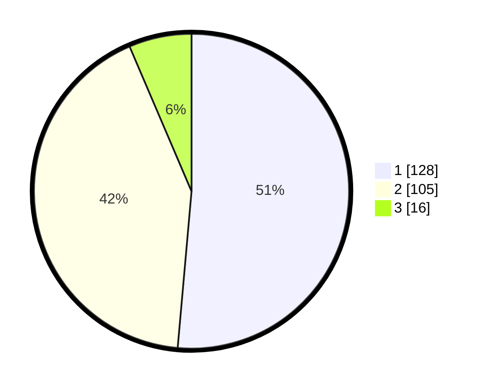

# Hasil

## Grafik

## Tabel

| No. | Nama Paslon    | Suara | Suara (raw) | Persentase |
|:--- |:-------------- | -----:| -----------:| ----------:|
| 1   | ANIES MUHAIMIN | 128   | [128][p-1]  | 51,41      |
| 2   | PRABOWO GIBRAN | 105   | [105][p-2]  | 42,17      |
| 3   | GANJAR MAHFUD  | 16    | [16][p-3]   | 6,43       |

[p-1]: https://github.com/gigit-pemilu/pemilu-2024/blob/main/pilpres/hitung-suara/sub/32-jawa-barat/sub/02-sukabumi/sub/14-bojonggenteng/sub/2005-bojonggaling/sub/004-tps/sub/paslon-1.txt
[p-2]: https://github.com/gigit-pemilu/pemilu-2024/blob/main/pilpres/hitung-suara/sub/32-jawa-barat/sub/02-sukabumi/sub/14-bojonggenteng/sub/2005-bojonggaling/sub/004-tps/sub/paslon-2.txt
[p-3]: https://github.com/gigit-pemilu/pemilu-2024/blob/main/pilpres/hitung-suara/sub/32-jawa-barat/sub/02-sukabumi/sub/14-bojonggenteng/sub/2005-bojonggaling/sub/004-tps/sub/paslon-3.txt

## Foto C Plano

https://sirekap-obj-formc.kpu.go.id/1400/pemilu/ppwp/32/02/14/20/05/3202142005004-20240217-091445--cb96d25d-22d2-4369-a1b9-7e43068ef6dc.jpg

https://sirekap-obj-formc.kpu.go.id/1400/pemilu/ppwp/32/02/14/20/05/3202142005004-20240217-092519--c5325aa4-94b5-442b-9bad-4442c396e22c.jpg

https://sirekap-obj-formc.kpu.go.id/1400/pemilu/ppwp/32/02/14/20/05/3202142005004-20240215-035014--5b5e971e-8a45-4d58-bf9d-bbb7d88e8c40.jpg

## Metadata

| Key        | Value               |
| ---------- | ------------------- |
| Time Stamp | 2024-02-17 12:00:00 |

